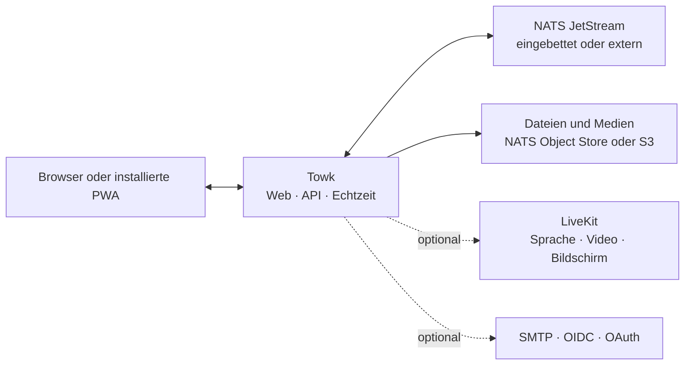

<div align="center">
  <picture>
    <source media="(prefers-color-scheme: dark)" srcset="branding/towk-horizontal-on-dark.webp" />
    <source media="(prefers-color-scheme: light)" srcset="branding/towk-horizontal-on-light.webp" />
    
  </picture>

  <p><strong>Deine Gespräche. Deine Infrastruktur.</strong></p>

  <p>
    Ein fokussierter, selbst gehosteter Kommunikationsarbeitsbereich für Teams und Communities.<br />
    Chat, Dateien, Benachrichtigungen und Anrufe für den Alltag — ohne verpflichtenden Hosting-Dienst.
  </p>

  <p>
    <a href="README.md">English</a> ·
    <a href="README.fr.md">Français</a> ·
    <strong>Deutsch</strong> ·
    <a href="README.es.md">Español</a> ·
    <a href="README.pt.md">Português</a>
  </p>

  <p>
    <a href="ROADMAP.md"></a>
    
    
    <a href=".github/workflows/refresh-readme-metrics.yml"></a>
    <a href="LICENSING.md"></a>
  </p>

  <p>
    <a href="#why-towk">Warum Towk</a> ·
    <a href="#development-pulse">Dynamik</a> ·
    <a href="#capabilities">Funktionen</a> ·
    <a href="#architecture">Architektur</a> ·
    <a href="#run-towk">Towk starten</a> ·
    <a href="#project">Projekt</a>
  </p>
</div>

<picture>
  <source media="(max-width: 600px)" srcset="https://raw.githubusercontent.com/Yo-DDV/Towk/readme-metrics/de/hero-mobile.svg" />
  
</picture>

<p align="center">
  <a href="apps/docs-website/src/content/docs/getting-started/quick-start.mdx"><strong>🚀 Towk starten</strong></a>
  &nbsp;·&nbsp;
  <a href="apps/docs-website/src/content/docs/guides/deployment/docker-compose.mdx"><strong>📦 Bereitstellen</strong></a>
  &nbsp;·&nbsp;
  <a href="apps/docs-website/src/content/docs/guides/operations/security.mdx"><strong>🛡️ Sicherheitsmodell</strong></a>
  &nbsp;·&nbsp;
  <a href="ROADMAP.md"><strong>🗺️ Roadmap</strong></a>
</p>

> [!IMPORTANT]
> Towk wird aktiv entwickelt und hat Version 1.0 noch nicht erreicht. Verwende
> für wichtige Installationen unveränderliche Releases oder Image-Digests,
> halte getestete Sicherungen bereit und lies vor Upgrades die Versionshinweise.

<picture>
  <source media="(prefers-color-scheme: dark)" srcset="apps/docs-website/src/assets/towk_dark.png" />
  <source media="(prefers-color-scheme: light)" srcset="apps/docs-website/src/assets/towk_light.png" />
  
</picture>

<a id="why-towk"></a>
## Warum Towk

<table>
  <tr>
    <td width="33%" valign="top">
      <h3>🛡️ Unabhängig konzipiert</h3>
      <p><strong>Deine Installation bildet die Grenze.</strong> Es gibt weder ein zentrales Towk-Konto noch eine verpflichtende Towk-Cloud oder eine organisationsübergreifende Steuerungsebene.</p>
    </td>
    <td width="33%" valign="top">
      <h3>🎯 Auf tägliche Kommunikation fokussiert</h3>
      <p><strong>Die Grundlagen verdienen erstklassige Aufmerksamkeit.</strong> Towk priorisiert Gespräche, Dateien, Benachrichtigungen und Anrufe, statt zu einer Plattform für alles zu werden.</p>
    </td>
    <td width="33%" valign="top">
      <h3>⚙️ Erst kompakt, dann skalierbar</h3>
      <p><strong>Beginne mit einem Prozess.</strong> Nutze externes NATS, S3-kompatiblen Speicher, mehrere Replikate und LiveKit erst dann, wenn dein Betrieb sie benötigt.</p>
    </td>
  </tr>
</table>

> **Selbsthosting ist kein Häkchen.** Es bedeutet, selbst zu bestimmen, wo der
> Dienst läuft, wie er gesichert wird, welchen Identitätsanbietern er vertraut,
> wo Dateien liegen und aus welcher exakten Quellcode-Revision das bereitgestellte
> Artefakt stammt.

Towk ist bewusst **weder** ein föderiertes Protokoll **noch** ein gehostetes SaaS.
Es ist eine fokussierte Open-Source-Alternative für Teams und Communities, die
ihren Kommunikationsarbeitsbereich selbst betreiben möchten — ohne den Anspruch,
jede Funktion jeder Kollaborationsplattform zu ersetzen.

<a id="development-pulse"></a>
## Entwicklungsdynamik

<picture>
  <source media="(max-width: 600px)" srcset="https://raw.githubusercontent.com/Yo-DDV/Towk/readme-metrics/de/activity-mobile.svg" />
  
</picture>

<picture>
  <source media="(max-width: 600px)" srcset="https://raw.githubusercontent.com/Yo-DDV/Towk/readme-metrics/de/contributors-mobile.svg" />
  
</picture>

<details>
  <summary><strong>Wie diese Metriken entstehen</strong></summary>

  Das Repository erzeugt die SVGs selbst aus der GitHub-API mit seinem auf das
  Repository beschränkten `GITHUB_TOKEN`. Ein persönlicher Token oder externer
  Statistikdienst ist nicht erforderlich. Der Workflow läuft nach jedem Push auf
  `main` sowie täglich ungefähr um **06:17 und 21:17 Uhr in der Zeitzone Europe/Paris**.

  Das Berichtsfenster umfasst die vergangenen 365 Tage. Commits stammen aus der
  von `main` erreichbaren Historie und werden nach ihrem Commit-Zeitstempel in UTC
  gruppiert. Pull Requests werden anhand von `merged_at` gezählt. Die Ranglisten
  verwenden die GitHub-Identität, die dem jeweiligen Commit auf `main` oder dem
  zusammengeführten Pull Request zugeordnet ist. Erkannte Bots erscheinen nicht
  in den menschlichen Ranglisten, sondern separat. Commit-Nachrichten und
  E-Mail-Adressen werden nicht auf den generierten Branch geschrieben.

  Die SVGs und der maschinenlesbare Snapshot liegen auf dem Branch
  [`readme-metrics`](https://github.com/Yo-DDV/Towk/tree/readme-metrics).
</details>

<a id="capabilities"></a>
## Was heute verfügbar ist

<table>
  <tr>
    <td width="33%" valign="top">
      <h3>💬 Gespräche</h3>
      <p>Räume, Direktnachrichten, Antworten, Threads, Bearbeiten und Löschen, Reaktionen, Erwähnungen, Tippanzeigen und Präsenz.</p>
    </td>
    <td width="33%" valign="top">
      <h3>📎 Dateien und Medien</h3>
      <p>Anhänge, Bildverarbeitung, Sprachnachrichten, Linkvorschauen, Dateiansicht pro Raum und optionale Videoverarbeitung.</p>
    </td>
    <td width="33%" valign="top">
      <h3>📞 Anrufe und installierte App</h3>
      <p>Optionale LiveKit-Sprach-/Videoräume, Bildschirmfreigabe, E2EE für Anrufmedien und eine installierbare responsive PWA.</p>
    </td>
  </tr>
  <tr>
    <td width="33%" valign="top">
      <h3>🔐 Identität und lokale Kontinuität</h3>
      <p>Passwort-/E-Mail-Flows, OIDC und ausgewählte OAuth-Anbieter sowie verschlüsselte Entwürfe, Postausgang und letzte Verläufe in unterstützten Browsern.</p>
    </td>
    <td width="33%" valign="top">
      <h3>🧭 Administration</h3>
      <p>Integrierte und eigene Rollen, granulare Berechtigungen, Raumgruppen, Branding, Nutzerverwaltung, Diagnosen und Ereignisprotokoll.</p>
    </td>
    <td width="33%" valign="top">
      <h3>🔌 APIs und Betrieb</h3>
      <p>Protobuf-orientierte ConnectRPC-APIs, Echtzeit-WebSocket-Frames, Operator-CLI/API, Health-Endpunkte, Metriken und Mehrserver-Client.</p>
    </td>
  </tr>
</table>

Die Oberfläche ist auf **Englisch, Deutsch, Französisch, Spanisch und Portugiesisch**
verfügbar. Ausführliches Verhalten, Abwägungen und aktuelle Grenzen stehen in den
[Feature Decision Records](docs/fdr/INDEX.md).

## Souveränität, konkret umgesetzt

<table>
  <tr>
    <td width="33%" valign="top"><h3>🏠 Bereitstellung</h3><p>Betreibe einen unabhängigen Server je Organisation oder Community — vom kompakten Binary bis zur replizierten Installation.</p></td>
    <td width="33%" valign="top"><h3>🗄️ Datenablage</h3><p>Wähle eingebettetes oder externes NATS sowie NATS Object Store oder S3-kompatiblen Speicher für Dateien.</p></td>
    <td width="33%" valign="top"><h3>🪪 Identitätsrichtlinie</h3><p>Nutze lokale Passwort-/E-Mail-Konten oder ausdrücklich ausgewählte externe Anbieter, einschließlich eines selbst gehosteten OIDC-Anbieters.</p></td>
  </tr>
  <tr>
    <td width="33%" valign="top"><h3>🔑 Schlüssellebenszyklus</h3><p>Nachrichtentext und ausgewählte dauerhafte Identitätsfelder verwenden nutzerbezogene Verschlüsselung mit Krypto-Löschung bei Kontolöschung.</p></td>
    <td width="33%" valign="top"><h3>📦 Build-Nachvollziehbarkeit</h3><p>Öffentlicher Quellcode, unveränderliche Koordinaten, OCI-Metadaten zum exakten Commit, SBOMs, Schwachstellenscans und Provenienzbestätigungen.</p></td>
    <td width="33%" valign="top"><h3>📈 Betriebliche Transparenz</h3><p>Health-/Readiness-Endpunkte, Prometheus-kompatible Metriken, Diagnosen, administratives Ereignisprotokoll und reproduzierbare Performance-Gates.</p></td>
  </tr>
</table>

> [!NOTE]
> Selbsthosting macht eine Installation nicht automatisch sicher oder konform.
> Towk verschlüsselt Nachrichtentext und ausgewählte dauerhafte Nutzerdaten
> **im Ruhezustand**; Textgespräche sind derzeit nicht Ende-zu-Ende-verschlüsselt.
> Ein Betreiber mit Kontrolle über Server, Speicher und Schlüssel bleibt Teil
> der Vertrauensgrenze. Anhänge und viele Metadaten liegen außerhalb dieser
> Feldverschlüsselung. LiveKit-Anrufmedien unterstützen E2EE, wenn Anrufe
> aktiviert sind.

Normale Anwendungsdaten und der integrierte Speicher für
Schlüsselverschlüsselungsschlüssel werden in Sicherungen standardmäßig getrennt,
sofern der Betreiber die Schlüssel nicht ausdrücklich einbezieht oder exportiert.
Lies den [Sicherheits- und Datenschutzleitfaden](apps/docs-website/src/content/docs/guides/operations/security.mdx)
und den [Leitfaden zu Verschlüsselung und Löschung](apps/docs-website/src/content/docs/guides/operations/privacy-erasure.mdx),
bevor du Aufbewahrungs-, Sicherungs- oder Löschverfahren festlegst.

<a id="architecture"></a>
## Architektur im Überblick



Der responsive SvelteKit-Client wird in den Go-Server kompiliert. Öffentliche
Request/Response-APIs verwenden ConnectRPC und Protocol Buffers; Live-Updates
laufen über einen Protobuf-WebSocket. Dauerhafter Domänenzustand wird als
Ereignisstrom in NATS JetStream gespeichert und über Projektionen bereitgestellt.

Sieh dir das [Architekturinventar](docs/ARCHITECTURE.md), die
[Architecture Decision Records](docs/adr/INDEX.md) und die
[öffentliche API-Referenz](apps/docs-website/src/content/docs/reference/connectrpc-api/index.mdx) an.

<a id="run-towk"></a>
## Towk starten

### Entwicklungsumgebung

Towk verwendet [mise](https://mise.jdx.dev/), um die festgelegte Toolchain bereitzustellen:

```sh
git clone https://github.com/Yo-DDV/Towk.git
cd Towk
mise trust
mise run setup
mise dev
```

Die Entwicklungsoberfläche ist standardmäßig unter <http://localhost:4000>
erreichbar. Die Bootstrap-Konten stehen in [CONTRIBUTING.md](CONTRIBUTING.md) und
dürfen niemals für eine öffentliche Installation wiederverwendet werden.

### Bereitstellungsweg wählen

<table>
  <tr>
    <td width="33%" valign="top"><h3>📦 Docker Compose</h3><p>Das vollständigste Einzelserver-Beispiel mit externem NATS, Caddy und optionalem LiveKit.</p><p><a href="apps/docs-website/src/content/docs/guides/deployment/docker-compose.mdx"><strong>Anleitung öffnen →</strong></a></p></td>
    <td width="33%" valign="top"><h3>⚡ Eigenständiges Binary</h3><p>Für Evaluierung, kompakte VMs und Betreiber, die bewusst eingebettetes NATS verwenden.</p><p><a href="apps/docs-website/src/content/docs/guides/deployment/binary.mdx"><strong>Anleitung öffnen →</strong></a></p></td>
    <td width="33%" valign="top"><h3>☸️ Kubernetes</h3><p>Für Betreiber, die gemeinsames NATS, Ingress, Geheimnisse und Lifecycle-Werkzeuge selbst bereitstellen.</p><p><a href="apps/docs-website/src/content/docs/guides/deployment/kubernetes.mdx"><strong>Anleitung öffnen →</strong></a></p></td>
  </tr>
</table>

Beginne mit [Read This First](apps/docs-website/src/content/docs/guides/deployment/read-this-first.mdx).
Für dauerhafte Installationen solltest du ein unveränderliches Image-Tag samt
Digest statt eines beweglichen Tags verwenden.

### Die aktuelle Grenze kennen

| Towk kann gut passen, wenn du… | Prüfe besonders sorgfältig, wenn du Folgendes benötigst… |
|---|---|
| Kommunikationsgrenze, Identitätsrichtlinie und Datenstandort selbst betreiben möchtest | ein verwaltetes SaaS, vertraglichen Support oder ein SLA für Reaktionszeiten |
| einen responsiven, installierbaren Webclient für Desktop und Mobilgeräte bevorzugst | offizielle native Anwendungen aus mobilen oder Desktop-App-Stores |
| einen fokussierten Arbeitsbereich mit Räumen, Dateien, Benachrichtigungen und Anrufen schätzt | Föderation zwischen unabhängig verwalteten Communities |
| Upgrades, Sicherungen und Wiederherstellungen testen kannst, solange das Projekt vor Version 1.0 steht | stabile 1.0-APIs oder bereits heute Ende-zu-Ende-verschlüsselte Textgespräche |

<a id="project"></a>
## Offenes Projekt, klare Regeln

Towk wird öffentlich entwickelt, nimmt jedoch keine unaufgeforderten externen
Pull Requests an. Öffentliche Beteiligung beginnt mit einem fokussierten
GitHub-Issue, damit Produkt-, Sicherheits-, Kompatibilitäts- und
Wartungsgrenzen vor der Umsetzung bewertet werden können.

<p align="center">
  <a href="https://github.com/Yo-DDV/Towk/issues/new?template=bug_report.yml"><strong>🐛 Fehler melden</strong></a>
  &nbsp;·&nbsp;
  <a href="https://github.com/Yo-DDV/Towk/issues/new?template=feature_request.yml"><strong>✨ Funktion vorschlagen</strong></a>
  &nbsp;·&nbsp;
  <a href="https://github.com/Yo-DDV/Towk/issues/new?template=question.yml"><strong>💬 Frage stellen</strong></a>
</p>

Veröffentliche Schwachstellen nicht öffentlich. Befolge [SECURITY.md](SECURITY.md)
und nutze GitHubs private Schwachstellenmeldung.

<table>
  <tr>
    <td width="25%" valign="top"><strong><a href="ROADMAP.md">🗺️ Roadmap</a></strong><br />Richtung ohne erfundene Lieferzusagen.</td>
    <td width="25%" valign="top"><strong><a href="GOVERNANCE.md">⚖️ Governance</a></strong><br />Regeln für Verantwortung, Review und Releases.</td>
    <td width="25%" valign="top"><strong><a href="docs/PERFORMANCE.md">📊 Performance</a></strong><br />Reproduzierbare Nachweise und Ablehnungsschwellen.</td>
    <td width="25%" valign="top"><strong><a href="PROVENANCE.md">🔎 Provenienz</a></strong><br />Herkunft, Attribution und selektive Upstream-Prüfung.</td>
  </tr>
</table>

## Lizenz und Herkunft

Towk verwendet SPDX- und REUSE-Metadaten pro Datei. Server, CLI und gebündelte
Serverartefakte stehen standardmäßig unter AGPL-3.0-or-later; ausdrücklich
gelistete Bereiche des Frontends, der öffentlichen API, der Dokumentation und
der Beispiele stehen unter Apache-2.0. Die genaue Grenze ist in
[LICENSING.md](LICENSING.md) und [REUSE.toml](REUSE.toml) beschrieben.

Towk ist ein unabhängiges Projekt auf Grundlage von
[Chatto](https://github.com/chattocorp/chatto). Chatto und seine Logos sind Namen
und Marken der ChattoCorp GmbH. Towk wird von ChattoCorp GmbH weder empfohlen
noch gesponsert, betrieben oder unterstützt.
