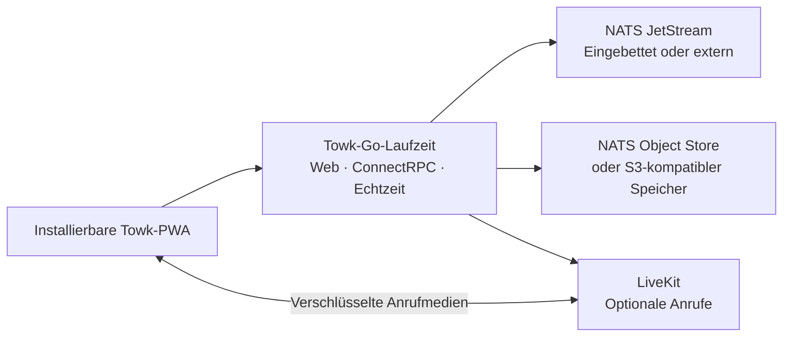

<div align="center">
  <picture>
    <source media="(prefers-color-scheme: dark)" srcset="branding/towk-horizontal-on-dark.webp" />
    <source media="(prefers-color-scheme: light)" srcset="branding/towk-horizontal-on-light.webp" />
    
  </picture>

  <h3>Kommunikation, die in deiner Hand bleibt.</h3>

  <p>
    Ein selbst gehosteter Kommunikationsarbeitsbereich für Teams und Communities.<br />
    Nachrichten, Dateien, Benachrichtigungen, Sprach- und Videoanrufe — auf der Infrastruktur deiner Wahl.
  </p>

  <p>
    <a href="README.md">English</a> ·
    <a href="README.de.md"><strong>Deutsch</strong></a> ·
    <a href="README.fr.md">Français</a> ·
    <a href="README.es.md">Español</a> ·
    <a href="README.pt.md">Português</a>
  </p>

  <p>
    <a href="https://github.com/Yo-DDV/Towk/releases"></a>
    
    
    
    <a href="SECURITY.md"></a>
    <a href="LICENSING.md"></a>
  </p>

  <p>
    <a href="#why-towk">Warum Towk</a> ·
    <a href="#what-you-get-today">Funktionsumfang</a> ·
    <a href="#security-and-privacy">Sicherheit & Datenschutz</a> ·
    <a href="#deploy-your-way">Bereitstellung</a> ·
    <a href="#try-towk-locally">Schnellstart</a> ·
    <a href="#project-status">Projektstatus</a>
  </p>
</div>

> [!IMPORTANT]
> **Towk wird aktiv entwickelt und hat Version 1.0 noch nicht erreicht.** Binde
> wichtige Installationen an eine unveränderliche Version, einen Image-Digest
> oder einen Quellcode-Commit, halte getestete Sicherungen vor, prüfe Upgrades in
> einer Staging-Umgebung und lies vor einem Versionswechsel die Release Notes.

<picture>
  <source media="(prefers-color-scheme: dark)" srcset="apps/docs-website/src/assets/towk_dark.png" />
  <source media="(prefers-color-scheme: light)" srcset="apps/docs-website/src/assets/towk_light.png" />
  
</picture>

## Kommunikation, ohne die Kontrolle abzugeben

Towk bringt die alltägliche Teamkommunikation auf eine Infrastruktur, die **du**
auswählst. Es gibt kein zentrales Towk-Konto, keinen verpflichtenden, von Towk
betriebenen Dienst und keine integrierten Produktanalysen oder Tracker von
Drittanbietern. Jede Installation dient einer Organisation oder Community und
bleibt eine eigenständige Verwaltungs- und Datenschutzgrenze.

Diese Unabhängigkeit ist beabsichtigt. Towk ist kein föderiertes Netzwerk und
kopiert Community-Daten nicht zwischen Servern. Der installierbare Webclient kann
sich direkt mit den Servern verbinden, die ein Benutzer hinzufügt. Der jeweilige
Betreiber behält die Kontrolle über Konten, Identitätsanbieter, Speicher,
Sicherungen, Aufbewahrung und öffentliche Erreichbarkeit.

<a id="why-towk"></a>
## Warum Towk

<table>
<tr>
<td width="50%" valign="top">

### Bestimme deine Grenze selbst

Wähle Host, Region, Domain, Identitätsanbieter, Speicher und Sicherungsstrategie.
Towk benötigt weder einen gemeinsamen Mandanten bei einem Anbieter noch ein vom
Projekt betriebenes Cloud-Konto.

</td>
<td width="50%" valign="top">

### Vereine die wichtigen Werkzeuge

Räume, Direktnachrichten, Threads, Dateien, Benachrichtigungen und Anrufe liegen
in einem responsiven Arbeitsbereich statt in voneinander getrennten Diensten.

</td>
</tr>
<tr>
<td width="50%" valign="top">

### Starte kompakt und wachse bewusst

Betreibe Web-App, API, Echtzeitdienst und einen eingebetteten NATS-Datenspeicher
in einer Binärdatei. Wechsle erst bei echtem Betriebsbedarf zu externem NATS,
S3-kompatiblem Speicher und LiveKit.

</td>
<td width="50%" valign="top">

### Betreibe ein nachvollziehbares System

Towk nutzt Protobuf-basierte APIs, dokumentierte ADRs und FDRs,
reproduzierbare Werkzeuge sowie Release-Artefakte, die mit SBOM- und
Provenienzdaten an genaue Quellcode-Commits gebunden sind.

</td>
</tr>
</table>

### Bewusst fokussiert

Towk versucht nicht, jede Ebene einer großen gehosteten Collaboration-Suite
nachzubauen. Die Produktlinie konzentriert sich darauf, die täglich genutzten
Grundlagen — Gespräche, Navigation, Benachrichtigungen, Dateien und Anrufe —
kohärent, reaktionsschnell und angenehm zu machen, bevor die Oberfläche erweitert
wird. Neue Komplexität muss ein klares Problem für Benutzer oder Betreiber lösen.

<a id="what-you-get-today"></a>
## Was heute enthalten ist

| Bereich | Aktuelle Funktionen |
| --- | --- |
| **Gespräche** | Räume, Direktnachrichten, Antworten, Threads, Reaktionen, Erwähnungen, Anwesenheit, Mitgliedersuche und Nachrichtensuche |
| **Inhalte** | Dateianhänge, Bilder, Linkvorschauen, Sprachnachrichten und optionale Videoverarbeitung |
| **Anrufe** | Raumbezogene Sprach- und Videoanrufe über LiveKit, Freigabe von Bildschirm, Fenster oder Tab, Geräteverwaltung und Medien-E2EE |
| **Benachrichtigungen** | Echtzeitaktualisierungen, konfigurierbare Benachrichtigungsstufen, Badges, Web Push und native Benachrichtigungsnavigation |
| **Installierbare PWA** | Responsiver Desktop-/Mobilclient, Offline-Shell, verschlüsselte lokale Entwürfe, ausstehende Nachrichten und letzte Zeitachsen, OS-Freigaben und fähigkeitsabhängige Anrufintegrationen |
| **Identität & Administration** | E-Mail-/Passwortabläufe, OAuth/OIDC, unabhängige Konten je Server, integrierte und benutzerdefinierte Rollen, granulare Berechtigungen, Raumüberschreibungen und Administrationswerkzeuge |
| **Betrieb & Integration** | Eingebettetes oder externes NATS, optionaler S3-kompatibler Objektspeicher, Prometheus-kompatible Metriken, Protobuf-/ConnectRPC-APIs, Echtzeit-WebSocket und lokale Operator-API/CLI |
| **Sprachen** | Oberflächenkataloge auf Englisch, Deutsch, Französisch, Spanisch und Portugiesisch |

<a id="security-and-privacy"></a>
## Sicherheit und Datenschutz ohne vage Versprechen

Towk betrachtet präzise Grenzen als Teil des Produkts. Das Projekt behauptet
nicht, dass jedes gespeicherte Byte verschlüsselt, jeder Kommunikationspfad
Ende-zu-Ende-verschlüsselt oder jede selbst gehostete Installation automatisch
sicher sei.

| Grenze | Was Towk heute umsetzt |
| --- | --- |
| **Telemetrie** | Es sind keine Produktanalysen oder Tracker von Drittanbietern integriert. Ein selbst gehosteter Server sendet weder Gespräche noch Kontodaten an den Towk-Projektinhaber. Betreiber können lokale Metriken für die eigene Überwachung bereitstellen. |
| **Authentifizierung** | Undurchsichtige serverseitige Zugangsdaten, signierte Browser-Cookies, optionale Cookie-Verschlüsselung, Schutz vor Enumeration bei sensiblen E-Mail-Abläufen und replikatübergreifende Authentifizierungs-Limits. |
| **Autorisierung** | Zugriffskontrolle an der API-Grenze mit integrierten und benutzerdefinierten Rollen, expliziten Erlaubnissen und Verweigerungen, raumspezifischen Überschreibungen und Berechtigungsprüfungen vor Domain-Änderungen. |
| **Anwendungsseitige Verschlüsselung** | Nachrichtentext und ausgewählte dauerhaft gespeicherte PII-Felder werden vor dem Speichern mit benutzerspezifischen Schlüsseln verschlüsselt. Anhänge, Avatare und wesentliche Ereignismetadaten liegen außerhalb dieser Hülle und benötigen Schutz auf Infrastrukturebene. |
| **Anrufe** | Wenn LiveKit-Anrufe aktiviert sind, stellt Towk schlüsselmaterial pro Anruf bereit und aktiviert Medien-E2EE. Daraus folgt keine Ende-zu-Ende-Verschlüsselung für Signalisierung, Mitgliedschaft oder Betriebsmetadaten. |
| **Wiederherstellung** | Sicherungen können mit age verschlüsselt werden. Daten, Schlüsselexporte, NATS-Speicher und S3-basierte Assets müssen entsprechend der Wiederherstellungs- und Löschstrategie des Betreibers geschützt und aufbewahrt werden. |

Lies vor einer Bereitstellung das aktuelle Modell im Detail:
[Sicherheit & Datenschutz](apps/docs-website/src/content/docs/guides/operations/security.mdx) ·
[Verschlüsselung und Datenlöschung](apps/docs-website/src/content/docs/guides/operations/privacy-erasure.mdx) ·
[Sicherung und Wiederherstellung](apps/docs-website/src/content/docs/guides/operations/backup-restore.mdx) ·
[Sicherheitsrichtlinie](SECURITY.md)

## Ein Client für jeden geeigneten Browser

Towks primärer Client ist eine installierbare Progressive Web App für aktuelle
Desktop- und Mobilbrowser. Derselbe Client passt sich vom normalen Browser-Tab
bis zur installierten App an und nutzt Plattformfunktionen nur dann, wenn sie
tatsächlich verfügbar sind.

- Der Service Worker speichert die ausführbare Shell, nicht private API-Antworten
  oder geschützte Chat-Assets.
- Kontobezogene Entwürfe, ausstehende Textnachrichten, vorbereitete Anhänge und
  begrenzte letzte Zeitachsen werden mit gerätelokalen Browser-Schlüsseln
  verschlüsselt.
- Offline-Inhalte werden als zwischengespeicherter oder getrennter Zustand
  angezeigt — nie als maßgebliche Live-Antwort des Servers.
- Share Targets, Dateihandler, Web Push, Badges, Wake Lock, Media Session und
  Picture-in-Picture sind progressive Erweiterungen, keine harten Abhängigkeiten.

Eigene App-Store-Pakete werden derzeit nicht veröffentlicht. Die PWA bleibt die
einzige Produktoberfläche, damit Interaktion, Sicherheitsupdates und
Funktionsverhalten nicht auf getrennte Clients auseinanderlaufen.

<a id="deploy-your-way"></a>
## Wähle deine Bereitstellungsform

| Weg | Geeignet für | Aufbau |
| --- | --- | --- |
| **Eine Binärdatei** | Lokale Evaluation, einfache VMs und kleine unabhängige Server | Towk stellt PWA, APIs und Echtzeitverkehr bereit und kann einen eingebetteten NATS-/JetStream-Datenspeicher ausführen. |
| **Docker Compose** | Die meisten selbst gehosteten Installationen auf einem Host | Explizite Verdrahtung von Towk, NATS, Caddy und LiveKit mit persistenten Volumes und betreiberkontrollierter Konfiguration. |
| **Externe Dienste** | Betreiber, die Trennung oder Wachstum benötigen | Verbinde Towk mit externem NATS, S3-kompatiblem Objektspeicher, SMTP, LiveKit und Überwachungssystemen. |
| **Kubernetes** | Teams, die Kubernetes bereits betreiben | Ein betreiberverwalteter Bereitstellungsweg. Das Beispiel ist keine pauschale Hochverfügbarkeitsgarantie; NATS, Speicher, Ingress und Ausfallgrenzen bleiben Betreiberaufgaben. |

Beginne mit dem Entscheidungsleitfaden:
[Zuerst lesen](apps/docs-website/src/content/docs/guides/deployment/read-this-first.mdx) ·
[Standalone-Binärdatei](apps/docs-website/src/content/docs/guides/deployment/binary.mdx) ·
[Docker Compose](examples/dockercompose/README.md) ·
[Kubernetes](examples/k8s/README.md)

<details>
<summary><strong>Architektur auf einen Blick</strong></summary>



Der Client wird mit SvelteKit gebaut und in die Go-Distribution eingebettet.
Domain-Zustand wird als dauerhafte Protobuf-Ereignisse in NATS JetStream
geschrieben und über Projektionen bereitgestellt. Öffentliche Anfrage-/Antwort-
APIs verwenden ConnectRPC; Live-Aktualisierungen laufen über ein
Protobuf-WebSocket-Protokoll.

Siehe [Towk Architecture](docs/ARCHITECTURE.md), die
[Architecture Decision Records](docs/adr/INDEX.md) und die
[Feature Decision Records](docs/fdr/INDEX.md).

</details>

<a id="try-towk-locally"></a>
## Towk lokal ausprobieren

Towk nutzt [mise](https://mise.jdx.dev/), um die festgelegte
Entwicklungswerkzeugkette zu installieren.

```sh
git clone https://github.com/Yo-DDV/Towk.git
cd Towk
mise trust
mise run setup
mise dev
```

Öffne <http://localhost:4000>. Dies ist ein Entwicklungsarbeitsbereich und keine
Produktionskonfiguration. Die in [CONTRIBUTING.md](CONTRIBUTING.md)
dokumentierten Entwicklungskonten und Fixtures dürfen niemals auf einem
öffentlichen Server wiederverwendet werden.

Für eine dauerhafte Installation geht es mit dem
[Schnellstart](apps/docs-website/src/content/docs/getting-started/quick-start.mdx)
und den [Bereitstellungsleitfäden](apps/docs-website/src/content/docs/guides/deployment/read-this-first.mdx) weiter.

<a id="project-status"></a>
## Projektstatus

Towk wird unabhängig und öffentlich entwickelt und befindet sich weiterhin in
der `0.x`-Reihe. Das aktuelle Repository eignet sich zur Evaluation und für
Betreiber, die ihre eigene Installation validieren können. Vor 1.0 können sich
Schnittstellen, Konfiguration und Betriebsdokumentation jedoch noch ändern.

Bevor du Towk für wichtige Kommunikation einsetzt:

1. Binde die Installation an die genaue Version, den Image-Digest oder den
   Quellcode-Commit.
2. Teste Sicherung **und Wiederherstellung**, einschließlich Schlüssel- und
   Objektspeicherabdeckung.
3. Prüfe Browser, Benachrichtigungen und Anrufe auf den Geräten und Netzen, die
   deine Benutzer benötigen.
4. Teste Upgrades in Staging und lies vor einem Versionswechsel die Release Notes.
5. Überwache den Dienst und halte Host, NATS, Objektspeicher, Geheimnisse und
   Sicherungen innerhalb deiner Sicherheitsgrenze.

Verfolge [Roadmap](ROADMAP.md), [Releases](https://github.com/Yo-DDV/Towk/releases)
und [offene Arbeiten](https://github.com/Yo-DDV/Towk/issues) für den aktuellen Stand.

## Unabhängige Open-Source-Software

Towk ist ein unabhängiges Projekt auf Grundlage von
[Chatto](https://github.com/chattocorp/chatto). Es bewahrt sachliche Herkunft,
Urheberschaft des Upstreams und Lizenzhinweise, trifft aber eigene Produkt-,
Release-, Support- und Kompatibilitätsentscheidungen. Towk wird nicht von
ChattoCorp GmbH empfohlen, gesponsert, betrieben oder unterstützt.

Das Repository verwendet ein Lizenzmodell pro Datei:

- Server, CLI und gebündelte Serverartefakte stehen im Allgemeinen unter
  **AGPL-3.0-or-later**;
- ausdrücklich gekennzeichnete Frontend-, öffentliche API-, Dokumentations-,
  Integrations- und Beispielbereiche stehen unter **Apache-2.0**;
- Hinweise zu Drittanbietern stehen in [NOTICE](NOTICE), die genaue
  maschinenlesbare Grenze in [REUSE.toml](REUSE.toml).

Lies [LICENSING.md](LICENSING.md), [PROVENANCE.md](PROVENANCE.md),
[UPSTREAM.md](UPSTREAM.md) und [SOURCE.md](SOURCE.md), bevor du einen veränderten
Netzdienst weitergibst oder betreibst.

## Sicher teilnehmen

Die öffentliche Beteiligung beginnt mit Issues:

- [Einen reproduzierbaren Fehler melden](https://github.com/Yo-DDV/Towk/issues/new?template=bug_report.yml)
- [Eine fokussierte Funktion vorschlagen](https://github.com/Yo-DDV/Towk/issues/new?template=feature_request.yml)
- [Eine Nutzungs- oder Self-Hosting-Frage stellen](https://github.com/Yo-DDV/Towk/issues/new?template=question.yml)

Towk akzeptiert keine unaufgeforderten externen Pull Requests. Lies vor der
Teilnahme [CONTRIBUTING.md](CONTRIBUTING.md), [GOVERNANCE.md](GOVERNANCE.md) und
[SUPPORT.md](SUPPORT.md).

> [!CAUTION]
> Melde eine vermutete Sicherheitslücke niemals in einem öffentlichen Issue.
> Folge [SECURITY.md](SECURITY.md) und nutze die private Schwachstellenmeldung.
> Entferne Geheimnisse, personenbezogene Daten, private Nachrichten, rohe
> Produktionsprotokolle und nicht anonymisierte Screenshots aus jedem
> öffentlichen Bericht.

<div align="center">
  <p><strong>Deine Gespräche. Deine Infrastruktur. Deine Entscheidung.</strong></p>
  <p>
    <a href="apps/docs-website/src/content/docs/getting-started/introduction.mdx">Towk entdecken</a> ·
    <a href="apps/docs-website/src/content/docs/getting-started/quick-start.mdx">Lokal starten</a> ·
    <a href="ROADMAP.md">Die Richtung ansehen</a>
  </p>
</div>
