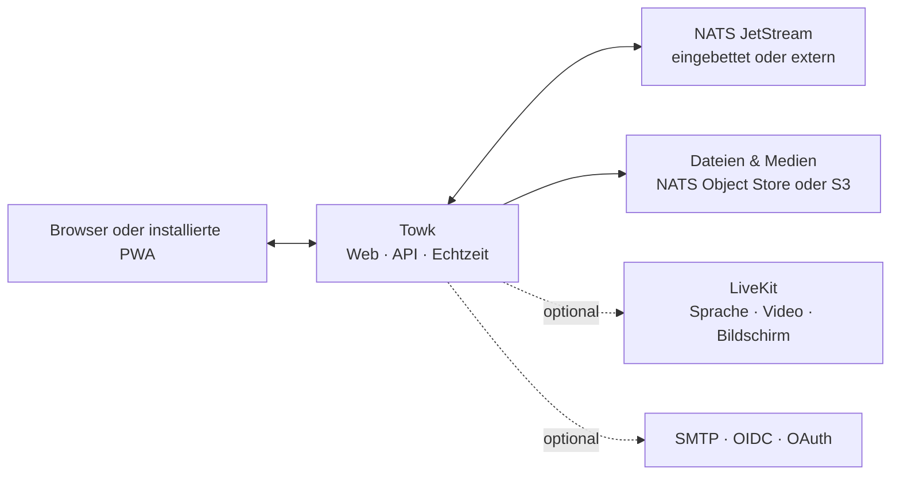

<div align="center">
  <picture>
    <source media="(prefers-color-scheme: dark)" srcset="branding/towk-horizontal-on-dark.webp" />
    <source media="(prefers-color-scheme: light)" srcset="branding/towk-horizontal-on-light.webp" />
    
  </picture>

  <p><strong>Deine Gespräche. Deine Infrastruktur.</strong></p>

  <p>
    Ein fokussierter, selbst gehosteter Kommunikationsarbeitsbereich für Teams und Communities.<br />
    Räume, Direktnachrichten, Dateien, Benachrichtigungen, Sprache und Video — ohne verpflichtenden Hosting-Dienst.
  </p>

  <p>
    <a href="README.md">English</a> ·
    <a href="README.fr.md">Français</a> ·
    <strong>Deutsch</strong> ·
    <a href="README.es.md">Español</a> ·
    <a href="README.pt.md">Português</a>
  </p>

  <p>
    <a href="https://github.com/Yo-DDV/Towk/actions/workflows/ci.yml"></a>
    <a href="ROADMAP.md"></a>
    <a href="LICENSING.md"></a>
    <a href="SECURITY.md"></a>
  </p>

  <p>
    <a href="#why-towk">Warum Towk</a> ·
    <a href="#capabilities">Funktionen</a> ·
    <a href="#data-control">Datenkontrolle</a> ·
    <a href="#architecture">Architektur</a> ·
    <a href="#run-towk">Towk starten</a> ·
    <a href="#project">Projekt</a>
  </p>
</div>

> [!IMPORTANT]
> Towk wird aktiv entwickelt und hat Version 1.0 noch nicht erreicht. Für
> wichtige Installationen solltest du unveränderliche Releases oder Image-Digests
> verwenden, Wiederherstellungen regelmäßig testen und vor Upgrades die
> Versionshinweise lesen.

<picture>
  <source media="(prefers-color-scheme: dark)" srcset="apps/docs-website/src/assets/towk_dark.png" />
  <source media="(prefers-color-scheme: light)" srcset="apps/docs-website/src/assets/towk_light.png" />
  
</picture>

<a id="why-towk"></a>
## Warum Towk

<table>
  <tr>
    <td width="33%" valign="top">
      <h3>Unabhängig konzipiert</h3>
      <p>Jede Installation bildet ihre eigene Betriebs- und Datenschutzgrenze. Es gibt weder ein zentrales Towk-Konto noch eine verpflichtende Towk-Cloud.</p>
    </td>
    <td width="33%" valign="top">
      <h3>Auf das Wesentliche fokussiert</h3>
      <p>Towk konzentriert sich auf die täglichen Interaktionen: Gespräche, Dateien, Benachrichtigungen und Anrufe — statt zu einer Plattform für alles zu werden.</p>
    </td>
    <td width="33%" valign="top">
      <h3>Erst kompakt, dann skalierbar</h3>
      <p>Starte mit einer Binärdatei und eingebettetem NATS. Wechsle bei Bedarf zu externem NATS, S3-kompatiblem Speicher, mehreren Replikaten und LiveKit.</p>
    </td>
  </tr>
</table>

> **Selbsthosting ist kein Häkchen.** Es bedeutet, selbst zu bestimmen, wo der
> Dienst läuft, wie er gesichert wird, welchen Identitätsanbietern er vertraut
> und aus welcher exakten Quellcode-Revision das bereitgestellte Artefakt stammt.

Towk ist bewusst **weder** ein föderiertes Protokoll **noch** ein gehostetes
SaaS. Ein Server gehört zu einer Organisation oder Community; der
installierbare Webclient kann sich mit den Towk-Servern verbinden, die seine
Nutzer hinzufügen.

<a id="capabilities"></a>
## Was heute verfügbar ist

| Bereich | Funktionen |
|---|---|
| **Gespräche** | Räume, Direktnachrichten, Antworten, Threads, Bearbeiten und Löschen, Reaktionen, Erwähnungen, Tippanzeigen und Präsenz |
| **Dateien & Medien** | Anhänge, Bildverarbeitung, Sprachnachrichten, Linkvorschauen, Dateiansicht pro Raum und optionale Videoverarbeitung |
| **Anrufe** | Optionale, LiveKit-gestützte Sprach- und Videoräume, Bildschirmfreigabe, Geräteauswahl und Ende-zu-Ende-Verschlüsselung der Anrufmedien |
| **Benachrichtigungen** | Echtzeitzustellung, Web Push, App-Badges, Erwähnungen und konfigurierbare Benachrichtigungsstufen pro Server oder Raum |
| **Administration** | Integrierte und benutzerdefinierte Rollen, granulare Berechtigungen, Raumgruppen, Server-Branding, Nutzerverwaltung und Diagnose |
| **Identität** | Anmeldung per Passwort und E-Mail sowie konfigurierbare OIDC-, GitHub-, GitLab-, Google- und Discord-Anbieter |
| **Installierte PWA** | Responsive Oberfläche für Desktop und Mobilgeräte, Offline-Oberfläche, verschlüsselte Entwürfe, Postausgang und letzte Verläufe, Betriebssystemfreigabe und Dateiverarbeitung |
| **Sprachen** | Benutzeroberfläche auf Englisch, Deutsch, Französisch, Spanisch und Portugiesisch |
| **Integration** | Protobuf-orientierte ConnectRPC-API, Echtzeit-WebSocket-Protokoll, Operator-CLI/API und Unterstützung mehrerer Server im Client |

Die Funktionsverträge werden öffentlich in den
[Feature Decision Records](docs/fdr/INDEX.md) dokumentiert — einschließlich
Verhalten, Abwägungen und aktuellen Einschränkungen. Die verlinkte technische
Projektdokumentation wird derzeit auf Englisch gepflegt.

<a id="data-control"></a>
## Souveränität, konkret umgesetzt

| Kontrolle | Was Towk bereitstellt |
|---|---|
| **Bereitstellungsgrenze** | Einen unabhängig betriebenen Server je Organisation oder Community, ohne zentrale Towk-Identität oder verpflichtende gehostete Steuerungsebene |
| **Datenablage** | Eingebettete oder externe NATS-Persistenz, NATS Object Store oder S3-kompatiblen Dateispeicher sowie dokumentierte Sicherungs- und Wiederherstellungswege |
| **Identitätsrichtlinie** | Lokale Passwort-/E-Mail-Konten oder ausgewählte externe Identitätsanbieter, einschließlich eines selbst gehosteten OIDC-Anbieters |
| **Schlüssellebenszyklus** | Nutzerbezogene Verschlüsselung für Nachrichtentexte und ausgewählte dauerhaft gespeicherte Identitätsfelder, mit Krypto-Löschung bei Kontolöschung |
| **Artefakt-Nachvollziehbarkeit** | Öffentlichen Quellcode, unveränderliche Release-Koordinaten, OCI-Metadaten zum exakten Commit, SBOMs, Schwachstellen-Scans und Provenienzbestätigungen |
| **Betriebliche Transparenz** | Health- und Readiness-Endpunkte, Prometheus-kompatible Metriken, Diagnose, administratives Ereignisprotokoll und reproduzierbares Performance-Protokoll |

> [!NOTE]
> Selbsthosting macht eine Installation nicht automatisch sicher oder
> regelkonform. Towk verschlüsselt Nachrichtentexte und ausgewählte dauerhaft
> gespeicherte Nutzerdaten **im Ruhezustand**; für Textunterhaltungen gibt es
> derzeit keine Ende-zu-Ende-Verschlüsselung. Ein Betreiber mit Kontrolle über
> Server, Speicher und Schlüssel bleibt Teil der Vertrauensgrenze. Anhänge und
> viele Metadaten liegen außerhalb dieser Verschlüsselungshülle. LiveKit-
> Anrufmedien unterstützen Ende-zu-Ende-Verschlüsselung, wenn Anrufe aktiviert
> sind.

Normale Anwendungsdaten und der integrierte Speicher für
Schlüsselverschlüsselungsschlüssel werden in Sicherungen standardmäßig
getrennt, sofern der Betreiber diese Schlüssel nicht ausdrücklich einbezieht
oder exportiert. Lies den
[Sicherheits- und Datenschutzleitfaden](apps/docs-website/src/content/docs/guides/operations/security.mdx)
sowie den
[Leitfaden zu Verschlüsselung und Löschung](apps/docs-website/src/content/docs/guides/operations/privacy-erasure.mdx),
bevor du Aufbewahrungs-, Sicherungs- oder Löschverfahren festlegst.

<a id="architecture"></a>
## Architektur im Überblick



Der responsive SvelteKit-Client wird in den Go-Server kompiliert. Öffentliche
Request/Response-APIs verwenden ConnectRPC und Protocol Buffers; Live-Updates
laufen über einen Protobuf-WebSocket. Dauerhafter Domänenzustand wird als
Ereignisstrom in NATS JetStream gespeichert und über Projektionen bereitgestellt.

Details findest du in der [Towk-Architektur](docs/ARCHITECTURE.md), den
[Architecture Decision Records](docs/adr/INDEX.md) und der
[öffentlichen API-Referenz](apps/docs-website/src/content/docs/reference/connectrpc-api/index.mdx).

<a id="run-towk"></a>
## Towk starten

### Entwicklungsumgebung

Towk verwendet [mise](https://mise.jdx.dev/), um die festgelegte
Projekt-Toolchain bereitzustellen:

```sh
git clone https://github.com/Yo-DDV/Towk.git
cd Towk
mise trust
mise run setup
mise dev
```

Die Entwicklungsoberfläche ist standardmäßig unter
<http://localhost:4000> erreichbar. Die Bootstrap-Konten sind in
[CONTRIBUTING.md](CONTRIBUTING.md) dokumentiert und dürfen niemals für eine
öffentliche Installation wiederverwendet werden.

### Bereitstellungsweg wählen

| Weg | Geeignet für | Leitfaden |
|---|---|---|
| **Docker Compose** | Das vollständigste Self-Hosting-Beispiel für einen einzelnen Server, mit externem NATS, Caddy und optionalem LiveKit | [Mit Docker Compose bereitstellen](apps/docs-website/src/content/docs/guides/deployment/docker-compose.mdx) |
| **Eigenständige Binärdatei** | Evaluierung, kompakte VMs und Betreiber, die bewusst eingebettetes NATS einsetzen | [Eigenständige Binärdatei ausführen](apps/docs-website/src/content/docs/guides/deployment/binary.mdx) |
| **Kubernetes** | Betreiber, die gemeinsames NATS, Ingress, Geheimnisse und Lifecycle-Werkzeuge selbst bereitstellen | [Kubernetes-Hinweise lesen](apps/docs-website/src/content/docs/guides/deployment/kubernetes.mdx) |

Beginne mit [Read This First](apps/docs-website/src/content/docs/guides/deployment/read-this-first.mdx).
Für dauerhafte Installationen solltest du ein unveränderliches Image-Tag samt
Digest statt eines beweglichen Tags verwenden.

### Die aktuelle Grenze kennen

| Towk kann gut passen, wenn du… | Prüfe besonders sorgfältig, wenn du Folgendes benötigst… |
|---|---|
| Kommunikationsgrenze, Identitätsrichtlinie und Datenstandort selbst betreiben möchtest | ein verwaltetes SaaS, vertraglichen Support oder ein SLA für Reaktionszeiten |
| einen responsiven, installierbaren Webclient für Desktop und Mobilgeräte bevorzugst | offizielle native Anwendungen aus mobilen oder Desktop-App-Stores |
| einen fokussierten Arbeitsbereich mit Räumen, Dateien, Benachrichtigungen und Anrufen schätzt | Föderation zwischen unabhängig verwalteten Communities |
| Upgrades, Sicherungen und Wiederherstellungen testen kannst, solange das Projekt noch vor Version 1.0 steht | stabile 1.0-APIs oder bereits heute Ende-zu-Ende-verschlüsselte Textunterhaltungen |

<a id="project"></a>
## Offenes Projekt, explizite Regeln

Towk wird öffentlich entwickelt, nimmt jedoch keine unaufgeforderten externen
Pull Requests an. Öffentliche Beteiligung beginnt mit einem fokussierten
GitHub-Issue, damit Produkt-, Sicherheits-, Kompatibilitäts- und
Wartungsgrenzen vor der Umsetzung bewertet werden können.

- [Reproduzierbaren Fehler melden](https://github.com/Yo-DDV/Towk/issues/new?template=bug_report.yml)
- [Abgegrenzte Funktion vorschlagen](https://github.com/Yo-DDV/Towk/issues/new?template=feature_request.yml)
- [Frage zu Nutzung oder Self-Hosting stellen](https://github.com/Yo-DDV/Towk/issues/new?template=question.yml)

Veröffentliche Schwachstellen nicht in öffentlichen Issues. Befolge
[SECURITY.md](SECURITY.md) und nutze GitHubs private
Schwachstellenmeldung.

<table>
  <tr>
    <td width="25%" valign="top"><strong><a href="ROADMAP.md">Roadmap</a></strong><br />Richtung ohne erfundene Lieferzusagen.</td>
    <td width="25%" valign="top"><strong><a href="GOVERNANCE.md">Governance</a></strong><br />Regeln für Verantwortung, Review und Releases.</td>
    <td width="25%" valign="top"><strong><a href="docs/PERFORMANCE.md">Performance</a></strong><br />Reproduzierbare Nachweise und Ablehnungsschwellen.</td>
    <td width="25%" valign="top"><strong><a href="PROVENANCE.md">Provenienz</a></strong><br />Herkunft, Attribution und selektive Upstream-Prüfung.</td>
  </tr>
</table>

## Lizenz und Herkunft

Towk verwendet SPDX- und REUSE-Metadaten pro Datei. Server, CLI und gebündelte
Serverartefakte stehen standardmäßig unter AGPL-3.0-or-later; ausdrücklich
aufgeführte Bereiche des Frontends, der öffentlichen API, der Dokumentation und
der Beispiele stehen unter Apache-2.0. Die genaue Grenze ist in
[LICENSING.md](LICENSING.md) und [REUSE.toml](REUSE.toml) beschrieben.

Towk ist ein unabhängiges Projekt auf Grundlage von
[Chatto](https://github.com/chattocorp/chatto). Chatto und seine Logos sind
Namen und Marken der ChattoCorp GmbH. Towk wird von der ChattoCorp GmbH weder
empfohlen noch gesponsert, betrieben oder unterstützt.
