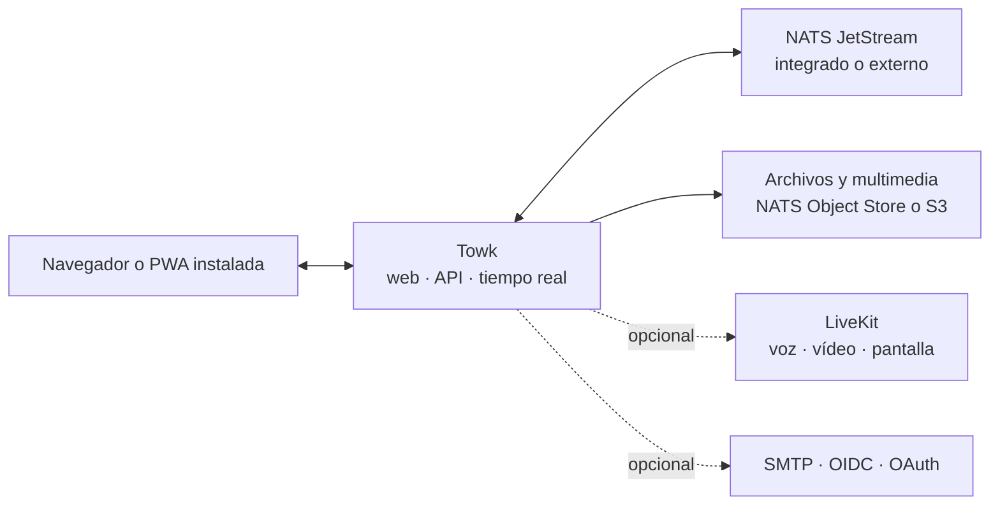

<div align="center">
  <picture>
    <source media="(prefers-color-scheme: dark)" srcset="branding/towk-horizontal-on-dark.webp" />
    <source media="(prefers-color-scheme: light)" srcset="branding/towk-horizontal-on-light.webp" />
    
  </picture>

  <p><strong>Tus conversaciones. Tu infraestructura.</strong></p>

  <p>
    Un espacio de comunicación autoalojado y centrado en lo esencial para equipos y comunidades.<br />
    Salas, mensajes directos, archivos, notificaciones, voz y vídeo — sin depender de un servicio alojado obligatorio.
  </p>

  <p>
    <a href="README.md">English</a> ·
    <a href="README.fr.md">Français</a> ·
    <a href="README.de.md">Deutsch</a> ·
    <strong>Español</strong> ·
    <a href="README.pt.md">Português</a>
  </p>

  <p>
    <a href="https://github.com/Yo-DDV/Towk/actions/workflows/ci.yml"></a>
    <a href="ROADMAP.md"></a>
    <a href="LICENSING.md"></a>
    <a href="SECURITY.md"></a>
  </p>

  <p>
    <a href="#why-towk">Por qué Towk</a> ·
    <a href="#capabilities">Funciones</a> ·
    <a href="#data-control">Control de datos</a> ·
    <a href="#architecture">Arquitectura</a> ·
    <a href="#run-towk">Ejecutar Towk</a> ·
    <a href="#project">Proyecto</a>
  </p>
</div>

> [!IMPORTANT]
> Towk está en desarrollo activo y todavía no ha alcanzado la versión 1.0. Para
> despliegues importantes, fija una versión inmutable o un digest de imagen,
> conserva copias de seguridad cuya restauración hayas probado y revisa las
> notas de la versión antes de actualizar.

<picture>
  <source media="(prefers-color-scheme: dark)" srcset="apps/docs-website/src/assets/towk_dark.png" />
  <source media="(prefers-color-scheme: light)" srcset="apps/docs-website/src/assets/towk_light.png" />
  
</picture>

<a id="why-towk"></a>
## Por qué Towk

<table>
  <tr>
    <td width="33%" valign="top">
      <h3>Independiente por diseño</h3>
      <p>Cada despliegue constituye su propio límite operativo y de protección de datos. No existe una cuenta central de Towk ni una nube de Towk obligatoria.</p>
    </td>
    <td width="33%" valign="top">
      <h3>Centrado en lo esencial</h3>
      <p>Towk se concentra en las interacciones cotidianas: conversaciones, archivos, notificaciones y llamadas — no en convertirse en una plataforma que lo abarque todo.</p>
    </td>
    <td width="33%" valign="top">
      <h3>Compacto primero, escalable después</h3>
      <p>Empieza con un solo binario y NATS integrado. Pasa a NATS externo, almacenamiento compatible con S3, varias réplicas y LiveKit cuando la operación lo requiera.</p>
    </td>
  </tr>
</table>

> **El autoalojamiento no es una casilla que marcar.** Significa elegir dónde se
> ejecuta el servicio, cómo se respalda, en qué proveedores de identidad confía
> y qué revisión exacta del código fuente produjo el artefacto desplegado.

Towk no pretende ser **ni** un protocolo federado **ni** un SaaS alojado. Cada
servidor pertenece a una organización o comunidad, mientras que el cliente web
instalable puede conectarse a los servidores Towk que el usuario decida añadir.

<a id="capabilities"></a>
## Lo que está disponible hoy

| Área | Funciones |
|---|---|
| **Conversaciones** | Salas, mensajes directos, respuestas, hilos, edición y eliminación, reacciones, menciones, indicadores de escritura y presencia |
| **Archivos y contenido multimedia** | Adjuntos, tratamiento de imágenes, mensajes de voz, vistas previas de enlaces, exploración de archivos por sala y procesamiento de vídeo opcional |
| **Llamadas** | Salas opcionales de voz y vídeo mediante LiveKit, pantalla compartida, controles de dispositivos y cifrado de extremo a extremo del contenido multimedia de cada llamada |
| **Notificaciones** | Entrega en tiempo real, Web Push, insignias de la aplicación, menciones y niveles de notificación configurables por servidor o sala |
| **Administración** | Roles integrados y personalizados, permisos granulares, grupos de salas, identidad visual del servidor, administración de usuarios y diagnósticos |
| **Identidad** | Flujos de contraseña y correo electrónico, además de proveedores configurables OIDC, GitHub, GitLab, Google y Discord |
| **PWA instalada** | Interfaz adaptable para escritorio y móvil, interfaz sin conexión, borradores, bandeja de salida e historiales recientes cifrados, uso compartido del sistema y gestión de archivos |
| **Idiomas** | Interfaz disponible en inglés, alemán, francés, español y portugués |
| **Integración** | API ConnectRPC basada en Protobuf, protocolo WebSocket en tiempo real, CLI/API de operador y compatibilidad multiserver en el cliente |

Los contratos funcionales están documentados públicamente en los
[Feature Decision Records](docs/fdr/INDEX.md), junto con su comportamiento,
decisiones de diseño y limitaciones actuales. La documentación técnica enlazada
se mantiene actualmente en inglés.

<a id="data-control"></a>
## Soberanía, de forma concreta

| Control | Lo que ofrece Towk |
|---|---|
| **Límite de despliegue** | Un servidor operado de forma independiente por organización o comunidad, sin identidad central de Towk ni plano de control alojado obligatorio |
| **Ubicación de los datos** | Persistencia NATS integrada o externa, archivos en NATS Object Store o almacenamiento compatible con S3, y procedimientos documentados de copia y restauración |
| **Política de identidad** | Cuentas locales con contraseña/correo o proveedores de identidad externos seleccionados, incluido un proveedor OIDC autoalojado |
| **Ciclo de vida de las claves** | Cifrado por usuario para el texto de los mensajes y determinados campos de identidad persistentes, con criptoborrado al eliminar la cuenta |
| **Trazabilidad de artefactos** | Código fuente público, coordenadas de versión inmutables, metadatos OCI ligados al commit exacto, SBOM, análisis de vulnerabilidades y atestaciones de procedencia |
| **Visibilidad operativa** | Endpoints de salud y disponibilidad, métricas compatibles con Prometheus, diagnósticos, registro administrativo de eventos y protocolo de rendimiento reproducible |

> [!NOTE]
> El autoalojamiento no convierte por sí solo un despliegue en seguro o conforme.
> Towk cifra **en reposo** el texto de los mensajes y determinados datos
> persistentes de usuario; actualmente no ofrece cifrado de extremo a extremo
> para conversaciones de texto. Un operador que controla el servidor, el
> almacenamiento y las claves permanece dentro del límite de confianza. Los
> adjuntos y muchos metadatos quedan fuera de esta envoltura. El contenido
> multimedia de las llamadas LiveKit admite cifrado de extremo a extremo cuando
> las llamadas están activadas.

Las copias de seguridad separan por defecto los datos ordinarios de la
aplicación del almacén integrado de claves de cifrado, salvo que el operador
incluya o exporte esas claves expresamente. Consulta la
[guía de seguridad y privacidad](apps/docs-website/src/content/docs/guides/operations/security.mdx)
y la
[guía de cifrado y borrado](apps/docs-website/src/content/docs/guides/operations/privacy-erasure.mdx)
antes de diseñar procedimientos de retención, copia o eliminación.

<a id="architecture"></a>
## Arquitectura de un vistazo



El cliente adaptable SvelteKit se compila dentro del servidor Go. Las API
públicas de solicitud/respuesta utilizan ConnectRPC y Protocol Buffers; las
actualizaciones en vivo utilizan un WebSocket Protobuf. El estado de dominio
duradero se registra como eventos en NATS JetStream y se sirve mediante
proyecciones.

Para ver el inventario detallado, consulta la
[arquitectura de Towk](docs/ARCHITECTURE.md), los
[Architecture Decision Records](docs/adr/INDEX.md) y la
[referencia de la API pública](apps/docs-website/src/content/docs/reference/connectrpc-api/index.mdx).

<a id="run-towk"></a>
## Ejecutar Towk

### Entorno de desarrollo

Towk utiliza [mise](https://mise.jdx.dev/) para proporcionar las versiones
fijadas de las herramientas del proyecto:

```sh
git clone https://github.com/Yo-DDV/Towk.git
cd Towk
mise trust
mise run setup
mise dev
```

La aplicación de desarrollo está disponible de forma predeterminada en
<http://localhost:4000>. Las cuentas iniciales están documentadas en
[CONTRIBUTING.md](CONTRIBUTING.md) y nunca deben reutilizarse en un despliegue
público.

### Elegir una vía de despliegue

| Vía | Adecuada para | Guía |
|---|---|---|
| **Docker Compose** | El ejemplo más completo de autoalojamiento en un solo servidor, con NATS externo, Caddy y LiveKit opcional | [Desplegar con Docker Compose](apps/docs-website/src/content/docs/guides/deployment/docker-compose.mdx) |
| **Binario independiente** | Evaluación, máquinas virtuales compactas y operadores que eligen deliberadamente NATS integrado | [Ejecutar el binario independiente](apps/docs-website/src/content/docs/guides/deployment/binary.mdx) |
| **Kubernetes** | Operadores que aportan su propio NATS compartido, ingress, secretos y herramientas de ciclo de vida | [Revisar la guía de Kubernetes](apps/docs-website/src/content/docs/guides/deployment/kubernetes.mdx) |

Empieza por [Leer antes de desplegar](apps/docs-website/src/content/docs/guides/deployment/read-this-first.mdx).
Para despliegues duraderos, usa una etiqueta de imagen y un digest inmutables,
no una etiqueta flotante.

### Conocer el límite actual

| Towk puede encajar cuando… | Evalúa con especial cuidado cuando necesites… |
|---|---|
| quieres operar tú mismo el límite de comunicación, la política de identidad y la ubicación de los datos | un SaaS gestionado, soporte contractual o un SLA de tiempo de respuesta |
| prefieres un único cliente web adaptable e instalable en escritorio y móvil | aplicaciones nativas oficiales distribuidas mediante tiendas móviles o de escritorio |
| valoras un espacio centrado en salas, archivos, notificaciones y llamadas | federación entre comunidades administradas de forma independiente |
| puedes probar actualizaciones, copias y restauraciones mientras el proyecto es anterior a 1.0 | API 1.0 estables o conversaciones de texto cifradas de extremo a extremo hoy |

<a id="project"></a>
## Un proyecto abierto con reglas explícitas

Towk se desarrolla públicamente, pero no acepta pull requests externos no
solicitados. La participación pública empieza con un Issue específico para
evaluar las restricciones de producto, seguridad, compatibilidad y
mantenimiento antes de implementar un cambio.

- [Informar de un error reproducible](https://github.com/Yo-DDV/Towk/issues/new?template=bug_report.yml)
- [Proponer una función acotada](https://github.com/Yo-DDV/Towk/issues/new?template=feature_request.yml)
- [Plantear una pregunta de uso o autoalojamiento](https://github.com/Yo-DDV/Towk/issues/new?template=question.yml)

No divulgues vulnerabilidades en público. Sigue [SECURITY.md](SECURITY.md) y
utiliza el sistema privado de GitHub para informar de vulnerabilidades.

<table>
  <tr>
    <td width="25%" valign="top"><strong><a href="ROADMAP.md">Hoja de ruta</a></strong><br />Dirección sin promesas de entrega inventadas.</td>
    <td width="25%" valign="top"><strong><a href="GOVERNANCE.md">Gobernanza</a></strong><br />Reglas de propiedad, revisión y publicación.</td>
    <td width="25%" valign="top"><strong><a href="docs/PERFORMANCE.md">Rendimiento</a></strong><br />Pruebas reproducibles y umbrales de rechazo.</td>
    <td width="25%" valign="top"><strong><a href="PROVENANCE.md">Procedencia</a></strong><br />Origen, atribución y revisión selectiva del proyecto ascendente.</td>
  </tr>
</table>

## Licencia y origen

Towk utiliza metadatos SPDX y REUSE por archivo. El servidor, la CLI y los
artefactos de servidor incluidos usan AGPL-3.0-or-later de forma predeterminada;
las superficies explícitamente enumeradas del frontend, la API pública, la
documentación y los ejemplos usan Apache-2.0. Consulta
[LICENSING.md](LICENSING.md) y [REUSE.toml](REUSE.toml) para conocer el límite
exacto.

Towk es un proyecto independiente basado en
[Chatto](https://github.com/chattocorp/chatto). Chatto y sus logotipos son
nombres y marcas de ChattoCorp GmbH. Towk no está avalado, patrocinado, operado
ni respaldado por ChattoCorp GmbH.
