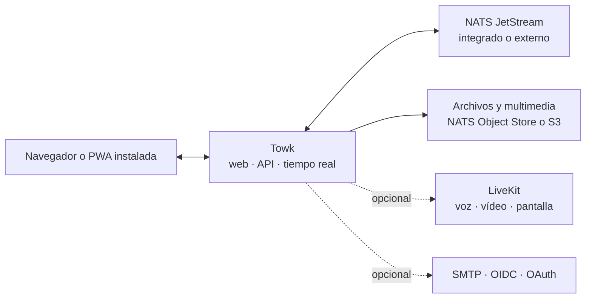

<div align="center">
  <picture>
    <source media="(prefers-color-scheme: dark)" srcset="branding/towk-horizontal-on-dark.webp" />
    <source media="(prefers-color-scheme: light)" srcset="branding/towk-horizontal-on-light.webp" />
    
  </picture>

  <p><strong>Tus conversaciones. Tu infraestructura.</strong></p>

  <p>
    Un espacio de comunicación autoalojado y centrado en lo esencial para equipos y comunidades.<br />
    Chat, archivos, notificaciones y llamadas del día a día — sin un servicio alojado obligatorio.
  </p>

  <p>
    <a href="README.md">English</a> ·
    <a href="README.fr.md">Français</a> ·
    <a href="README.de.md">Deutsch</a> ·
    <strong>Español</strong> ·
    <a href="README.pt.md">Português</a>
  </p>

  <p>
    <a href="ROADMAP.md"></a>
    
    
    <a href=".github/workflows/refresh-readme-metrics.yml"></a>
    <a href="LICENSING.md"></a>
  </p>

  <p>
    <a href="#why-towk">Por qué Towk</a> ·
    <a href="#development-pulse">Ritmo</a> ·
    <a href="#capabilities">Funciones</a> ·
    <a href="#architecture">Arquitectura</a> ·
    <a href="#run-towk">Ejecutar Towk</a> ·
    <a href="#project">Proyecto</a>
  </p>
</div>

<picture>
  <source media="(max-width: 600px)" srcset="https://raw.githubusercontent.com/Yo-DDV/Towk/readme-metrics/es/hero-mobile.svg" />
  
</picture>

<p align="center">
  <a href="apps/docs-website/src/content/docs/getting-started/quick-start.mdx"><strong>🚀 Ejecutar Towk</strong></a>
  &nbsp;·&nbsp;
  <a href="apps/docs-website/src/content/docs/guides/deployment/docker-compose.mdx"><strong>📦 Desplegar</strong></a>
  &nbsp;·&nbsp;
  <a href="apps/docs-website/src/content/docs/guides/operations/security.mdx"><strong>🛡️ Modelo de seguridad</strong></a>
  &nbsp;·&nbsp;
  <a href="ROADMAP.md"><strong>🗺️ Hoja de ruta</strong></a>
</p>

> [!IMPORTANT]
> Towk está en desarrollo activo y aún no ha alcanzado la versión 1.0. Para
> despliegues importantes, fija una versión o un digest de imagen inmutable,
> conserva copias de seguridad cuya restauración hayas probado y revisa las
> notas de versión antes de actualizar.

<picture>
  <source media="(prefers-color-scheme: dark)" srcset="apps/docs-website/src/assets/towk_dark.png" />
  <source media="(prefers-color-scheme: light)" srcset="apps/docs-website/src/assets/towk_light.png" />
  
</picture>

<a id="why-towk"></a>
## Por qué Towk

<table>
  <tr>
    <td width="33%" valign="top">
      <h3>🛡️ Independiente por diseño</h3>
      <p><strong>Tu despliegue define el perímetro.</strong> No hay una cuenta central de Towk, una nube Towk obligatoria ni un plano de control compartido entre organizaciones.</p>
    </td>
    <td width="33%" valign="top">
      <h3>🎯 Centrado en la comunicación diaria</h3>
      <p><strong>Los fundamentos merecen atención de primera clase.</strong> Towk prioriza conversaciones, archivos, notificaciones y llamadas en lugar de convertirse en una plataforma para todo.</p>
    </td>
    <td width="33%" valign="top">
      <h3>⚙️ Compacto primero, escalable después</h3>
      <p><strong>Empieza con un solo proceso.</strong> Pasa a NATS externo, almacenamiento compatible con S3, varias réplicas y LiveKit solo cuando la operación lo requiera.</p>
    </td>
  </tr>
</table>

> **El autoalojamiento no es una casilla que marcar.** Significa elegir dónde se
> ejecuta el servicio, cómo se respalda, en qué proveedores de identidad confía,
> dónde viven los archivos y qué revisión exacta del código fuente produjo el
> artefacto desplegado.

Towk no pretende ser **ni** un protocolo federado **ni** un SaaS alojado. Es una
alternativa de código abierto y enfocada para equipos y comunidades que quieren
gestionar su propio espacio de comunicación — sin afirmar que sustituye cada
función de todas las plataformas de colaboración.

<a id="development-pulse"></a>
## Ritmo de desarrollo

<picture>
  <source media="(max-width: 600px)" srcset="https://raw.githubusercontent.com/Yo-DDV/Towk/readme-metrics/es/activity-mobile.svg" />
  
</picture>

<picture>
  <source media="(max-width: 600px)" srcset="https://raw.githubusercontent.com/Yo-DDV/Towk/readme-metrics/es/contributors-mobile.svg" />
  
</picture>

<details>
  <summary><strong>Cómo se generan estas métricas</strong></summary>

  El propio repositorio genera estos SVG a partir de la API de GitHub con su
  `GITHUB_TOKEN` limitado al repositorio; no utiliza un token personal ni un
  servicio externo de estadísticas. El workflow se ejecuta después de cada push
  a `main` y aproximadamente a las **06:17 y 21:17 en la zona horaria Europe/Paris**,
  cada día.

  La ventana cubre los últimos 365 días. Los commits se leen del historial
  alcanzable desde `main` y se agrupan por su marca temporal de commit en UTC.
  Las pull requests se cuentan por `merged_at`. Las clasificaciones usan la
  identidad de GitHub atribuida a cada commit de `main` o pull request fusionada;
  los bots detectados se excluyen de las clasificaciones humanas y se muestran
  por separado. Los mensajes de commit y las direcciones de correo electrónico
  no se escriben en la rama generada.

  Los SVG y la instantánea legible por máquina se publican en la rama
  [`readme-metrics`](https://github.com/Yo-DDV/Towk/tree/readme-metrics).
</details>

<a id="capabilities"></a>
## Qué incluye hoy

<table>
  <tr>
    <td width="33%" valign="top">
      <h3>💬 Conversaciones</h3>
      <p>Salas, mensajes directos, respuestas, hilos, edición y eliminación, reacciones, menciones, indicadores de escritura y presencia.</p>
    </td>
    <td width="33%" valign="top">
      <h3>📎 Archivos y multimedia</h3>
      <p>Adjuntos, tratamiento de imágenes, mensajes de voz, vistas previas de enlaces, exploración de archivos por sala y procesamiento de vídeo opcional.</p>
    </td>
    <td width="33%" valign="top">
      <h3>📞 Llamadas y aplicación instalada</h3>
      <p>Salas de voz/vídeo opcionales con LiveKit, pantalla compartida, E2EE de los medios de llamada y una PWA adaptable e instalable.</p>
    </td>
  </tr>
  <tr>
    <td width="33%" valign="top">
      <h3>🔐 Identidad y continuidad local</h3>
      <p>Flujos de contraseña/correo, OIDC y proveedores OAuth seleccionados, además de borradores, bandeja de salida e historiales recientes cifrados en navegadores compatibles.</p>
    </td>
    <td width="33%" valign="top">
      <h3>🧭 Administración</h3>
      <p>Roles integrados y personalizados, permisos granulares, grupos de salas, identidad visual, administración de usuarios, diagnósticos y registro de eventos.</p>
    </td>
    <td width="33%" valign="top">
      <h3>🔌 API y operación</h3>
      <p>API ConnectRPC basadas en Protobuf, tramas WebSocket en tiempo real, CLI/API de operador, endpoints de salud, métricas y cliente multiservidor.</p>
    </td>
  </tr>
</table>

La interfaz está disponible en **inglés, alemán, francés, español y portugués**.
El comportamiento detallado, las decisiones y las limitaciones actuales están
documentados en los [Feature Decision Records](docs/fdr/INDEX.md).

## Soberanía, de forma concreta

<table>
  <tr>
    <td width="33%" valign="top"><h3>🏠 Despliegue</h3><p>Opera un servidor independiente por organización o comunidad, desde un binario compacto hasta un despliegue con réplicas.</p></td>
    <td width="33%" valign="top"><h3>🗄️ Ubicación de los datos</h3><p>Elige persistencia NATS integrada o externa y NATS Object Store o almacenamiento compatible con S3 para los archivos.</p></td>
    <td width="33%" valign="top"><h3>🪪 Política de identidad</h3><p>Usa cuentas locales con contraseña/correo o proveedores externos elegidos expresamente, incluido un proveedor OIDC autoalojado.</p></td>
  </tr>
  <tr>
    <td width="33%" valign="top"><h3>🔑 Ciclo de vida de las claves</h3><p>El texto de los mensajes y ciertos campos de identidad duraderos usan cifrado por usuario, con borrado criptográfico al eliminar la cuenta.</p></td>
    <td width="33%" valign="top"><h3>📦 Trazabilidad de las compilaciones</h3><p>Código público, coordenadas inmutables, metadatos OCI del commit exacto, SBOM, análisis de vulnerabilidades y atestaciones de procedencia.</p></td>
    <td width="33%" valign="top"><h3>📈 Visibilidad operativa</h3><p>Endpoints de salud y disponibilidad, métricas compatibles con Prometheus, diagnósticos, registro administrativo y controles de rendimiento reproducibles.</p></td>
  </tr>
</table>

> [!NOTE]
> Autoalojar no hace que un despliegue sea automáticamente seguro o conforme.
> Towk cifra **en reposo** el texto de los mensajes y ciertos datos duraderos del
> usuario; actualmente no ofrece cifrado de extremo a extremo para conversaciones
> de texto. Un operador que controla el servidor, el almacenamiento y las claves
> sigue dentro del perímetro de confianza. Los adjuntos y gran parte de los
> metadatos quedan fuera de esa envoltura. Los medios de las llamadas LiveKit
> admiten E2EE cuando las llamadas están habilitadas.

Las copias de seguridad separan deliberadamente los datos normales de la
aplicación del almacén integrado de claves de cifrado, salvo que el operador
incluya o exporte esas claves expresamente. Lee la
[guía de seguridad y privacidad](apps/docs-website/src/content/docs/guides/operations/security.mdx)
y la [guía de cifrado y eliminación](apps/docs-website/src/content/docs/guides/operations/privacy-erasure.mdx)
antes de definir políticas de retención, copia de seguridad o eliminación.

<a id="architecture"></a>
## Arquitectura de un vistazo



El cliente SvelteKit adaptable se compila dentro del servidor Go. Las API
públicas de petición/respuesta usan ConnectRPC y Protocol Buffers; las
actualizaciones en vivo usan un WebSocket Protobuf. El estado duradero del
dominio se almacena como eventos en NATS JetStream y se sirve mediante
proyecciones.

Consulta el [inventario de arquitectura](docs/ARCHITECTURE.md), los
[Architecture Decision Records](docs/adr/INDEX.md) y la
[referencia de la API pública](apps/docs-website/src/content/docs/reference/connectrpc-api/index.mdx).

<a id="run-towk"></a>
## Ejecutar Towk

### Entorno de desarrollo

Towk usa [mise](https://mise.jdx.dev/) para instalar la cadena de herramientas fijada:

```sh
git clone https://github.com/Yo-DDV/Towk.git
cd Towk
mise trust
mise run setup
mise dev
```

La interfaz de desarrollo está disponible por defecto en
<http://localhost:4000>. Las cuentas de arranque se documentan en
[CONTRIBUTING.md](CONTRIBUTING.md) y nunca deben reutilizarse en un despliegue
público.

### Elegir una ruta de despliegue

<table>
  <tr>
    <td width="33%" valign="top"><h3>📦 Docker Compose</h3><p>El ejemplo más completo para un solo servidor, con NATS externo, Caddy y LiveKit opcional.</p><p><a href="apps/docs-website/src/content/docs/guides/deployment/docker-compose.mdx"><strong>Abrir la guía →</strong></a></p></td>
    <td width="33%" valign="top"><h3>⚡ Binario autónomo</h3><p>Para evaluación, máquinas virtuales compactas y operadores que eligen conscientemente NATS integrado.</p><p><a href="apps/docs-website/src/content/docs/guides/deployment/binary.mdx"><strong>Abrir la guía →</strong></a></p></td>
    <td width="33%" valign="top"><h3>☸️ Kubernetes</h3><p>Para operadores que aportan su propio NATS compartido, ingress, secretos y herramientas de ciclo de vida.</p><p><a href="apps/docs-website/src/content/docs/guides/deployment/kubernetes.mdx"><strong>Abrir la guía →</strong></a></p></td>
  </tr>
</table>

Empieza por [Read This First](apps/docs-website/src/content/docs/guides/deployment/read-this-first.mdx).
Para despliegues duraderos, usa una etiqueta de imagen inmutable junto con su
digest, no una etiqueta flotante.

### Conocer el límite actual

| Towk puede encajar si… | Evalúa con especial cuidado si necesitas… |
|---|---|
| quieres gestionar tú mismo el perímetro de comunicación, la política de identidad y la ubicación de los datos | un SaaS administrado, soporte contractual o un SLA de tiempo de respuesta |
| prefieres un único cliente web adaptable e instalable para escritorio y móvil | aplicaciones nativas oficiales distribuidas mediante tiendas móviles o de escritorio |
| valoras un espacio enfocado con salas, archivos, notificaciones y llamadas | federación entre comunidades administradas de forma independiente |
| puedes probar actualizaciones, copias de seguridad y restauraciones mientras el proyecto está en fase pre-1.0 | API 1.0 estables o conversaciones de texto cifradas de extremo a extremo hoy |

<a id="project"></a>
## Proyecto abierto, reglas explícitas

Towk se desarrolla en público, pero no acepta pull requests externas no
solicitadas. La participación pública comienza con una Issue de GitHub bien
delimitada para evaluar las restricciones de producto, seguridad, compatibilidad
y mantenimiento antes de implementar.

<p align="center">
  <a href="https://github.com/Yo-DDV/Towk/issues/new?template=bug_report.yml"><strong>🐛 Informar de un error</strong></a>
  &nbsp;·&nbsp;
  <a href="https://github.com/Yo-DDV/Towk/issues/new?template=feature_request.yml"><strong>✨ Proponer una función</strong></a>
  &nbsp;·&nbsp;
  <a href="https://github.com/Yo-DDV/Towk/issues/new?template=question.yml"><strong>💬 Hacer una pregunta</strong></a>
</p>

No publiques vulnerabilidades. Sigue [SECURITY.md](SECURITY.md) y utiliza el
sistema privado de informes de vulnerabilidades de GitHub.

<table>
  <tr>
    <td width="25%" valign="top"><strong><a href="ROADMAP.md">🗺️ Hoja de ruta</a></strong><br />Dirección sin promesas de entrega inventadas.</td>
    <td width="25%" valign="top"><strong><a href="GOVERNANCE.md">⚖️ Gobernanza</a></strong><br />Reglas de responsabilidad, revisión y publicación.</td>
    <td width="25%" valign="top"><strong><a href="docs/PERFORMANCE.md">📊 Rendimiento</a></strong><br />Pruebas reproducibles y umbrales de rechazo.</td>
    <td width="25%" valign="top"><strong><a href="PROVENANCE.md">🔎 Procedencia</a></strong><br />Origen, atribución y revisión selectiva del upstream.</td>
  </tr>
</table>

## Licencia y origen

Towk usa metadatos SPDX y REUSE por archivo. El servidor, la CLI y los artefactos
de servidor incluidos usan AGPL-3.0-or-later por defecto; las superficies del
frontend, la API pública, la documentación y los ejemplos que se enumeran
explícitamente usan Apache-2.0. Consulta [LICENSING.md](LICENSING.md) y
[REUSE.toml](REUSE.toml) para ver el límite exacto.

Towk es un proyecto independiente basado en
[Chatto](https://github.com/chattocorp/chatto). Chatto y sus logotipos son nombres
y marcas de ChattoCorp GmbH. Towk no está recomendado, patrocinado, operado ni
respaldado por ChattoCorp GmbH.
