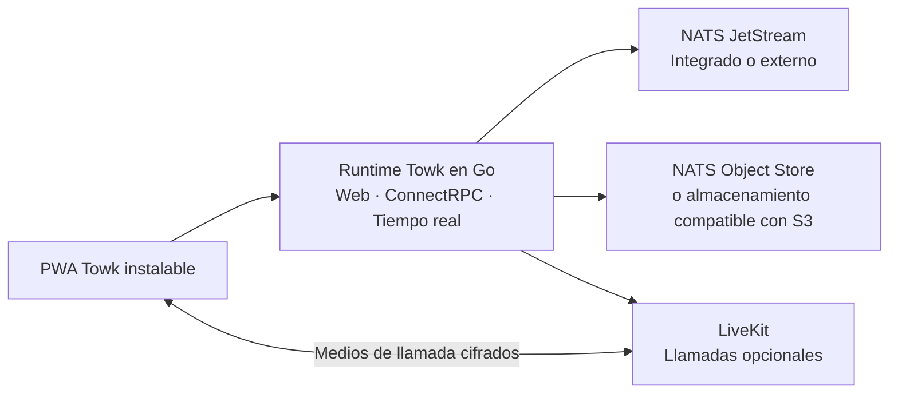

<div align="center">
  <picture>
    <source media="(prefers-color-scheme: dark)" srcset="branding/towk-horizontal-on-dark.webp" />
    <source media="(prefers-color-scheme: light)" srcset="branding/towk-horizontal-on-light.webp" />
    
  </picture>

  <h3>La comunicación que sigue siendo tuya.</h3>

  <p>
    Un espacio de comunicación autoalojado para equipos y comunidades.<br />
    Mensajes, archivos, notificaciones, voz y vídeo — en la infraestructura que tú elijas.
  </p>

  <p>
    <a href="README.md">English</a> ·
    <a href="README.de.md">Deutsch</a> ·
    <a href="README.fr.md">Français</a> ·
    <a href="README.es.md"><strong>Español</strong></a> ·
    <a href="README.pt.md">Português</a>
  </p>

  <p>
    <a href="https://github.com/Yo-DDV/Towk/releases"></a>
    
    
    
    <a href="SECURITY.md"></a>
    <a href="LICENSING.md"></a>
  </p>

  <p>
    <a href="#why-towk">Por qué Towk</a> ·
    <a href="#what-you-get-today">Funciones</a> ·
    <a href="#security-and-privacy">Seguridad y privacidad</a> ·
    <a href="#deploy-your-way">Despliegue</a> ·
    <a href="#try-towk-locally">Inicio rápido</a> ·
    <a href="#project-status">Estado del proyecto</a>
  </p>
</div>

> [!IMPORTANT]
> **Towk es software pre-1.0 en desarrollo activo.** Fija los despliegues
> importantes a una versión inmutable, un digest de imagen o un commit de código
> fuente; conserva copias de seguridad cuya restauración hayas probado; valida
> las actualizaciones en preproducción; y revisa las notas de versión antes de
> cambiar de versión.

<picture>
  <source media="(prefers-color-scheme: dark)" srcset="apps/docs-website/src/assets/towk_dark.png" />
  <source media="(prefers-color-scheme: light)" srcset="apps/docs-website/src/assets/towk_light.png" />
  
</picture>

## Comunícate sin ceder el control

Towk lleva la comunicación diaria de un equipo a una infraestructura que **tú**
eliges. No existe una cuenta central de Towk, ni un servicio alojado por Towk
obligatorio, ni analítica de producto o seguimiento de terceros integrados en la
aplicación. Cada despliegue sirve a una organización o comunidad y mantiene su
propio límite administrativo y de protección de datos.

Esa independencia es intencionada. Towk no es una red federada y no copia datos
de la comunidad entre servidores. Su cliente web instalable se conecta
directamente a los servidores que añade cada usuario, mientras que cada operador
conserva el control de las cuentas, los proveedores de identidad, el
almacenamiento, las copias de seguridad, la retención y la exposición pública.

<a id="why-towk"></a>
## Por qué Towk

<table>
<tr>
<td width="50%" valign="top">

### Controla tu propio límite

Elige el host, la región, el dominio, los proveedores de identidad, el
almacenamiento y la política de copias de seguridad. Towk no requiere un tenant
compartido con un proveedor ni una cuenta cloud operada por el proyecto.

</td>
<td width="50%" valign="top">

### Mantén unidas las funciones esenciales

Salas, mensajes directos, hilos, archivos, notificaciones y llamadas conviven en
un espacio adaptable en lugar de estar repartidos entre herramientas sin
relación entre sí.

</td>
</tr>
<tr>
<td width="50%" valign="top">

### Empieza de forma compacta y crece con intención

Ejecuta la aplicación web, la API, el servicio en tiempo real y un almacén de
datos NATS integrado desde un único binario; adopta NATS externo, almacenamiento
compatible con S3 y LiveKit cuando exista una necesidad operativa real.

</td>
<td width="50%" valign="top">

### Opera un sistema inspeccionable

Towk utiliza API basadas en Protobuf, ADR y FDR documentados, herramientas
reproducibles y artefactos de versión vinculados a commits de código fuente
exactos con metadatos SBOM y de procedencia.

</td>
</tr>
</table>

### Enfoque deliberado

Towk no intenta reproducir todas las capas de una gran suite colaborativa
alojada. Su dirección es hacer que los fundamentos de uso diario —
conversaciones, navegación, notificaciones, archivos y llamadas — sean
coherentes, ágiles y agradables antes de ampliar la superficie del producto. La
nueva complejidad debe resolver un problema claro para usuarios u operadores.

<a id="what-you-get-today"></a>
## Lo que ofrece hoy

| Área | Capacidades actuales |
| --- | --- |
| **Conversaciones** | Salas, mensajes directos, respuestas, hilos, reacciones, menciones, presencia, búsqueda de miembros y búsqueda de mensajes |
| **Contenido** | Archivos adjuntos, imágenes, vistas previas de enlaces, mensajes de voz y procesamiento de vídeo opcional |
| **Llamadas** | Voz y vídeo por sala mediante LiveKit, uso compartido de pantalla, ventana o pestaña, controles de dispositivos y E2EE de los medios |
| **Notificaciones** | Actualizaciones en tiempo real, niveles de notificación configurables, insignias, Web Push y enrutamiento de notificaciones nativas |
| **PWA instalable** | Cliente adaptable para escritorio y móvil, shell sin conexión, borradores locales cifrados, mensajes pendientes e historiales recientes limitados, uso compartido del sistema e integraciones de llamada según las capacidades disponibles |
| **Identidad y administración** | Flujos de correo electrónico/contraseña, OAuth/OIDC, cuentas independientes por servidor, roles integrados y personalizados, permisos granulares, excepciones por sala y herramientas administrativas |
| **Operación e integración** | NATS integrado o externo, almacenamiento de objetos compatible con S3 opcional, métricas compatibles con Prometheus, API Protobuf/ConnectRPC, WebSocket en tiempo real y API/CLI local para operadores |
| **Idiomas** | Catálogos de interfaz en inglés, alemán, francés, español y portugués |

<a id="security-and-privacy"></a>
## Seguridad y privacidad, sin promesas vagas

Towk considera que unos límites precisos forman parte del producto. El proyecto
no afirma que cada byte almacenado esté cifrado, que cada vía de comunicación
tenga cifrado de extremo a extremo ni que cualquier despliegue autoalojado sea
automáticamente seguro.

| Límite | Lo que Towk hace hoy |
| --- | --- |
| **Telemetría** | No integra analítica de producto ni seguimiento de terceros. Un servidor autoalojado no envía conversaciones ni datos de cuentas al propietario del proyecto Towk. Los operadores pueden exponer métricas locales para su propia supervisión. |
| **Autenticación** | Credenciales opacas almacenadas en el servidor, cookies de navegador firmadas, cifrado opcional de cookies, comportamiento anti-enumeración en flujos sensibles de correo y límites de autenticación compartidos entre réplicas. |
| **Autorización** | Control de acceso en el límite de la API con roles integrados y personalizados, concesiones y denegaciones explícitas, excepciones específicas por sala y comprobaciones de permisos antes de modificar el estado de dominio. |
| **Cifrado en la aplicación** | El texto de los mensajes y determinados campos duraderos de datos personales se cifran antes de almacenarse con claves por usuario. Los adjuntos, avatares y una parte importante de los metadatos de eventos quedan fuera de esa envoltura y necesitan protección en la infraestructura. |
| **Llamadas** | Cuando se habilitan las llamadas con LiveKit, Towk proporciona material de clave por llamada y activa E2EE para los medios. Esto no implica cifrado de extremo a extremo para la señalización, la pertenencia o los metadatos operativos. |
| **Recuperación** | Las copias de seguridad pueden cifrarse con age. Los datos, las exportaciones de claves, el almacenamiento NATS y los objetos alojados en S3 deben protegerse y conservarse según la política de recuperación y eliminación del operador. |

Consulta el modelo actual exacto antes de desplegar:
[Seguridad y privacidad](apps/docs-website/src/content/docs/guides/operations/security.mdx) ·
[Cifrado y eliminación de datos](apps/docs-website/src/content/docs/guides/operations/privacy-erasure.mdx) ·
[Copias de seguridad y restauración](apps/docs-website/src/content/docs/guides/operations/backup-restore.mdx) ·
[Política de seguridad](SECURITY.md)

## Un solo cliente, donde llegue el navegador

El cliente principal de Towk es una aplicación web progresiva instalable para
navegadores actuales de escritorio y móvil. El mismo cliente se adapta desde una
pestaña normal hasta una aplicación instalada y solo usa capacidades de la
plataforma cuando están realmente disponibles.

- El service worker guarda en caché el shell ejecutable, no las respuestas
  privadas de la API ni los recursos de chat protegidos.
- Los borradores asociados a una cuenta, mensajes de texto pendientes, adjuntos
  preparados e historiales recientes limitados se cifran con claves del navegador
  locales al dispositivo.
- El estado sin conexión se muestra como contenido en caché o desconectado —
  nunca como una respuesta actual y autoritativa del servidor.
- Destinos de uso compartido, manejadores de archivos, Web Push, insignias, Wake
  Lock, Media Session y Picture-in-Picture son mejoras progresivas, no
  dependencias obligatorias.

Actualmente no se publican paquetes específicos en tiendas de aplicaciones. La
PWA sigue siendo la única superficie de producto para no fragmentar la
interacción, las actualizaciones de seguridad y el comportamiento funcional entre
clientes separados.

<a id="deploy-your-way"></a>
## Despliega a tu manera

| Vía | Uso recomendado | Forma |
| --- | --- | --- |
| **Binario único** | Evaluación local, máquinas virtuales sencillas y servidores independientes pequeños | Towk sirve la PWA, las API y el tráfico en tiempo real, y puede ejecutar un almacén NATS/JetStream integrado. |
| **Docker Compose** | La mayoría de despliegues autoalojados en un único host | Conexión explícita de Towk, NATS, Caddy y LiveKit con volúmenes persistentes y configuración controlada por el operador. |
| **Servicios externos** | Operadores que necesitan separación o crecimiento | Conecta Towk a NATS externo, almacenamiento de objetos compatible con S3, SMTP, LiveKit y sistemas de supervisión. |
| **Kubernetes** | Equipos que ya operan Kubernetes | Una vía gestionada por el operador. El ejemplo no constituye una garantía general de alta disponibilidad; NATS, almacenamiento, ingress y dominios de fallo siguen siendo responsabilidades del operador. |

Empieza por la guía de decisión de despliegue:
[Lee esto primero](apps/docs-website/src/content/docs/guides/deployment/read-this-first.mdx) ·
[Binario independiente](apps/docs-website/src/content/docs/guides/deployment/binary.mdx) ·
[Docker Compose](examples/dockercompose/README.md) ·
[Kubernetes](examples/k8s/README.md)

<details>
<summary><strong>Arquitectura de un vistazo</strong></summary>



El cliente se construye con SvelteKit y se integra en la distribución Go. El
estado de dominio se escribe como eventos Protobuf duraderos en NATS JetStream y
se sirve mediante proyecciones. Las API públicas de petición/respuesta utilizan
ConnectRPC, mientras que las actualizaciones en directo usan un protocolo
WebSocket Protobuf.

Consulta [Towk Architecture](docs/ARCHITECTURE.md), los
[Architecture Decision Records](docs/adr/INDEX.md) y los
[Feature Decision Records](docs/fdr/INDEX.md).

</details>

<a id="try-towk-locally"></a>
## Prueba Towk en local

Towk utiliza [mise](https://mise.jdx.dev/) para instalar la cadena de herramientas
de desarrollo fijada por el proyecto.

```sh
git clone https://github.com/Yo-DDV/Towk.git
cd Towk
mise trust
mise run setup
mise dev
```

Abre <http://localhost:4000>. Se trata de un entorno de desarrollo, no de una
configuración de producción. Las cuentas y fixtures de desarrollo descritas en
[CONTRIBUTING.md](CONTRIBUTING.md) no deben reutilizarse nunca en un servidor
público.

Para una instalación duradera, continúa con el
[inicio rápido](apps/docs-website/src/content/docs/getting-started/quick-start.mdx)
y las [guías de despliegue](apps/docs-website/src/content/docs/guides/deployment/read-this-first.mdx).

<a id="project-status"></a>
## Estado del proyecto

Towk se mantiene de forma independiente, se desarrolla públicamente y sigue en
la serie `0.x`. El repositorio actual es útil para evaluación y para operadores
dispuestos a validar su propio despliegue, pero antes de la versión 1.0 las
interfaces, la configuración y las recomendaciones operativas todavía pueden
evolucionar.

Antes de confiar comunicaciones importantes a Towk:

1. fija la versión exacta, el digest de imagen o el commit de código fuente que
   despliegues;
2. prueba la copia de seguridad **y la restauración**, incluida la cobertura de
   claves y almacenamiento de objetos;
3. valida navegadores, notificaciones y llamadas en los dispositivos y redes de
   los que dependen tus usuarios;
4. prueba las actualizaciones en preproducción y lee las notas de versión;
5. supervisa el servicio y mantén host, NATS, almacenamiento de objetos, secretos
   y copias de seguridad dentro de tu límite de seguridad.

Consulta la [hoja de ruta](ROADMAP.md), las
[versiones](https://github.com/Yo-DDV/Towk/releases) y el
[trabajo conocido](https://github.com/Yo-DDV/Towk/issues) para conocer el estado actual.

## Código abierto independiente

Towk es un proyecto independiente basado en
[Chatto](https://github.com/chattocorp/chatto). Conserva la procedencia factual,
la autoría del proyecto de origen y los avisos de licencia, mientras toma sus
propias decisiones de producto, publicación, soporte y compatibilidad. Towk no
está respaldado, patrocinado, operado ni soportado por ChattoCorp GmbH.

El repositorio utiliza un modelo de licencias por archivo:

- el servidor, la CLI y los artefactos de servidor incluidos se publican
  generalmente bajo **AGPL-3.0-or-later**;
- las superficies de frontend, API pública, documentación, integración y
  ejemplos identificadas expresamente se publican bajo **Apache-2.0**;
- los avisos de terceros permanecen en [NOTICE](NOTICE) y el límite exacto
  legible por máquinas se define en [REUSE.toml](REUSE.toml).

Lee [LICENSING.md](LICENSING.md), [PROVENANCE.md](PROVENANCE.md),
[UPSTREAM.md](UPSTREAM.md) y [SOURCE.md](SOURCE.md) antes de redistribuir u operar
un servicio de red modificado.

## Participa de forma segura

La participación pública empieza por las issues:

- [Informar de un error reproducible](https://github.com/Yo-DDV/Towk/issues/new?template=bug_report.yml)
- [Proponer una función concreta](https://github.com/Yo-DDV/Towk/issues/new?template=feature_request.yml)
- [Plantear una pregunta de uso o autoalojamiento](https://github.com/Yo-DDV/Towk/issues/new?template=question.yml)

Towk no acepta pull requests externas no solicitadas. Lee
[CONTRIBUTING.md](CONTRIBUTING.md), [GOVERNANCE.md](GOVERNANCE.md) y
[SUPPORT.md](SUPPORT.md) antes de participar.

> [!CAUTION]
> No informes nunca de una vulnerabilidad sospechada en una issue pública. Sigue
> [SECURITY.md](SECURITY.md) y utiliza el informe privado de vulnerabilidades.
> Elimina secretos, datos personales, mensajes privados, registros brutos de
> producción y capturas de pantalla sin anonimizar de cualquier informe público.

<div align="center">
  <p><strong>Tus conversaciones. Tu infraestructura. Tu decisión.</strong></p>
  <p>
    <a href="apps/docs-website/src/content/docs/getting-started/introduction.mdx">Descubrir Towk</a> ·
    <a href="apps/docs-website/src/content/docs/getting-started/quick-start.mdx">Ejecutarlo en local</a> ·
    <a href="ROADMAP.md">Ver la dirección</a>
  </p>
</div>
