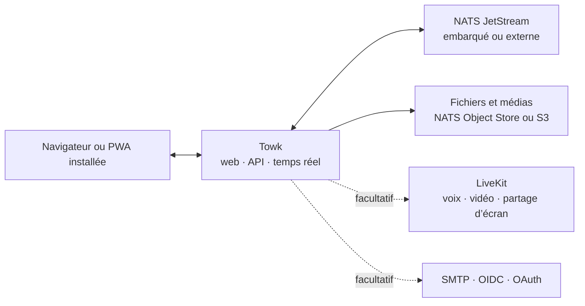

<div align="center">
  <picture>
    <source media="(prefers-color-scheme: dark)" srcset="branding/towk-horizontal-on-dark.webp" />
    <source media="(prefers-color-scheme: light)" srcset="branding/towk-horizontal-on-light.webp" />
    
  </picture>

  <p><strong>Vos conversations. Votre infrastructure.</strong></p>

  <p>
    Un espace de communication auto-hébergé et volontairement ciblé pour les équipes et les communautés.<br />
    Salons, messages directs, fichiers, notifications, voix et vidéo — sans service hébergé imposé.
  </p>

  <p>
    <a href="README.md">English</a> ·
    <strong>Français</strong> ·
    <a href="README.de.md">Deutsch</a> ·
    <a href="README.es.md">Español</a> ·
    <a href="README.pt.md">Português</a>
  </p>

  <p>
    <a href="https://github.com/Yo-DDV/Towk/actions/workflows/ci.yml"></a>
    <a href="ROADMAP.md"></a>
    <a href="LICENSING.md"></a>
    <a href="SECURITY.md"></a>
  </p>

  <p>
    <a href="#why-towk">Pourquoi Towk</a> ·
    <a href="#capabilities">Fonctionnalités</a> ·
    <a href="#data-control">Maîtrise des données</a> ·
    <a href="#architecture">Architecture</a> ·
    <a href="#run-towk">Lancer Towk</a> ·
    <a href="#project">Projet</a>
  </p>
</div>

> [!IMPORTANT]
> Towk est en développement actif et n’a pas encore atteint la version 1.0. Pour
> tout déploiement important, épinglez une version immuable ou un digest d’image,
> conservez des sauvegardes testées et consultez les notes de version avant une
> mise à niveau.

<picture>
  <source media="(prefers-color-scheme: dark)" srcset="apps/docs-website/src/assets/towk_dark.png" />
  <source media="(prefers-color-scheme: light)" srcset="apps/docs-website/src/assets/towk_light.png" />
  
</picture>

<a id="why-towk"></a>
## Pourquoi Towk

<table>
  <tr>
    <td width="33%" valign="top">
      <h3>Indépendant par conception</h3>
      <p>Chaque déploiement constitue son propre périmètre opérationnel et de protection des données. Il n’existe ni compte Towk central ni cloud Towk obligatoire.</p>
    </td>
    <td width="33%" valign="top">
      <h3>L’essentiel, volontairement</h3>
      <p>Towk se concentre sur les interactions quotidiennes : conversations, fichiers, notifications et appels — sans chercher à devenir une plateforme qui fait tout.</p>
    </td>
    <td width="33%" valign="top">
      <h3>Compact, puis évolutif</h3>
      <p>Commencez avec un seul binaire et NATS embarqué. Passez à NATS externe, à un stockage compatible S3, à plusieurs répliques et à LiveKit lorsque l’exploitation l’exige.</p>
    </td>
  </tr>
</table>

> **L’auto-hébergement n’est pas une case à cocher.** Il consiste à choisir où le
> service s’exécute, comment il est sauvegardé, quels fournisseurs d’identité il
> accepte et quelle révision exacte du code source a produit l’artefact déployé.

Towk n’est volontairement **ni** un protocole fédéré **ni** un SaaS hébergé. Un
serveur appartient à une organisation ou à une communauté, tandis que
l’application web installable peut se connecter aux serveurs Towk que
l’utilisateur choisit d’ajouter.

<a id="capabilities"></a>
## Ce qui est disponible aujourd’hui

| Domaine | Fonctionnalités |
|---|---|
| **Conversations** | Salons, messages directs, réponses, fils de discussion, modification et suppression, réactions, mentions, indicateurs de saisie et présence |
| **Fichiers et médias** | Pièces jointes, traitement des images, messages vocaux, aperçus de liens, navigation dans les fichiers d’un salon et traitement vidéo facultatif |
| **Appels** | Salons vocaux et vidéo facultatifs propulsés par LiveKit, partage d’écran, gestion des périphériques et chiffrement de bout en bout des médias par appel |
| **Notifications** | Diffusion en temps réel, Web Push, badges d’application, mentions et niveaux de notification configurables par serveur ou par salon |
| **Administration** | Rôles intégrés et personnalisés, permissions granulaires, groupes de salons, personnalisation du serveur, gestion des utilisateurs et diagnostics |
| **Identité** | Authentification par mot de passe et e-mail, ainsi que fournisseurs OIDC, GitHub, GitLab, Google et Discord configurables |
| **PWA installée** | Interface adaptative sur ordinateur et mobile, interface hors ligne, brouillons, boîte d’envoi et historiques récents chiffrés, partage par le système et gestion de fichiers |
| **Langues** | Interface disponible en anglais, allemand, français, espagnol et portugais |
| **Intégration** | API ConnectRPC fondée sur Protobuf, protocole WebSocket temps réel, CLI/API opérateur et prise en charge de plusieurs serveurs côté client |

Les contrats fonctionnels sont documentés publiquement dans les
[Feature Decision Records](docs/fdr/INDEX.md), avec leur comportement, leurs
compromis et leurs limites actuelles. La documentation technique liée est
actuellement maintenue en anglais.

<a id="data-control"></a>
## Une souveraineté concrète

| Maîtrise | Ce que Towk fournit |
|---|---|
| **Périmètre de déploiement** | Un serveur exploité indépendamment par organisation ou communauté, sans identité Towk centrale ni plan de contrôle hébergé imposé |
| **Emplacement des données** | Persistance NATS embarquée ou externe, fichiers dans NATS Object Store ou un stockage compatible S3, et procédures documentées de sauvegarde et de restauration |
| **Politique d’identité** | Comptes locaux par mot de passe/e-mail ou fournisseurs d’identité externes sélectionnés, y compris un fournisseur OIDC auto-hébergé |
| **Cycle de vie des clés** | Chiffrement par utilisateur du texte des messages et de certains champs d’identité persistants, avec crypto-effacement lors de la suppression du compte |
| **Traçabilité des artefacts** | Code source public, coordonnées de version immuables, métadonnées OCI liées au commit exact, SBOM, analyses de vulnérabilités et attestations de provenance |
| **Visibilité opérationnelle** | Points de contrôle de santé et de disponibilité, métriques compatibles Prometheus, diagnostics, journal d’événements administratif et protocole de performance reproductible |

> [!NOTE]
> L’auto-hébergement ne suffit pas à rendre un déploiement sûr ou conforme. Towk
> chiffre **au repos** le texte des messages et certaines données utilisateur
> persistantes ; il ne fournit pas actuellement de chiffrement de bout en bout
> pour les conversations textuelles. Un opérateur qui contrôle le serveur, le
> stockage et les clés fait partie du périmètre de confiance. Les pièces jointes
> et de nombreuses métadonnées ne sont pas couvertes par cette enveloppe. Les
> médias d’appel LiveKit prennent en charge le chiffrement de bout en bout lorsque
> les appels sont activés.

Par défaut, les sauvegardes séparent les données applicatives ordinaires du
magasin intégré des clés de chiffrement, sauf si l’opérateur inclut ou exporte
explicitement ces clés. Consultez le
[guide de sécurité et de confidentialité](apps/docs-website/src/content/docs/guides/operations/security.mdx)
et le
[guide sur le chiffrement et l’effacement](apps/docs-website/src/content/docs/guides/operations/privacy-erasure.mdx)
avant de définir les politiques de conservation, de sauvegarde ou de
suppression.

<a id="architecture"></a>
## Architecture en un coup d’œil



Le client SvelteKit adaptatif est compilé dans le serveur Go. Les API publiques
de requête/réponse utilisent ConnectRPC et Protocol Buffers ; les mises à jour
en direct utilisent un WebSocket Protobuf. L’état métier durable est
journalisé sous forme d’événements dans NATS JetStream, puis exposé par des
projections.

Pour l’inventaire détaillé, consultez
[l’architecture de Towk](docs/ARCHITECTURE.md), les
[Architecture Decision Records](docs/adr/INDEX.md) et la
[référence de l’API publique](apps/docs-website/src/content/docs/reference/connectrpc-api/index.mdx).

<a id="run-towk"></a>
## Lancer Towk

### Environnement de développement

Towk utilise [mise](https://mise.jdx.dev/) pour installer l’outillage épinglé du
projet :

```sh
git clone https://github.com/Yo-DDV/Towk.git
cd Towk
mise trust
mise run setup
mise dev
```

L’application de développement est accessible par défaut sur
<http://localhost:4000>. Les comptes d’amorçage sont décrits dans
[CONTRIBUTING.md](CONTRIBUTING.md) et ne doivent jamais être réutilisés dans un
déploiement public.

### Choisir un mode de déploiement

| Mode | Adapté à | Guide |
|---|---|---|
| **Docker Compose** | L’exemple d’auto-hébergement sur un serveur le plus complet, avec NATS externe, Caddy et LiveKit facultatif | [Déployer avec Docker Compose](apps/docs-website/src/content/docs/guides/deployment/docker-compose.mdx) |
| **Binaire autonome** | Évaluation, machines virtuelles compactes et opérateurs choisissant délibérément NATS embarqué | [Exécuter le binaire autonome](apps/docs-website/src/content/docs/guides/deployment/binary.mdx) |
| **Kubernetes** | Opérateurs fournissant leur propre NATS partagé, ingress, gestion des secrets et outillage de cycle de vie | [Consulter le guide Kubernetes](apps/docs-website/src/content/docs/guides/deployment/kubernetes.mdx) |

Commencez par [À lire avant de déployer](apps/docs-website/src/content/docs/guides/deployment/read-this-first.mdx).
Pour un déploiement durable, utilisez un tag et un digest d’image immuables
plutôt qu’un tag flottant.

### Connaître le périmètre actuel

| Towk peut convenir si vous… | Évaluez soigneusement la solution si vous exigez… |
|---|---|
| souhaitez exploiter vous-même le périmètre de communication, la politique d’identité et l’emplacement des données | un SaaS géré, un support contractuel ou un engagement de temps de réponse |
| préférez un client web unique, adaptatif et installable sur ordinateur comme sur mobile | des applications natives officielles distribuées dans les boutiques mobiles ou de bureau |
| privilégiez un espace ciblé avec salons, fichiers, notifications et appels | une fédération entre communautés administrées indépendamment |
| pouvez tester les mises à niveau, les sauvegardes et les restaurations tant que le projet est pré-1.0 | des API 1.0 stables ou le chiffrement de bout en bout des conversations textuelles dès aujourd’hui |

<a id="project"></a>
## Un projet ouvert, avec des règles explicites

Towk est développé publiquement, mais n’accepte pas les pull requests externes
non sollicitées. La participation publique commence par une issue ciblée afin
d’évaluer les contraintes produit, sécurité, compatibilité et maintenance avant
toute implémentation.

- [Signaler un bug reproductible](https://github.com/Yo-DDV/Towk/issues/new?template=bug_report.yml)
- [Proposer une fonctionnalité délimitée](https://github.com/Yo-DDV/Towk/issues/new?template=feature_request.yml)
- [Poser une question sur l’utilisation ou l’auto-hébergement](https://github.com/Yo-DDV/Towk/issues/new?template=question.yml)

Ne divulguez aucune vulnérabilité publiquement. Suivez
[SECURITY.md](SECURITY.md) et utilisez le signalement privé de vulnérabilité de
GitHub.

<table>
  <tr>
    <td width="25%" valign="top"><strong><a href="ROADMAP.md">Feuille de route</a></strong><br />Une direction sans promesses de livraison artificielles.</td>
    <td width="25%" valign="top"><strong><a href="GOVERNANCE.md">Gouvernance</a></strong><br />Règles de propriété, de revue et de publication.</td>
    <td width="25%" valign="top"><strong><a href="docs/PERFORMANCE.md">Performance</a></strong><br />Preuves reproductibles et seuils de rejet.</td>
    <td width="25%" valign="top"><strong><a href="PROVENANCE.md">Provenance</a></strong><br />Origine, attribution et revue sélective de l’amont.</td>
  </tr>
</table>

## Licence et origine

Towk utilise des métadonnées SPDX et REUSE par fichier. Le serveur, la CLI et
les artefacts serveur groupés sont par défaut sous AGPL-3.0-or-later ; les
surfaces explicitement listées du frontend, de l’API publique, de la
documentation et des exemples sont sous Apache-2.0. Consultez
[LICENSING.md](LICENSING.md) et [REUSE.toml](REUSE.toml) pour connaître la
frontière exacte.

Towk est un projet indépendant fondé sur
[Chatto](https://github.com/chattocorp/chatto). Chatto et ses logos sont des
noms et marques de ChattoCorp GmbH. Towk n’est ni approuvé, ni sponsorisé, ni
exploité, ni pris en charge par ChattoCorp GmbH.
