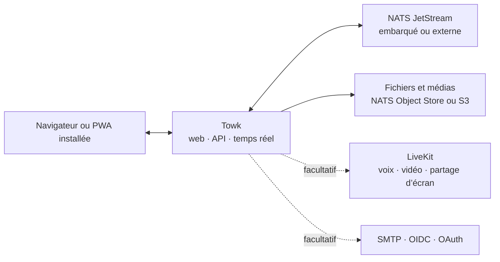

<div align="center">
  <picture>
    <source media="(prefers-color-scheme: dark)" srcset="branding/towk-horizontal-on-dark.webp" />
    <source media="(prefers-color-scheme: light)" srcset="branding/towk-horizontal-on-light.webp" />
    
  </picture>

  <p><strong>Vos conversations. Votre infrastructure.</strong></p>

  <p>
    Un espace de communication auto-hébergé et volontairement centré sur l’essentiel pour les équipes et les communautés.<br />
    Discussions, fichiers, notifications et appels du quotidien — sans service hébergé imposé.
  </p>

  <p>
    <a href="README.md">English</a> ·
    <strong>Français</strong> ·
    <a href="README.de.md">Deutsch</a> ·
    <a href="README.es.md">Español</a> ·
    <a href="README.pt.md">Português</a>
  </p>

  <p>
    <a href="ROADMAP.md"></a>
    
    
    <a href=".github/workflows/refresh-readme-metrics.yml"></a>
    <a href="LICENSING.md"></a>
  </p>

  <p>
    <a href="#why-towk">Pourquoi Towk</a> ·
    <a href="#development-pulse">Dynamique</a> ·
    <a href="#capabilities">Fonctionnalités</a> ·
    <a href="#architecture">Architecture</a> ·
    <a href="#run-towk">Lancer Towk</a> ·
    <a href="#project">Projet</a>
  </p>
</div>

<picture>
  <source media="(max-width: 600px)" srcset="https://raw.githubusercontent.com/Yo-DDV/Towk/readme-metrics/fr/hero-mobile.svg" />
  
</picture>

<p align="center">
  <a href="apps/docs-website/src/content/docs/getting-started/quick-start.mdx"><strong>🚀 Lancer Towk</strong></a>
  &nbsp;·&nbsp;
  <a href="apps/docs-website/src/content/docs/guides/deployment/docker-compose.mdx"><strong>📦 Déployer</strong></a>
  &nbsp;·&nbsp;
  <a href="apps/docs-website/src/content/docs/guides/operations/security.mdx"><strong>🛡️ Modèle de sécurité</strong></a>
  &nbsp;·&nbsp;
  <a href="ROADMAP.md"><strong>🗺️ Feuille de route</strong></a>
</p>

> [!IMPORTANT]
> Towk est en développement actif et n’a pas encore atteint la version 1.0. Pour
> un déploiement important, épinglez le digest exact de l’image ou le commit source,
> conservez des sauvegardes dont la restauration est testée et consultez les notes
> de version ainsi que les changements de configuration avant chaque mise à niveau.

<picture>
  <source media="(prefers-color-scheme: dark)" srcset="apps/docs-website/src/assets/towk_dark.png" />
  <source media="(prefers-color-scheme: light)" srcset="apps/docs-website/src/assets/towk_light.png" />
  
</picture>

<a id="why-towk"></a>
## Pourquoi Towk

<table>
  <tr>
    <td width="33%" valign="top">
      <h3>🛡️ Indépendant par conception</h3>
      <p><strong>Votre déploiement constitue le périmètre.</strong> Aucun compte Towk central, aucun cloud Towk obligatoire et aucun plan de contrôle partagé entre organisations.</p>
    </td>
    <td width="33%" valign="top">
      <h3>🎯 Centré sur la communication quotidienne</h3>
      <p><strong>Les fonctions essentielles méritent un soin particulier.</strong> Towk privilégie les conversations, les fichiers, les notifications et les appels plutôt que de devenir une plateforme à tout faire.</p>
    </td>
    <td width="33%" valign="top">
      <h3>⚙️ Compact, puis évolutif</h3>
      <p><strong>Commencez avec un seul processus.</strong> Passez à NATS externe, au stockage compatible S3, à plusieurs répliques et à LiveKit uniquement lorsque l’exploitation l’exige.</p>
    </td>
  </tr>
</table>

> **L’auto-hébergement n’est pas une simple case à cocher.** Il consiste à choisir
> où le service s’exécute, comment il est sauvegardé, quels fournisseurs
> d’identité sont approuvés, où résident les fichiers et quelle révision exacte
> du code source a produit l’artefact déployé.

Towk n’est volontairement **ni** un protocole fédéré **ni** un SaaS hébergé. Il
constitue une alternative open source ciblée pour les équipes et communautés qui
souhaitent exploiter elles-mêmes leur espace de communication — sans prétendre
remplacer chaque fonctionnalité de chaque plateforme collaborative.

<a id="development-pulse"></a>
## Dynamique du développement

<picture>
  <source media="(max-width: 600px)" srcset="https://raw.githubusercontent.com/Yo-DDV/Towk/readme-metrics/fr/activity-mobile.svg" />
  
</picture>

<picture>
  <source media="(max-width: 600px)" srcset="https://raw.githubusercontent.com/Yo-DDV/Towk/readme-metrics/fr/contributors-mobile.svg" />
  
</picture>

<details>
  <summary><strong>Comment ces métriques sont produites</strong></summary>

  Le dépôt génère lui-même ces SVG à partir de l’API GitHub avec son
  `GITHUB_TOKEN` limité au dépôt ; aucun jeton personnel ni service de statistiques
  externe n’est utilisé. Le workflow s’exécute après chaque push sur `main` et est
  planifié approximativement à **06 h 17 et 21 h 17, heure de Paris**, chaque jour.

  Les compteurs principaux et les classements commencent après le commit public de
  fondation du dépôt autonome `205e91fe1ae5e5c23420974f7e04cf82456eeab3`, fusionné le 12 juillet 2026.
  L’historique hérité de Chatto n’est ainsi pas présenté comme de l’activité Towk
  actuelle. Les graphiques conservent des vues glissantes sur 30 jours, 12 semaines
  et 12 mois ; les périodes antérieures à cette fondation apparaissent à zéro. Les
  commits sont sélectionnés topologiquement depuis `main` après ce commit, puis
  regroupés selon leur horodatage de commit en UTC. Les pull requests sont comptées
  selon `merged_at` après l’horodatage de fondation. Les classements utilisent
  l’identifiant GitHub lorsqu’il existe, sinon le nom public de l’auteur du commit.
  Les robots détectés sont exclus des classements humains et présentés séparément.
  Ces chiffres décrivent l’activité du dépôt et l’attribution Git, pas l’effort
  individuel. Les messages de commit et les adresses électroniques ne sont pas
  écrits sur la branche générée.

  Les SVG et l’instantané lisible par machine sont publiés sur la branche
  [`readme-metrics`](https://github.com/Yo-DDV/Towk/tree/readme-metrics).
</details>

<a id="capabilities"></a>
## Ce qui est disponible aujourd’hui

<table>
  <tr>
    <td width="33%" valign="top">
      <h3>💬 Conversations</h3>
      <p>Salons, messages directs, réponses, fils de discussion, modification et suppression, réactions, mentions, indicateurs de saisie et présence.</p>
    </td>
    <td width="33%" valign="top">
      <h3>📎 Fichiers et médias</h3>
      <p>Pièces jointes, traitement d’images, messages vocaux, aperçus de liens, consultation des fichiers d’un salon et traitement vidéo facultatif.</p>
    </td>
    <td width="33%" valign="top">
      <h3>📞 Appels et application installée</h3>
      <p>Appels vocaux et vidéo facultatifs via LiveKit, partage d’écran, chiffrement de bout en bout des médias d’appel et PWA responsive installable.</p>
    </td>
  </tr>
  <tr>
    <td width="33%" valign="top">
      <h3>🔐 Identité et continuité locale</h3>
      <p>Flux par mot de passe et e-mail, OIDC et fournisseurs OAuth sélectionnés, brouillons, boîte d’envoi et historiques récents de salons chiffrés sur les navigateurs pris en charge.</p>
    </td>
    <td width="33%" valign="top">
      <h3>🧭 Administration</h3>
      <p>Rôles intégrés ou personnalisés, permissions granulaires, groupes de salons, identité visuelle, gestion des utilisateurs, diagnostics et journal d’événements.</p>
    </td>
    <td width="33%" valign="top">
      <h3>🔌 API et exploitation</h3>
      <p>API ConnectRPC fondées sur Protobuf, trames WebSocket temps réel, CLI/API opérateur, endpoints de santé, métriques et client multiserveur.</p>
    </td>
  </tr>
</table>

L’interface est disponible en **anglais, allemand, français, espagnol et portugais**.
Les comportements détaillés, compromis et limites actuelles sont consignés dans
les [Feature Decision Records](docs/fdr/INDEX.md). La documentation technique liée
est actuellement maintenue en anglais.

## La souveraineté, concrètement

<table>
  <tr>
    <td width="33%" valign="top"><h3>🏠 Déploiement</h3><p>Chaque déploiement dessert une organisation ou une communauté, du binaire compact jusqu’à une topologie répliquée.</p></td>
    <td width="33%" valign="top"><h3>🗄️ Localisation des données</h3><p>Choisissez NATS embarqué ou externe et NATS Object Store ou un stockage compatible S3 pour les fichiers.</p></td>
    <td width="33%" valign="top"><h3>🪪 Politique d’identité</h3><p>Utilisez des comptes locaux par mot de passe/e-mail ou des fournisseurs explicitement sélectionnés, dont un fournisseur OIDC auto-hébergé.</p></td>
  </tr>
  <tr>
    <td width="33%" valign="top"><h3>🔑 Cycle de vie des clés</h3><p>Le texte des messages et certains champs d’identité durables utilisent un chiffrement par utilisateur avec crypto-effacement lors de la suppression du compte.</p></td>
    <td width="33%" valign="top"><h3>📦 Traçabilité des builds</h3><p>Code source public, métadonnées OCI du commit exact, digests d’images, SBOM, analyses de vulnérabilités et attestations de provenance.</p></td>
    <td width="33%" valign="top"><h3>📈 Visibilité opérationnelle</h3><p>Endpoints de santé et de disponibilité, métriques compatibles Prometheus, diagnostics, journal administratif et protocole reproductible de qualification des performances médias.</p></td>
  </tr>
</table>

> [!NOTE]
> L’auto-hébergement ne rend pas automatiquement un déploiement sécurisé ou
> conforme. Towk chiffre **au repos** le texte des messages et certaines données
> utilisateur durables ; les conversations textuelles ne disposent pas encore
> d’un chiffrement de bout en bout. Un opérateur contrôlant le serveur, le
> stockage et les clés reste dans le périmètre de confiance. Les pièces jointes
> et une grande partie des métadonnées se trouvent hors de cette enveloppe. Les
> médias d’appel LiveKit utilisent le chiffrement de bout en bout lorsque les
> appels sont activés, mais Towk fournit la clé d’appel partagée ; un opérateur Towk
> capable d’accéder à ces clés reste dans le périmètre de confiance de l’appel.

Les sauvegardes séparent volontairement les données applicatives ordinaires du
magasin intégré de clés de chiffrement, sauf si l’opérateur choisit explicitement
d’inclure ou d’exporter ces clés. Consultez le
[guide de sécurité et de confidentialité](apps/docs-website/src/content/docs/guides/operations/security.mdx)
et le [guide de chiffrement et d’effacement](apps/docs-website/src/content/docs/guides/operations/privacy-erasure.mdx)
avant de définir les politiques de conservation, de sauvegarde ou de suppression.

<a id="architecture"></a>
## Architecture en un coup d’œil



Le client SvelteKit responsive est compilé dans le serveur Go. Les API publiques
requête/réponse utilisent ConnectRPC et Protocol Buffers ; les mises à jour en
temps réel utilisent un WebSocket Protobuf. L’état durable du domaine est stocké
sous forme d’événements dans NATS JetStream et servi au moyen de projections.

Explorez l’[inventaire de l’architecture](docs/ARCHITECTURE.md), les
[Architecture Decision Records](docs/adr/INDEX.md) et la
[référence de l’API publique](apps/docs-website/src/content/docs/reference/connectrpc-api/index.mdx).

<a id="run-towk"></a>
## Lancer Towk

### Environnement de développement

Towk utilise [mise](https://mise.jdx.dev/) pour fournir la chaîne d’outils épinglée :

```sh
git clone https://github.com/Yo-DDV/Towk.git
cd Towk
mise trust
mise run setup
mise dev
```

L’interface de développement est disponible par défaut sur
<http://localhost:4000>. Les comptes d’amorçage sont documentés dans
[CONTRIBUTING.md](CONTRIBUTING.md) et ne doivent jamais être réutilisés pour un
déploiement public.

### Choisir un mode de déploiement

<table>
  <tr>
    <td width="33%" valign="top"><h3>📦 Docker Compose</h3><p>L’exemple mono-serveur le plus complet, avec NATS externe, Caddy et LiveKit facultatif.</p><p><a href="apps/docs-website/src/content/docs/guides/deployment/docker-compose.mdx"><strong>Ouvrir le guide →</strong></a></p></td>
    <td width="33%" valign="top"><h3>⚡ Binaire autonome</h3><p>Pour l’évaluation, les VM compactes et les opérateurs choisissant volontairement NATS embarqué.</p><p><a href="apps/docs-website/src/content/docs/guides/deployment/binary.mdx"><strong>Ouvrir le guide →</strong></a></p></td>
    <td width="33%" valign="top"><h3>☸️ Kubernetes</h3><p>Pour les opérateurs qui fournissent eux-mêmes NATS partagé, ingress, secrets et outils de cycle de vie.</p><p><a href="apps/docs-website/src/content/docs/guides/deployment/kubernetes.mdx"><strong>Ouvrir le guide →</strong></a></p></td>
  </tr>
</table>

Commencez par [Read This First](apps/docs-website/src/content/docs/guides/deployment/read-this-first.mdx).
Pour un déploiement durable, épinglez un digest d’image exact plutôt que de vous
fier à un tag flottant.

### Connaître la limite actuelle

| Towk peut vous convenir si vous… | Évaluez soigneusement la solution si vous exigez… |
|---|---|
| souhaitez exploiter vous-même le périmètre de communication, la politique d’identité et la localisation des données | un SaaS géré, un support contractuel ou un SLA de temps de réponse |
| préférez un client web responsive et installable sur ordinateur comme sur mobile | des applications natives officielles distribuées dans les stores mobiles ou de bureau |
| appréciez un espace ciblé avec salons, fichiers, notifications et appels | une fédération entre communautés administrées indépendamment |
| pouvez tester mises à niveau, sauvegardes et restaurations pendant la phase pré-1.0 | des API 1.0 stables ou des conversations textuelles chiffrées de bout en bout dès aujourd’hui |

<a id="project"></a>
## Projet ouvert, règles explicites

Towk est développé publiquement, mais n’accepte pas les pull requests externes
non sollicitées. La participation publique commence par une Issue GitHub ciblée,
afin d’évaluer les contraintes produit, sécurité, compatibilité et maintenance
avant l’implémentation.

<p align="center">
  <a href="https://github.com/Yo-DDV/Towk/issues/new?template=bug_report.yml"><strong>🐛 Signaler un bug</strong></a>
  &nbsp;·&nbsp;
  <a href="https://github.com/Yo-DDV/Towk/issues/new?template=feature_request.yml"><strong>✨ Proposer une fonctionnalité</strong></a>
  &nbsp;·&nbsp;
  <a href="https://github.com/Yo-DDV/Towk/issues/new?template=question.yml"><strong>💬 Poser une question</strong></a>
</p>

Ne divulguez aucune vulnérabilité publiquement. Suivez [SECURITY.md](SECURITY.md)
et utilisez le signalement privé de vulnérabilités de GitHub.

<table>
  <tr>
    <td width="25%" valign="top"><strong><a href="ROADMAP.md">🗺️ Feuille de route</a></strong><br />Une direction sans promesses de livraison inventées.</td>
    <td width="25%" valign="top"><strong><a href="GOVERNANCE.md">⚖️ Gouvernance</a></strong><br />Règles de responsabilité, de revue et de publication.</td>
    <td width="25%" valign="top"><strong><a href="docs/PERFORMANCE.md">📊 Performance</a></strong><br />Preuves reproductibles et seuils de rejet.</td>
    <td width="25%" valign="top"><strong><a href="PROVENANCE.md">🔎 Provenance</a></strong><br />Origine, attribution et revue sélective de l’amont.</td>
  </tr>
</table>

## Licence et origine

Towk utilise des métadonnées SPDX et REUSE par fichier. Le serveur, la CLI et les
artefacts de distribution du serveur sont sous AGPL-3.0-or-later par défaut ; les surfaces
explicitement listées du frontend, de l’API publique, de la documentation et des
exemples sont sous Apache-2.0. Consultez [LICENSING.md](LICENSING.md) et
[REUSE.toml](REUSE.toml) pour connaître la frontière exacte.

Towk est un projet indépendant fondé sur
[Chatto](https://github.com/chattocorp/chatto). Chatto et ses logos sont des noms
et marques de ChattoCorp GmbH. Towk n’est ni recommandé, ni sponsorisé, ni
exploité, ni pris en charge par ChattoCorp GmbH.
