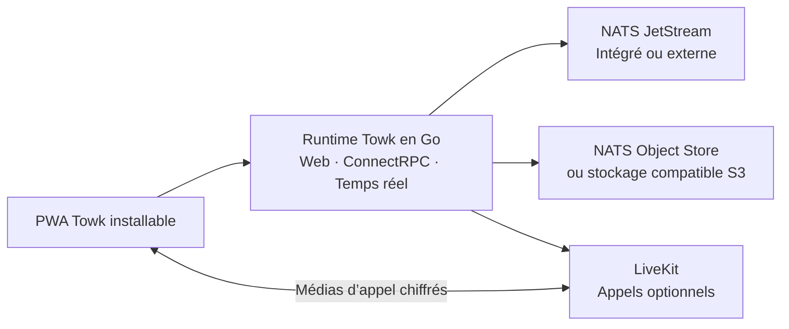

<div align="center">
  <picture>
    <source media="(prefers-color-scheme: dark)" srcset="branding/towk-horizontal-on-dark.webp" />
    <source media="(prefers-color-scheme: light)" srcset="branding/towk-horizontal-on-light.webp" />
    
  </picture>

  <h3>Une communication qui reste entre vos mains.</h3>

  <p>
    Un espace de communication auto-hébergé pour les équipes et les communautés.<br />
    Messages, fichiers, notifications, voix et vidéo — sur l’infrastructure de votre choix.
  </p>

  <p>
    <a href="README.md">English</a> ·
    <a href="README.de.md">Deutsch</a> ·
    <a href="README.fr.md"><strong>Français</strong></a> ·
    <a href="README.es.md">Español</a> ·
    <a href="README.pt.md">Português</a>
  </p>

  <p>
    <a href="https://github.com/Yo-DDV/Towk/releases"></a>
    
    
    
    <a href="SECURITY.md"></a>
    <a href="LICENSING.md"></a>
  </p>

  <p>
    <a href="#why-towk">Pourquoi Towk</a> ·
    <a href="#what-you-get-today">Fonctionnalités</a> ·
    <a href="#security-and-privacy">Sécurité et confidentialité</a> ·
    <a href="#deploy-your-way">Déployer</a> ·
    <a href="#try-towk-locally">Démarrage rapide</a> ·
    <a href="#project-status">État du projet</a>
  </p>
</div>

> [!IMPORTANT]
> **Towk est un logiciel pré-1.0 en développement actif.** Pour tout déploiement
> important, utilisez une version immuable, un digest d’image ou un commit source
> précis ; conservez des sauvegardes dont la restauration a été testée ; validez
> les mises à niveau en préproduction ; et consultez les notes de version avant
> tout changement de version.

<picture>
  <source media="(prefers-color-scheme: dark)" srcset="apps/docs-website/src/assets/towk_dark.png" />
  <source media="(prefers-color-scheme: light)" srcset="apps/docs-website/src/assets/towk_light.png" />
  
</picture>

## Communiquer sans abandonner le contrôle

Towk ramène les échanges quotidiens d’une équipe sur une infrastructure que
**vous** choisissez. Il n’existe ni compte Towk central, ni service hébergé par
Towk obligatoire, ni outil d’analyse produit ou de suivi tiers intégré à
l’application. Chaque déploiement dessert une organisation ou une communauté et
constitue sa propre frontière d’administration et de protection des données.

Cette indépendance est volontaire. Towk n’est pas un réseau fédéré et ne copie
pas les données communautaires d’un serveur à l’autre. Son client web installable
se connecte directement aux serveurs ajoutés par l’utilisateur, tandis que chaque
opérateur garde la maîtrise des comptes, des fournisseurs d’identité, du
stockage, des sauvegardes, de la rétention et de l’exposition publique.

<a id="why-towk"></a>
## Pourquoi Towk

<table>
<tr>
<td width="50%" valign="top">

### Maîtrisez votre frontière

Choisissez l’hôte, la région, le domaine, les fournisseurs d’identité, le
stockage et la politique de sauvegarde. Towk n’impose ni tenant partagé chez un
fournisseur, ni compte cloud exploité par le projet.

</td>
<td width="50%" valign="top">

### Réunissez les fonctions essentielles

Salons, messages directs, fils de discussion, fichiers, notifications et appels
cohabitent dans un espace réactif au lieu d’être dispersés entre plusieurs
outils sans lien entre eux.

</td>
</tr>
<tr>
<td width="50%" valign="top">

### Commencez simplement, évoluez à dessein

Faites fonctionner l’application web, l’API, le service temps réel et un stockage
NATS intégré depuis un seul binaire, puis adoptez NATS externe, un stockage
compatible S3 et LiveKit lorsque le besoin opérationnel est réel.

</td>
<td width="50%" valign="top">

### Exploitez un système vérifiable

Towk s’appuie sur des API centrées sur Protobuf, des ADR et FDR documentés, un
outillage reproductible et des artefacts de version rattachés à des commits
sources précis, accompagnés de métadonnées SBOM et de provenance.

</td>
</tr>
</table>

### Un périmètre volontairement maîtrisé

Towk ne cherche pas à reproduire chaque couche d’une vaste suite collaborative
hébergée. Sa direction consiste d’abord à rendre cohérents, réactifs et agréables
les fondamentaux utilisés au quotidien — conversations, navigation,
notifications, fichiers et appels — avant d’étendre la surface du produit. Toute
nouvelle complexité doit répondre à un problème utilisateur ou opérateur clair.

<a id="what-you-get-today"></a>
## Ce qui est disponible aujourd’hui

| Domaine | Capacités actuelles |
| --- | --- |
| **Conversations** | Salons, messages directs, réponses, fils de discussion, réactions, mentions, présence, recherche de membres et recherche de messages |
| **Contenus** | Pièces jointes, images, aperçus de liens, messages vocaux et traitement vidéo optionnel |
| **Appels** | Voix et vidéo par salon via LiveKit, partage d’écran, de fenêtre ou d’onglet, gestion des périphériques et chiffrement E2EE des médias |
| **Notifications** | Mises à jour en temps réel, niveaux de notification configurables, badges, Web Push et routage des notifications natives |
| **PWA installable** | Client adaptatif pour ordinateur et mobile, shell hors ligne, brouillons locaux chiffrés, messages en attente et historiques récents bornés, partage depuis le système et intégrations d’appel selon les capacités disponibles |
| **Identité et administration** | Parcours e-mail/mot de passe, OAuth/OIDC, comptes indépendants par serveur, rôles intégrés et personnalisés, permissions granulaires, exceptions par salon et outils d’administration |
| **Exploitation et intégration** | NATS intégré ou externe, stockage objet compatible S3 optionnel, métriques compatibles Prometheus, API Protobuf/ConnectRPC, WebSocket temps réel et API/CLI Operator locale |
| **Langues** | Catalogues d’interface en anglais, allemand, français, espagnol et portugais |

<a id="security-and-privacy"></a>
## Sécurité et confidentialité, sans promesses vagues

Towk considère la précision de ses frontières comme une fonctionnalité du
produit. Le projet ne prétend pas que chaque octet stocké est chiffré, que chaque
canal de communication bénéficie d’un chiffrement de bout en bout ou que tout
déploiement auto-hébergé est automatiquement sécurisé.

| Frontière | Ce que Towk met en œuvre aujourd’hui |
| --- | --- |
| **Télémétrie** | Aucun outil d’analyse produit ni suivi tiers n’est intégré. Un serveur auto-hébergé n’envoie ni conversations ni données de compte au propriétaire du projet Towk. L’opérateur peut exposer des métriques locales pour sa propre supervision. |
| **Authentification** | Identifiants opaques conservés côté serveur, cookies navigateur signés, chiffrement optionnel des cookies, comportement anti-énumération pour les parcours e-mail sensibles et limites d’authentification partagées entre les réplicas. |
| **Autorisation** | Contrôle d’accès à la frontière de l’API avec rôles intégrés et personnalisés, autorisations et refus explicites, exceptions propres aux salons et vérifications de permission avant les mutations métier. |
| **Chiffrement applicatif** | Le texte des messages et certains champs durables de données personnelles sont chiffrés avant stockage avec des clés propres à chaque utilisateur. Les pièces jointes, avatars et une part importante des métadonnées d’événements restent hors de cette enveloppe et nécessitent une protection d’infrastructure. |
| **Appels** | Lorsque les appels LiveKit sont activés, Towk fournit un matériel de clé propre à chaque appel et active le chiffrement E2EE des médias. Cela n’implique pas un chiffrement de bout en bout de la signalisation, des appartenances ou des métadonnées opérationnelles. |
| **Reprise** | Les sauvegardes peuvent être chiffrées avec age. Données, exports de clés, stockage NATS et objets stockés dans S3 doivent être protégés et conservés conformément à la politique de reprise et de suppression de l’opérateur. |

Consultez le modèle actuel exact avant tout déploiement :
[Sécurité et confidentialité](apps/docs-website/src/content/docs/guides/operations/security.mdx) ·
[Chiffrement et effacement des données](apps/docs-website/src/content/docs/guides/operations/privacy-erasure.mdx) ·
[Sauvegarde et restauration](apps/docs-website/src/content/docs/guides/operations/backup-restore.mdx) ·
[Politique de sécurité](SECURITY.md)

## Un seul client, partout où le navigateur le permet

Le client principal de Towk est une Progressive Web App installable sur les
navigateurs récents pour ordinateur et mobile. Le même client passe d’un onglet
classique à une application installée et n’utilise une capacité de la plateforme
que lorsqu’elle est réellement disponible.

- Le service worker met en cache le shell exécutable, pas les réponses privées de
  l’API ni les contenus de discussion protégés.
- Les brouillons liés à un compte, messages texte en attente, pièces jointes
  préparées et historiques récents bornés sont chiffrés avec des clés locales à
  l’appareil dans le navigateur.
- L’état hors ligne est présenté comme mis en cache ou déconnecté — jamais comme
  une réponse serveur actuelle faisant autorité.
- Cibles de partage, gestionnaires de fichiers, Web Push, badges, Wake Lock,
  Media Session et Picture-in-Picture sont des améliorations progressives, pas
  des dépendances obligatoires.

Aucun paquet dédié aux boutiques d’applications n’est publié actuellement. La
PWA reste l’unique surface produit afin d’éviter de fragmenter les interactions,
les mises à jour de sécurité et le comportement fonctionnel entre plusieurs
clients.

<a id="deploy-your-way"></a>
## Choisissez votre mode de déploiement

| Parcours | Usage adapté | Architecture |
| --- | --- | --- |
| **Binaire unique** | Évaluation locale, machines virtuelles simples et petits serveurs indépendants | Towk sert la PWA, les API et le trafic temps réel, et peut exécuter un stockage NATS/JetStream intégré. |
| **Docker Compose** | La plupart des déploiements auto-hébergés sur une seule machine | Câblage explicite de Towk, NATS, Caddy et LiveKit avec volumes persistants et configuration contrôlée par l’opérateur. |
| **Services externes** | Opérateurs ayant besoin de séparation ou d’évolution | Reliez Towk à un NATS externe, un stockage objet compatible S3, SMTP, LiveKit et vos systèmes de supervision. |
| **Kubernetes** | Équipes exploitant déjà Kubernetes | Un parcours géré par l’opérateur. L’exemple ne constitue pas une garantie générale de haute disponibilité : NATS, le stockage, l’ingress et les domaines de panne restent sous la responsabilité de l’opérateur. |

Commencez par le guide de décision :
[À lire en premier](apps/docs-website/src/content/docs/guides/deployment/read-this-first.mdx) ·
[Binaire autonome](apps/docs-website/src/content/docs/guides/deployment/binary.mdx) ·
[Docker Compose](examples/dockercompose/README.md) ·
[Kubernetes](examples/k8s/README.md)

<details>
<summary><strong>L’architecture en un coup d’œil</strong></summary>



Le client est construit avec SvelteKit et intégré à la distribution Go. L’état
métier est écrit sous forme d’événements Protobuf durables dans NATS JetStream,
puis exposé par des projections. Les API publiques de requête/réponse utilisent
ConnectRPC, tandis que les mises à jour en direct passent par un protocole
WebSocket Protobuf.

Consultez [Towk Architecture](docs/ARCHITECTURE.md), les
[Architecture Decision Records](docs/adr/INDEX.md) et les
[Feature Decision Records](docs/fdr/INDEX.md).

</details>

<a id="try-towk-locally"></a>
## Essayer Towk en local

Towk utilise [mise](https://mise.jdx.dev/) pour installer une chaîne d’outils de
développement verrouillée.

```sh
git clone https://github.com/Yo-DDV/Towk.git
cd Towk
mise trust
mise run setup
mise dev
```

Ouvrez <http://localhost:4000>. Il s’agit d’un environnement de développement,
pas d’une configuration de production. Les comptes et données de test décrits
dans [CONTRIBUTING.md](CONTRIBUTING.md) ne doivent jamais être réutilisés sur un
serveur public.

Pour une installation durable, poursuivez avec le
[démarrage rapide](apps/docs-website/src/content/docs/getting-started/quick-start.mdx)
et les [guides de déploiement](apps/docs-website/src/content/docs/guides/deployment/read-this-first.mdx).

<a id="project-status"></a>
## État du projet

Towk est maintenu indépendamment, développé publiquement et se trouve toujours
dans la série `0.x`. Le dépôt actuel convient à l’évaluation et aux opérateurs
prêts à valider leur propre déploiement ; avant la version 1.0, les interfaces,
la configuration et les recommandations d’exploitation peuvent encore évoluer.

Avant de confier des communications importantes à Towk :

1. utilisez la version, le digest d’image ou le commit source exact déployé ;
2. testez la sauvegarde **et la restauration**, y compris la couverture des clés
   et du stockage objet ;
3. validez navigateurs, notifications et appels sur les appareils et réseaux
   dont dépendent vos utilisateurs ;
4. testez les mises à niveau en préproduction et lisez les notes de version ;
5. supervisez le service et maintenez l’hôte, NATS, le stockage objet, les secrets
   et les sauvegardes dans votre frontière de sécurité.

Suivez la [feuille de route](ROADMAP.md), les
[versions](https://github.com/Yo-DDV/Towk/releases) et les
[travaux connus](https://github.com/Yo-DDV/Towk/issues) pour connaître l’état actuel.

## Un logiciel libre indépendant

Towk est un projet indépendant fondé sur
[Chatto](https://github.com/chattocorp/chatto). Il préserve la provenance
factuelle, les attributions des auteurs amont et les avis de licence, tout en
prenant ses propres décisions de produit, de publication, de support et de
compatibilité. Towk n’est ni approuvé, ni sponsorisé, ni exploité, ni pris en
charge par ChattoCorp GmbH.

Le dépôt applique un modèle de licence fichier par fichier :

- le serveur, la CLI et les artefacts serveur intégrés sont généralement sous
  **AGPL-3.0-or-later** ;
- les surfaces frontend, API publique, documentation, intégration et exemples
  explicitement identifiées sont sous **Apache-2.0** ;
- les avis tiers restent dans [NOTICE](NOTICE) et la frontière exacte lisible par
  une machine est définie dans [REUSE.toml](REUSE.toml).

Lisez [LICENSING.md](LICENSING.md), [PROVENANCE.md](PROVENANCE.md),
[UPSTREAM.md](UPSTREAM.md) et [SOURCE.md](SOURCE.md) avant de redistribuer ou
d’exploiter un service réseau modifié.

## Participer en sécurité

La participation publique commence par les issues :

- [Signaler un bug reproductible](https://github.com/Yo-DDV/Towk/issues/new?template=bug_report.yml)
- [Proposer une fonctionnalité ciblée](https://github.com/Yo-DDV/Towk/issues/new?template=feature_request.yml)
- [Poser une question d’utilisation ou d’auto-hébergement](https://github.com/Yo-DDV/Towk/issues/new?template=question.yml)

Towk n’accepte pas les pull requests externes non sollicitées. Consultez
[CONTRIBUTING.md](CONTRIBUTING.md), [GOVERNANCE.md](GOVERNANCE.md) et
[SUPPORT.md](SUPPORT.md) avant de participer.

> [!CAUTION]
> Ne signalez jamais une vulnérabilité présumée dans une issue publique. Suivez
> [SECURITY.md](SECURITY.md) et utilisez le signalement privé. Retirez de tout
> rapport public les secrets, données personnelles, messages privés, journaux de
> production bruts et captures d’écran non expurgées.

<div align="center">
  <p><strong>Vos conversations. Votre infrastructure. Votre décision.</strong></p>
  <p>
    <a href="apps/docs-website/src/content/docs/getting-started/introduction.mdx">Découvrir Towk</a> ·
    <a href="apps/docs-website/src/content/docs/getting-started/quick-start.mdx">Lancer en local</a> ·
    <a href="ROADMAP.md">Voir la direction</a>
  </p>
</div>
