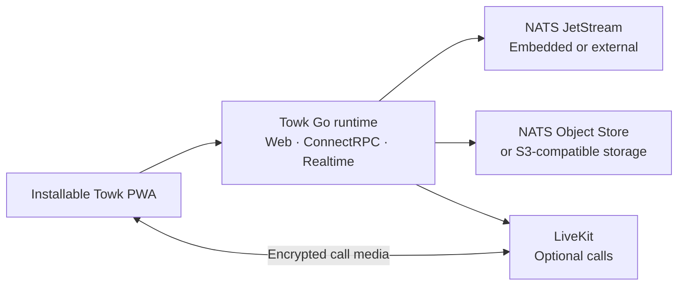

<div align="center">
  <picture>
    <source media="(prefers-color-scheme: dark)" srcset="branding/towk-horizontal-on-dark.webp" />
    <source media="(prefers-color-scheme: light)" srcset="branding/towk-horizontal-on-light.webp" />
    
  </picture>

  <h3>Communication that stays yours.</h3>

  <p>
    A self-hosted communication workspace for teams and communities.<br />
    Messaging, files, notifications, voice and video — on infrastructure you choose.
  </p>

  <p>
    <a href="README.md"><strong>English</strong></a> ·
    <a href="README.de.md">Deutsch</a> ·
    <a href="README.fr.md">Français</a> ·
    <a href="README.es.md">Español</a> ·
    <a href="README.pt.md">Português</a>
  </p>

  <p>
    <a href="https://github.com/Yo-DDV/Towk/releases"></a>
    
    
    
    <a href="SECURITY.md"></a>
    <a href="LICENSING.md"></a>
  </p>

  <p>
    <a href="#why-towk">Why Towk</a> ·
    <a href="#what-you-get-today">What you get</a> ·
    <a href="#security-and-privacy-without-vague-promises">Security & privacy</a> ·
    <a href="#deploy-your-way">Deploy</a> ·
    <a href="#try-towk-locally">Quick start</a> ·
    <a href="#project-status">Project status</a>
  </p>
</div>

> [!IMPORTANT]
> **Towk is active pre-1.0 software.** Pin important deployments to an immutable
> release, image digest or source commit; keep tested backups; validate upgrades
> in staging; and review the release notes before changing versions.

<picture>
  <source media="(prefers-color-scheme: dark)" srcset="apps/docs-website/src/assets/towk_dark.png" />
  <source media="(prefers-color-scheme: light)" srcset="apps/docs-website/src/assets/towk_light.png" />
  
</picture>

## Communication without surrendering control

Towk brings everyday team communication into infrastructure that **you** choose.
There is no central Towk account, no mandatory Towk-hosted service and no product
analytics or third-party tracking built into the application. Each deployment
serves one organization or community and remains its own administrative and
data-protection boundary.

That independence is deliberate. Towk is not a federated network and does not
copy community data between servers. Its installable web client can connect
directly to the servers a user adds, while each operator keeps control of
accounts, identity providers, storage, backups, retention and public exposure.

## Why Towk

<table>
<tr>
<td width="50%" valign="top">

### Own the boundary

Choose the host, region, domain, identity providers, storage and backup policy.
Towk does not require a shared vendor tenant or a project-operated cloud account.

</td>
<td width="50%" valign="top">

### Keep the essentials together

Rooms, direct messages, threads, files, notifications and calls live in one
responsive workspace instead of being scattered across unrelated tools.

</td>
</tr>
<tr>
<td width="50%" valign="top">

### Start compact, grow deliberately

Run the web app, API, realtime service and an embedded NATS data store from one
binary, then move to external NATS, S3-compatible storage and LiveKit when the
operational need is real.

</td>
<td width="50%" valign="top">

### Operate something inspectable

Towk uses protobuf-first APIs, documented ADRs and FDRs, reproducible tooling,
and release artifacts tied to exact source commits with SBOM and provenance
metadata.

</td>
</tr>
</table>

### Deliberately focused

Towk is not trying to reproduce every layer of a large hosted collaboration
suite. Its direction is to make the fundamentals people use every day —
conversations, navigation, notifications, files and calls — coherent, responsive
and pleasant before expanding the product surface. New complexity should earn
its place by solving a clear user or operator problem.

## What you get today

| Area | Current capabilities |
| --- | --- |
| **Conversations** | Rooms, direct messages, replies, threads, reactions, mentions, presence, member discovery and message search |
| **Content** | File attachments, images, link previews, voice messages and optional video processing |
| **Calls** | Room-based voice and video through LiveKit, screen/window/tab sharing, device controls and media E2EE |
| **Notifications** | Realtime updates, configurable notification levels, badges, Web Push and native notification routing |
| **Installable PWA** | Responsive desktop/mobile client, offline shell, encrypted device-local drafts, pending messages and recent timelines, OS sharing and capability-detected call integrations |
| **Identity & administration** | Email/password flows, OAuth/OIDC, independent per-server accounts, built-in and custom roles, granular permissions, room overrides and administrative tools |
| **Operations & integration** | Embedded or external NATS, optional S3-compatible object storage, Prometheus-compatible metrics, protobuf/ConnectRPC APIs, realtime WebSocket and a local Operator API/CLI |
| **Languages** | English, German, French, Spanish and Portuguese interface catalogs |

## Security and privacy, without vague promises

Towk treats precise boundaries as part of the product. It does not describe every
stored byte as encrypted, every communication path as end-to-end encrypted or
every self-hosted deployment as automatically secure.

| Boundary | What Towk does today |
| --- | --- |
| **Telemetry** | No product analytics or third-party tracking is built in, and a self-hosted server does not send conversations or account data to the Towk project owner. Operators may expose local metrics for their own monitoring. |
| **Authentication** | Opaque server-side credentials, signed browser cookies, optional cookie encryption, anti-enumeration behavior for sensitive email flows and replica-shared authentication rate limits. |
| **Authorization** | API-boundary access control with built-in and custom roles, explicit grants and denies, room-specific overrides and permission checks before domain mutations. |
| **Application-level encryption** | Message text and selected durable user-PII fields are encrypted before storage with per-user keys. Attachments, avatars and substantial event metadata are outside that envelope and require infrastructure-level protection. |
| **Calls** | When LiveKit calling is enabled, Towk provisions per-call key material and enables media E2EE. Signaling, membership and operational metadata are not implied to be end-to-end encrypted. |
| **Recovery** | Backups can be encrypted with age. Data, key exports, NATS storage and S3-backed assets must be protected and retained according to the operator's recovery and deletion policy. |

Read the exact current model before deployment:
[Security & privacy](apps/docs-website/src/content/docs/guides/operations/security.mdx) ·
[Encryption and data erasure](apps/docs-website/src/content/docs/guides/operations/privacy-erasure.mdx) ·
[Backup and restore](apps/docs-website/src/content/docs/guides/operations/backup-restore.mdx) ·
[Security policy](SECURITY.md)

## One client, wherever the browser goes

Towk's primary client is an installable Progressive Web App for current desktop
and mobile browsers. The same client adapts from a normal browser tab to an
installed app and uses platform capabilities only when they are actually
available.

- The service worker caches the executable shell, not private API responses or
  protected chat assets.
- Account-scoped drafts, pending text messages, staged attachments and bounded
  recent timelines are encrypted with device-local browser keys.
- Offline state is shown as cached or disconnected state — never as an
  authoritative live server response.
- Share targets, file handlers, Web Push, badges, Wake Lock, Media Session and
  Picture-in-Picture are progressive enhancements rather than hard dependencies.

Dedicated app-store packages are not currently published. The PWA remains the
single product surface so interaction, security updates and feature behavior do
not fragment across separate clients.

## Deploy your way

| Path | Best fit | Shape |
| --- | --- | --- |
| **Single binary** | Local evaluation, simple VMs and small independent servers | Towk serves the PWA, APIs and realtime traffic and can run an embedded NATS/JetStream data store. |
| **Docker Compose** | Most single-host self-hosted deployments | Explicit Towk, NATS, Caddy and LiveKit wiring with persistent volumes and operator-controlled configuration. |
| **External services** | Operators that need separation or growth | Connect Towk to external NATS, S3-compatible object storage, SMTP, LiveKit and monitoring systems. |
| **Kubernetes** | Teams already operating Kubernetes | An operator-managed deployment path. The example is not a blanket high-availability guarantee; NATS, storage, ingress and failure domains remain operator responsibilities. |

Start with the deployment decision guide:
[Read this first](apps/docs-website/src/content/docs/guides/deployment/read-this-first.mdx) ·
[Standalone binary](apps/docs-website/src/content/docs/guides/deployment/binary.mdx) ·
[Docker Compose](examples/dockercompose/README.md) ·
[Kubernetes](examples/k8s/README.md)

<details>
<summary><strong>Architecture at a glance</strong></summary>



The client is built with SvelteKit and embedded into the Go distribution. Domain
state is written as durable protobuf events in NATS JetStream and served through
projections. Public request/response APIs use ConnectRPC, while live updates use
a protobuf WebSocket protocol.

See [Towk Architecture](docs/ARCHITECTURE.md), the
[Architecture Decision Records](docs/adr/INDEX.md) and the
[Feature Decision Records](docs/fdr/INDEX.md).

</details>

## Try Towk locally

Towk uses [mise](https://mise.jdx.dev/) to install the pinned development
toolchain.

```sh
git clone https://github.com/Yo-DDV/Towk.git
cd Towk
mise trust
mise run setup
mise dev
```

Open <http://localhost:4000>. This is a development workspace, not a production
configuration. Development accounts and fixtures documented in
[CONTRIBUTING.md](CONTRIBUTING.md) must never be reused on a public server.

For a durable installation, continue with the
[quick start](apps/docs-website/src/content/docs/getting-started/quick-start.mdx)
and the [deployment guides](apps/docs-website/src/content/docs/guides/deployment/read-this-first.mdx).

## Project status

Towk is independently maintained, publicly developed and still in the `0.x`
series. The current repository is useful for evaluation and for operators who are
prepared to validate their own deployment, but pre-1.0 means interfaces,
configuration and operational guidance may still evolve.

Before relying on Towk for important communications:

1. pin the exact release, image digest or source commit you deploy;
2. test backup **and restore** procedures, including key and object-storage
   coverage;
3. validate browsers, notifications and calls on the devices and networks your
   users depend on;
4. stage upgrades and read release notes before changing versions;
5. monitor the service and keep the host, NATS, object storage, secrets and
   backups inside your security boundary.

Follow the [roadmap](ROADMAP.md), [releases](https://github.com/Yo-DDV/Towk/releases)
and [known work](https://github.com/Yo-DDV/Towk/issues) for the current state.

## Independent open source

Towk is an independent project based on
[Chatto](https://github.com/chattocorp/chatto). It preserves factual provenance,
upstream authorship and license notices while making its own product, release,
support and compatibility decisions. Towk is not endorsed, sponsored, operated
or supported by ChattoCorp GmbH.

The repository uses a per-file licensing model:

- the server, CLI and bundled server artifacts are generally
  **AGPL-3.0-or-later**;
- explicitly identified frontend, public API, documentation, integration and
  example surfaces are **Apache-2.0**;
- third-party notices remain in [NOTICE](NOTICE), and the exact machine-readable
  boundary is defined by [REUSE.toml](REUSE.toml).

Read [LICENSING.md](LICENSING.md), [PROVENANCE.md](PROVENANCE.md),
[UPSTREAM.md](UPSTREAM.md) and [SOURCE.md](SOURCE.md) before redistributing or
operating a modified network service.

## Participate safely

Public participation is issue-first:

- [Report a reproducible bug](https://github.com/Yo-DDV/Towk/issues/new?template=bug_report.yml)
- [Propose a focused feature](https://github.com/Yo-DDV/Towk/issues/new?template=feature_request.yml)
- [Ask a usage or self-hosting question](https://github.com/Yo-DDV/Towk/issues/new?template=question.yml)

Towk does not accept unsolicited external pull requests. Read
[CONTRIBUTING.md](CONTRIBUTING.md), [GOVERNANCE.md](GOVERNANCE.md) and
[SUPPORT.md](SUPPORT.md) before participating.

> [!CAUTION]
> Never report a suspected vulnerability in a public issue. Follow
> [SECURITY.md](SECURITY.md) and use private vulnerability reporting. Remove
> secrets, personal data, private messages, raw production logs and unredacted
> screenshots from every public report.

<div align="center">
  <p><strong>Your conversations. Your infrastructure. Your decision.</strong></p>
  <p>
    <a href="apps/docs-website/src/content/docs/getting-started/introduction.mdx">Explore Towk</a> ·
    <a href="apps/docs-website/src/content/docs/getting-started/quick-start.mdx">Run it locally</a> ·
    <a href="ROADMAP.md">See the direction</a>
  </p>
</div>
