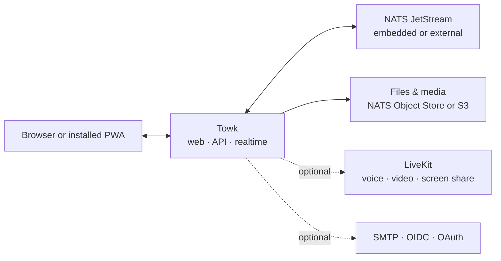

<div align="center">
  <picture>
    <source media="(prefers-color-scheme: dark)" srcset="branding/towk-horizontal-on-dark.webp" />
    <source media="(prefers-color-scheme: light)" srcset="branding/towk-horizontal-on-light.webp" />
    
  </picture>

  <p><strong>Your conversations. Your infrastructure.</strong></p>

  <p>
    A focused, self-hosted communication workspace for teams and communities.<br />
    Everyday chat, files, notifications and calls — without a mandatory hosted service.
  </p>

  <p>
    <strong>English</strong> ·
    <a href="README.fr.md">Français</a> ·
    <a href="README.de.md">Deutsch</a> ·
    <a href="README.es.md">Español</a> ·
    <a href="README.pt.md">Português</a>
  </p>

  <p>
    <a href="ROADMAP.md"></a>
    
    
    <a href=".github/workflows/refresh-readme-metrics.yml"></a>
    <a href="LICENSING.md"></a>
  </p>

  <p>
    <a href="#why-towk">Why Towk</a> ·
    <a href="#development-pulse">Development pulse</a> ·
    <a href="#capabilities">Capabilities</a> ·
    <a href="#architecture">Architecture</a> ·
    <a href="#run-towk">Run Towk</a> ·
    <a href="#project">Project</a>
  </p>
</div>

<picture>
  <source media="(max-width: 600px)" srcset="https://raw.githubusercontent.com/Yo-DDV/Towk/readme-metrics/en/hero-mobile.svg" />
  
</picture>

<p align="center">
  <a href="apps/docs-website/src/content/docs/getting-started/quick-start.mdx"><strong>🚀 Run Towk</strong></a>
  &nbsp;·&nbsp;
  <a href="apps/docs-website/src/content/docs/guides/deployment/docker-compose.mdx"><strong>📦 Deploy</strong></a>
  &nbsp;·&nbsp;
  <a href="apps/docs-website/src/content/docs/guides/operations/security.mdx"><strong>🛡️ Security model</strong></a>
  &nbsp;·&nbsp;
  <a href="ROADMAP.md"><strong>🗺️ Roadmap</strong></a>
</p>

> [!IMPORTANT]
> Towk is under active development and has not reached 1.0. For important
> deployments, pin an immutable release or image digest, keep tested backups,
> and review release notes before upgrading.

<picture>
  <source media="(prefers-color-scheme: dark)" srcset="apps/docs-website/src/assets/towk_dark.png" />
  <source media="(prefers-color-scheme: light)" srcset="apps/docs-website/src/assets/towk_light.png" />
  
</picture>

<a id="why-towk"></a>
## Why Towk

<table>
  <tr>
    <td width="33%" valign="top">
      <h3>🛡️ Independent by design</h3>
      <p><strong>Your deployment is the boundary.</strong> There is no central Towk account, mandatory Towk cloud or shared control plane between organizations.</p>
    </td>
    <td width="33%" valign="top">
      <h3>🎯 Focused on daily communication</h3>
      <p><strong>The basics deserve first-class attention.</strong> Towk prioritizes conversations, files, notifications and calls instead of becoming an everything-platform.</p>
    </td>
    <td width="33%" valign="top">
      <h3>⚙️ Compact, then scalable</h3>
      <p><strong>Start with one process.</strong> Move to external NATS, S3-compatible storage, multiple replicas and LiveKit only when your operations require them.</p>
    </td>
  </tr>
</table>

> **Self-hosting is not a checkbox.** It means choosing where the service runs,
> how it is backed up, which identity providers it trusts, where files live and
> which exact source revision produced the artifact you deploy.

Towk is intentionally **not** a federated protocol and **not** a hosted SaaS. It
is a focused open-source alternative for teams and communities that want to run
their communication workspace themselves — not a claim to replace every feature
of every collaboration platform.

<a id="development-pulse"></a>
## Development pulse

<picture>
  <source media="(max-width: 600px)" srcset="https://raw.githubusercontent.com/Yo-DDV/Towk/readme-metrics/en/activity-mobile.svg" />
  
</picture>

<picture>
  <source media="(max-width: 600px)" srcset="https://raw.githubusercontent.com/Yo-DDV/Towk/readme-metrics/en/contributors-mobile.svg" />
  
</picture>

<details>
  <summary><strong>How these metrics are produced</strong></summary>

  The repository generates these SVGs from GitHub's API with its scoped
  `GITHUB_TOKEN`; it does not use a personal token or an external statistics
  service. The workflow refreshes after every push to `main` and at approximately
  **06:17 and 21:17 Europe/Paris** each day.

  The reporting window is the trailing 365 days. Commits are counted from the
  history reachable from `main` and bucketed by their committed timestamp in UTC.
  Pull requests are counted by `merged_at`. Contributor rankings use the GitHub
  identity attributed to each main-branch commit or merged pull request; detected
  bots are excluded from human rankings and reported separately. Raw commit
  messages and email addresses are not written to the generated branch.

  The generated SVGs and machine-readable snapshot live on the
  [`readme-metrics`](https://github.com/Yo-DDV/Towk/tree/readme-metrics) branch.
</details>

<a id="capabilities"></a>
## What ships today

<table>
  <tr>
    <td width="33%" valign="top">
      <h3>💬 Conversations</h3>
      <p>Rooms, direct messages, replies, threads, editing and deletion, reactions, mentions, typing indicators and presence.</p>
    </td>
    <td width="33%" valign="top">
      <h3>📎 Files &amp; media</h3>
      <p>Attachments, image handling, voice messages, link previews, room file browsing and optional video processing.</p>
    </td>
    <td width="33%" valign="top">
      <h3>📞 Calls &amp; installed app</h3>
      <p>Optional LiveKit voice/video rooms, screen sharing and call-media E2EE, plus an installable responsive PWA.</p>
    </td>
  </tr>
  <tr>
    <td width="33%" valign="top">
      <h3>🔐 Identity &amp; local continuity</h3>
      <p>Password/email flows, OIDC and selected OAuth providers, encrypted drafts, outbox and recent timelines on supported browsers.</p>
    </td>
    <td width="33%" valign="top">
      <h3>🧭 Administration</h3>
      <p>Built-in and custom roles, granular permissions, room groups, branding, user administration, diagnostics and event-log inspection.</p>
    </td>
    <td width="33%" valign="top">
      <h3>🔌 APIs &amp; operations</h3>
      <p>Protobuf-first ConnectRPC APIs, realtime WebSocket frames, operator CLI/API, health endpoints, metrics and multi-server client support.</p>
    </td>
  </tr>
</table>

The interface is available in **English, German, French, Spanish and Portuguese**.
Detailed behavior, trade-offs and current limitations are recorded in the
[Feature Decision Records](docs/fdr/INDEX.md).

## Sovereignty, made concrete

<table>
  <tr>
    <td width="33%" valign="top"><h3>🏠 Deployment</h3><p>Run one independently operated server per organization or community, from a compact binary to a replicated deployment.</p></td>
    <td width="33%" valign="top"><h3>🗄️ Data placement</h3><p>Choose embedded or external NATS persistence and NATS Object Store or S3-compatible storage for files.</p></td>
    <td width="33%" valign="top"><h3>🪪 Identity policy</h3><p>Use local password/email accounts or explicitly selected external providers, including a self-hosted OIDC provider.</p></td>
  </tr>
  <tr>
    <td width="33%" valign="top"><h3>🔑 Key lifecycle</h3><p>Message text and selected durable identity fields use per-user encryption, with crypto-shredding during account deletion.</p></td>
    <td width="33%" valign="top"><h3>📦 Build traceability</h3><p>Public source, immutable coordinates, exact-commit OCI metadata, SBOMs, vulnerability scans and provenance attestations.</p></td>
    <td width="33%" valign="top"><h3>📈 Operational visibility</h3><p>Health/readiness endpoints, Prometheus-compatible metrics, diagnostics, an administrative event log and reproducible performance gates.</p></td>
  </tr>
</table>

> [!NOTE]
> Self-hosting does not by itself make a deployment secure or compliant. Towk
> encrypts message text and selected durable user data **at rest**; it does not
> currently provide end-to-end encryption for text conversations. An operator
> controlling the server, storage and keys remains inside the trust boundary.
> Attachments and much of the surrounding metadata are outside that field-level
> envelope. LiveKit call media supports E2EE when calls are enabled.

Backups deliberately separate normal application data from the built-in
key-encryption-key store unless an operator explicitly includes or exports those
keys. Read the [security and privacy guide](apps/docs-website/src/content/docs/guides/operations/security.mdx)
and [privacy-erasure guide](apps/docs-website/src/content/docs/guides/operations/privacy-erasure.mdx)
before designing retention, backup or deletion procedures.

<a id="architecture"></a>
## Architecture at a glance



The responsive SvelteKit client is compiled into the Go server. Public
request/response APIs use ConnectRPC and Protocol Buffers; live updates use a
protobuf WebSocket. Durable domain state is event-sourced in NATS JetStream and
served through projections.

Explore the [architecture inventory](docs/ARCHITECTURE.md),
[Architecture Decision Records](docs/adr/INDEX.md) and
[public API reference](apps/docs-website/src/content/docs/reference/connectrpc-api/index.mdx).

<a id="run-towk"></a>
## Run Towk

### Development workspace

Towk uses [mise](https://mise.jdx.dev/) to provision the pinned project toolchain:

```sh
git clone https://github.com/Yo-DDV/Towk.git
cd Towk
mise trust
mise run setup
mise dev
```

The default development entry point is <http://localhost:4000>. Development
bootstrap accounts are documented in [CONTRIBUTING.md](CONTRIBUTING.md) and must
never be reused in a public deployment.

### Choose a deployment path

<table>
  <tr>
    <td width="33%" valign="top"><h3>📦 Docker Compose</h3><p>The most complete single-server example, with external NATS, Caddy and optional LiveKit.</p><p><a href="apps/docs-website/src/content/docs/guides/deployment/docker-compose.mdx"><strong>Open the guide →</strong></a></p></td>
    <td width="33%" valign="top"><h3>⚡ Standalone binary</h3><p>Evaluation, compact VMs and operators who deliberately want embedded NATS.</p><p><a href="apps/docs-website/src/content/docs/guides/deployment/binary.mdx"><strong>Open the guide →</strong></a></p></td>
    <td width="33%" valign="top"><h3>☸️ Kubernetes</h3><p>For operators supplying shared NATS, ingress, secrets and lifecycle tooling.</p><p><a href="apps/docs-website/src/content/docs/guides/deployment/kubernetes.mdx"><strong>Open the guide →</strong></a></p></td>
  </tr>
</table>

Start with [Read This First](apps/docs-website/src/content/docs/guides/deployment/read-this-first.mdx).
For durable deployments, use an immutable image tag and digest rather than a
floating tag.

### Know the current boundary

| Towk may be a good fit when you… | Evaluate carefully when you require… |
|---|---|
| want to operate the communication boundary, identity policy and data location yourself | a managed SaaS, contractual support or a response-time SLA |
| prefer one responsive, installable web client across desktop and mobile | official native applications distributed through mobile or desktop stores |
| value a focused workspace with rooms, files, notifications and calls | federation between independently administered communities |
| can test upgrades, backups and restores while the project is pre-1.0 | stable 1.0 APIs or end-to-end encrypted text conversations today |

<a id="project"></a>
## Open project, explicit rules

Towk is developed in public, but it does not accept unsolicited external pull
requests. Public participation starts with a focused GitHub Issue so product,
security, compatibility and maintenance constraints can be assessed before
implementation.

<p align="center">
  <a href="https://github.com/Yo-DDV/Towk/issues/new?template=bug_report.yml"><strong>🐛 Report a bug</strong></a>
  &nbsp;·&nbsp;
  <a href="https://github.com/Yo-DDV/Towk/issues/new?template=feature_request.yml"><strong>✨ Propose a feature</strong></a>
  &nbsp;·&nbsp;
  <a href="https://github.com/Yo-DDV/Towk/issues/new?template=question.yml"><strong>💬 Ask a question</strong></a>
</p>

Do not disclose vulnerabilities in public. Follow [SECURITY.md](SECURITY.md) and
use GitHub private vulnerability reporting.

<table>
  <tr>
    <td width="25%" valign="top"><strong><a href="ROADMAP.md">🗺️ Roadmap</a></strong><br />Direction without invented delivery promises.</td>
    <td width="25%" valign="top"><strong><a href="GOVERNANCE.md">⚖️ Governance</a></strong><br />Ownership, review and release rules.</td>
    <td width="25%" valign="top"><strong><a href="docs/PERFORMANCE.md">📊 Performance</a></strong><br />Reproducible evidence and rejection gates.</td>
    <td width="25%" valign="top"><strong><a href="PROVENANCE.md">🔎 Provenance</a></strong><br />Origin, attribution and selective upstream review.</td>
  </tr>
</table>

## License and origin

Towk uses per-file SPDX and REUSE metadata. The server, CLI and bundled server
artifacts are AGPL-3.0-or-later by default; explicitly listed frontend, public
API, documentation and example surfaces are Apache-2.0. See
[LICENSING.md](LICENSING.md) and [REUSE.toml](REUSE.toml) for the exact boundary.

Towk is an independent project based on
[Chatto](https://github.com/chattocorp/chatto). Chatto and its logos are names
and marks of ChattoCorp GmbH. Towk is not endorsed, sponsored, operated or
supported by ChattoCorp GmbH.
