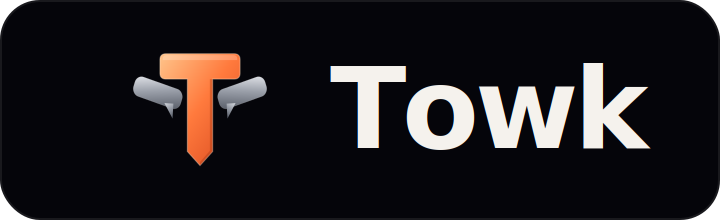

<div align="center">
  

  <p><strong>Your conversations. Your infrastructure.</strong></p>

  <p>
    A fast, self-hosted communication workspace for teams and communities.<br />
    Real-time messaging, files, notifications, voice and video — without handing
    ownership of the community to a central platform.
  </p>

  <p>
    <a href="https://github.com/Yo-DDV/towk/actions/workflows/ci.yml"></a>
    <a href="https://github.com/Yo-DDV/towk/security"></a>
    <a href="LICENSING.md"></a>
    <a href="CONTRIBUTING.md"></a>
  </p>
</div>

> [!IMPORTANT]
> Towk is under active development and has not reached 1.0. Pin deployments to
> immutable tags or digests, keep tested backups, and read the release notes
> before upgrading.

## What Towk is

Towk gives one organization or community its own communication server. It is
designed for self-hosting, responsive browser use, and installable PWA workflows.
The current foundation includes:

- rooms, direct messages, replies, threads, reactions, mentions and presence;
- file attachments, image handling, link previews and optional video processing;
- granular roles, permissions, room groups and administration tools;
- realtime notifications, Web Push, badges and configurable notification levels;
- voice and video rooms powered by LiveKit, including screen sharing and media E2EE;
- OAuth/OIDC integration, password and email-based authentication flows;
- per-user encryption keys for selected durable data and crypto-shredding support;
- a single-binary mode, Docker deployment, external NATS and S3-compatible storage;
- multi-server client foundations and a protobuf-first public API.

Towk is not a federated protocol and does not place every community on one shared
service. Each deployment remains operationally and legally independent.

## Architecture at a glance

| Layer | Technology | Responsibility |
|---|---|---|
| Client | Svelte 5, SvelteKit, Tailwind CSS 4 | Responsive web app and installable PWA |
| API | ConnectRPC and Protocol Buffers | Public, admin, auth and discovery contracts |
| Realtime | Protobuf over WebSocket | Live messages, state and configuration updates |
| Domain | Go services and projections | Authorization, event-sourced behavior and APIs |
| Data | NATS JetStream and KV | Events, projections, runtime state and object storage |
| Calls | LiveKit | Voice, video, screen sharing and media transport |

The inherited `chatto.*` protocol namespaces, `CHATTO_*` environment variables,
and several persisted identifiers remain compatibility contracts for now. They
are not Towk branding and will only change through versioned, rollback-safe
migrations. See [ADR-049](docs/adr/ADR-049-towk-product-identity-and-compatibility-boundary.md).

## Run a development workspace

Towk uses [mise](https://mise.jdx.dev/) to provision the project toolchain.

```sh
git clone https://github.com/Yo-DDV/towk.git
cd towk
mise trust
mise run setup
mise dev
```

The default development entry point is <http://localhost:4000>. Development
bootstrap accounts are documented in [CONTRIBUTING.md](CONTRIBUTING.md) and must
never be reused in a public deployment.

Useful checks:

```sh
mise license-check
mise test
mise build
```

Run the narrowest relevant task while iterating, then the complete required
matrix before opening a pull request.

## Releases and deployment

Towk images are built from this repository, scanned before publication, and tied
to an exact commit through OCI metadata, SBOM and provenance attestations. See
[Corresponding source](SOURCE.md) for the source lookup contract.

Do not deploy floating upstream images as a Towk release. Production and durable
pilots should use an immutable Towk tag or digest.

## Contributing

Contributions from humans and from contributors using coding agents are welcome.
The same engineering, security, licensing and verification rules apply in both
cases. The person opening an issue or pull request remains accountable for every
submitted line and every public claim.

Start with:

1. [Contribution policy](CONTRIBUTING.md)
2. [Repository guidance](AGENTS.md)
3. [Architecture decisions](docs/adr/INDEX.md) and [feature decisions](docs/fdr/INDEX.md)
4. [Code of conduct](CODE_OF_CONDUCT.md)

Pull requests that skip mandatory guidance, conceal unverified generated changes,
include secrets, or fail required checks will not be merged.

## Security

Do not disclose suspected vulnerabilities in a public issue. Follow
[SECURITY.md](SECURITY.md) and use GitHub private vulnerability reporting. Never
include tokens, private messages, personal data, raw production logs, or
unredacted screenshots in reports.

## Project governance

- `main` is protected; changes land through pull requests and required checks.
- Conventional Commits are used for commits and pull request titles.
- The canonical repository is standalone and has no GitHub fork-network link.
- Upstream changes are selected and reviewed; they are not merged automatically.
- Release artifacts are produced only by Towk-owned workflows and namespaces.
- Durable product and architecture choices are recorded in FDRs and ADRs.

See [GOVERNANCE.md](GOVERNANCE.md), [PROVENANCE.md](PROVENANCE.md),
[UPSTREAM.md](UPSTREAM.md), and [ROADMAP.md](ROADMAP.md).

## License and origin

Towk uses the repository's existing per-file licensing model:

- the server, CLI and bundled server artifacts are AGPL-3.0-or-later by default;
- explicitly listed frontend, public API, documentation and example surfaces are
  Apache-2.0;
- third-party notices remain in [NOTICE](NOTICE).

The exact machine-readable boundary is defined by [REUSE.toml](REUSE.toml).
When a modified AGPL server is available over a network, its users must receive a
prominent way to obtain the corresponding source for that deployed version.

Towk is an independent project based on
[Chatto](https://github.com/chattocorp/chatto). Chatto and its logos are names and
marks of ChattoCorp GmbH. Towk is not endorsed, sponsored, operated, or supported
by ChattoCorp GmbH.
