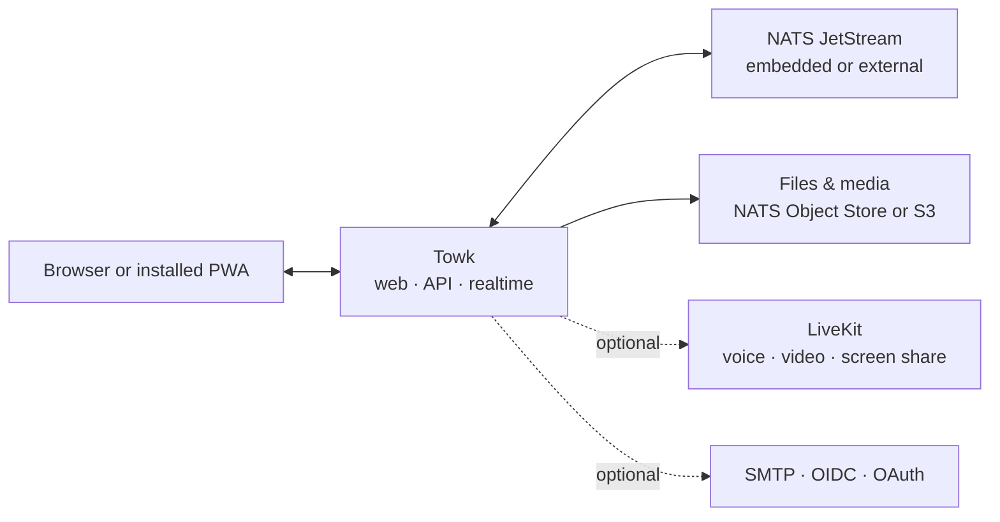

<div align="center">
  <picture>
    <source media="(prefers-color-scheme: dark)" srcset="branding/towk-horizontal-on-dark.webp" />
    <source media="(prefers-color-scheme: light)" srcset="branding/towk-horizontal-on-light.webp" />
    
  </picture>

  <p><strong>Your conversations. Your infrastructure.</strong></p>

  <p>
    A focused, self-hosted communication workspace for teams and communities.<br />
    Rooms, direct messages, files, notifications, voice and video — without a mandatory hosted service.
  </p>

  <p>
    <strong>English</strong> ·
    <a href="README.fr.md">Français</a> ·
    <a href="README.de.md">Deutsch</a> ·
    <a href="README.es.md">Español</a> ·
    <a href="README.pt.md">Português</a>
  </p>

  <p>
    <a href="https://github.com/Yo-DDV/Towk/actions/workflows/ci.yml"></a>
    <a href="ROADMAP.md"></a>
    <a href="LICENSING.md"></a>
    <a href="SECURITY.md"></a>
  </p>

  <p>
    <a href="#why-towk">Why Towk</a> ·
    <a href="#capabilities">Capabilities</a> ·
    <a href="#data-control">Data control</a> ·
    <a href="#architecture">Architecture</a> ·
    <a href="#run-towk">Run Towk</a> ·
    <a href="#project">Project</a>
  </p>
</div>

> [!IMPORTANT]
> Towk is under active development and has not reached 1.0. For important
> deployments, pin an immutable release or image digest, keep tested backups, and
> review release notes before upgrading.

<picture>
  <source media="(prefers-color-scheme: dark)" srcset="apps/docs-website/src/assets/towk_dark.png" />
  <source media="(prefers-color-scheme: light)" srcset="apps/docs-website/src/assets/towk_light.png" />
  
</picture>

<a id="why-towk"></a>
## Why Towk

<table>
  <tr>
    <td width="33%" valign="top">
      <h3>Independent by design</h3>
      <p>Each deployment is its own operational and data-protection boundary. There is no central Towk account and no mandatory Towk cloud.</p>
    </td>
    <td width="33%" valign="top">
      <h3>Focused on the essentials</h3>
      <p>Towk concentrates on the interactions people use every day: conversations, files, notifications and calls—not on becoming an everything-platform.</p>
    </td>
    <td width="33%" valign="top">
      <h3>Compact, then scalable</h3>
      <p>Start with one binary and embedded NATS. Move to external NATS, S3-compatible storage, multiple replicas and LiveKit when your operations require them.</p>
    </td>
  </tr>
</table>

> **Self-hosting is not a checkbox.** It means choosing where the service runs,
> how it is backed up, which identity providers it trusts, and which exact source
> revision produced the artifact you deploy.

Towk is intentionally **not** a federated protocol or a hosted SaaS. A server
belongs to one organization or community, while the installable web client can
connect to the Towk servers its user chooses to add.

<a id="capabilities"></a>
## What ships today

| Area | Capabilities |
|---|---|
| **Conversations** | Rooms, direct messages, replies, threads, editing and deletion, reactions, mentions, typing indicators and presence |
| **Files & media** | Attachments, image handling, voice messages, link previews, room file browsing and optional video processing |
| **Calls** | Optional LiveKit-powered voice and video rooms, screen sharing, device controls and per-call media E2EE |
| **Notifications** | Realtime delivery, Web Push, app badges, mentions and configurable server or room notification levels |
| **Administration** | Built-in and custom roles, granular permissions, room groups, server branding, user administration and diagnostics |
| **Identity** | Password and email flows plus configurable OIDC, GitHub, GitLab, Google and Discord sign-in providers |
| **Installed PWA** | Responsive desktop and mobile UI, offline shell, encrypted drafts, outbox and recent timelines, OS sharing and file handling |
| **Languages** | User interface available in English, German, French, Spanish and Portuguese |
| **Integration** | Protobuf-first ConnectRPC API, realtime WebSocket protocol, operator CLI/API and multi-server client support |

The feature contracts are documented publicly in the
[Feature Decision Records](docs/fdr/INDEX.md), including their behavior,
trade-offs and current limitations.

<a id="data-control"></a>
## Sovereignty, made concrete

| Control | What Towk provides |
|---|---|
| **Deployment boundary** | One independently operated server per organization or community, with no central Towk identity or required hosted control plane |
| **Data placement** | Embedded or external NATS persistence, NATS Object Store or S3-compatible file storage, and documented backup and restore paths |
| **Identity policy** | Local password/email accounts or selected external identity providers, including a self-hosted OIDC provider |
| **Key lifecycle** | Per-user encryption for message text and selected durable identity fields, with crypto-shredding during account deletion |
| **Build traceability** | Public source, immutable release coordinates, exact-commit OCI metadata, SBOMs, vulnerability scans and provenance attestations |
| **Operational visibility** | Health and readiness endpoints, Prometheus-compatible metrics, diagnostics, an administrative event log and a reproducible performance protocol |

> [!NOTE]
> Self-hosting does not by itself make a deployment secure or compliant. Towk
> encrypts message text and selected durable user data **at rest**; it does not
> currently provide end-to-end encryption for text conversations. An operator
> controlling the server, storage and keys remains inside the trust boundary.
> Attachments and much of the surrounding metadata are outside that field-level
> encryption envelope. LiveKit call media supports E2EE when calls are enabled.

Backups deliberately separate normal application data from the built-in
key-encryption-key store unless an operator explicitly includes or exports those
keys. Read the [security and privacy guide](apps/docs-website/src/content/docs/guides/operations/security.mdx)
and [privacy-erasure guide](apps/docs-website/src/content/docs/guides/operations/privacy-erasure.mdx)
before designing retention, backup or deletion procedures.

<a id="architecture"></a>
## Architecture at a glance



The responsive SvelteKit client is compiled into the Go server. Public
request/response APIs use ConnectRPC and Protocol Buffers; live updates use a
protobuf WebSocket. Durable domain state is event-sourced in NATS JetStream and
served through projections.

For the detailed inventory, see [Towk Architecture](docs/ARCHITECTURE.md), the
[Architecture Decision Records](docs/adr/INDEX.md) and the
[public API reference](apps/docs-website/src/content/docs/reference/connectrpc-api/index.mdx).

<a id="run-towk"></a>
## Run Towk

### Development workspace

Towk uses [mise](https://mise.jdx.dev/) to provision the pinned project
toolchain:

```sh
git clone https://github.com/Yo-DDV/Towk.git
cd Towk
mise trust
mise run setup
mise dev
```

The default development entry point is <http://localhost:4000>. Development
bootstrap accounts are documented in [CONTRIBUTING.md](CONTRIBUTING.md) and must
never be reused in a public deployment.

### Choose a deployment path

| Path | Best for | Guide |
|---|---|---|
| **Docker Compose** | The most complete single-server self-hosting example, with external NATS, Caddy and optional LiveKit | [Deploy with Docker Compose](apps/docs-website/src/content/docs/guides/deployment/docker-compose.mdx) |
| **Standalone binary** | Evaluation, compact VMs and operators who deliberately want embedded NATS | [Run the standalone binary](apps/docs-website/src/content/docs/guides/deployment/binary.mdx) |
| **Kubernetes** | Operators supplying their own shared NATS, ingress, secrets and lifecycle tooling | [Review Kubernetes guidance](apps/docs-website/src/content/docs/guides/deployment/kubernetes.mdx) |

Start with [Read This First](apps/docs-website/src/content/docs/guides/deployment/read-this-first.mdx).
For durable deployments, use an immutable image tag and digest rather than a
floating tag.

### Know the current boundary

| Towk may be a good fit when you… | Evaluate carefully when you require… |
|---|---|
| want to operate the communication boundary, identity policy and data location yourself | a managed SaaS, contractual support or a response-time SLA |
| prefer one responsive, installable web client across desktop and mobile | official native applications distributed through mobile or desktop stores |
| value a focused workspace with rooms, files, notifications and calls | federation between independently administered communities |
| can test upgrades, backups and restores while the project is pre-1.0 | stable 1.0 APIs or end-to-end encrypted text conversations today |

<a id="project"></a>
## An open project with explicit rules

Towk is developed in public, but it does not accept unsolicited external pull
requests. Public participation starts with a focused GitHub Issue so product,
security, compatibility and maintenance constraints can be assessed before
implementation.

- [Report a reproducible bug](https://github.com/Yo-DDV/Towk/issues/new?template=bug_report.yml)
- [Propose a scoped feature](https://github.com/Yo-DDV/Towk/issues/new?template=feature_request.yml)
- [Ask a usage or self-hosting question](https://github.com/Yo-DDV/Towk/issues/new?template=question.yml)

Do not disclose vulnerabilities in public. Follow [SECURITY.md](SECURITY.md) and
use GitHub private vulnerability reporting.

<table>
  <tr>
    <td width="25%" valign="top"><strong><a href="ROADMAP.md">Roadmap</a></strong><br />Direction without invented delivery promises.</td>
    <td width="25%" valign="top"><strong><a href="GOVERNANCE.md">Governance</a></strong><br />Ownership, review and release rules.</td>
    <td width="25%" valign="top"><strong><a href="docs/PERFORMANCE.md">Performance</a></strong><br />Reproducible evidence and rejection gates.</td>
    <td width="25%" valign="top"><strong><a href="PROVENANCE.md">Provenance</a></strong><br />Origin, attribution and selective upstream review.</td>
  </tr>
</table>

## License and origin

Towk uses per-file SPDX and REUSE metadata. The server, CLI and bundled server
artifacts are AGPL-3.0-or-later by default; explicitly listed frontend, public
API, documentation and example surfaces are Apache-2.0. See
[LICENSING.md](LICENSING.md) and [REUSE.toml](REUSE.toml) for the exact boundary.

Towk is an independent project based on
[Chatto](https://github.com/chattocorp/chatto). Chatto and its logos are names
and marks of ChattoCorp GmbH. Towk is not endorsed, sponsored, operated or
supported by ChattoCorp GmbH.
