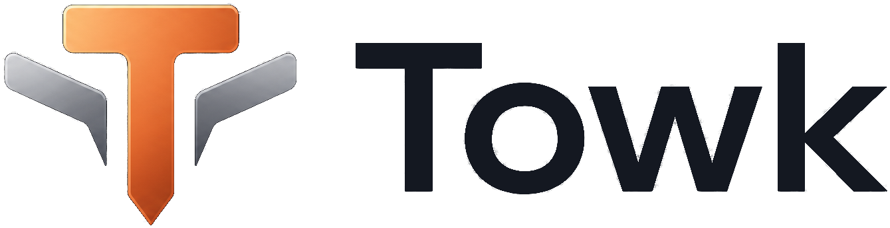
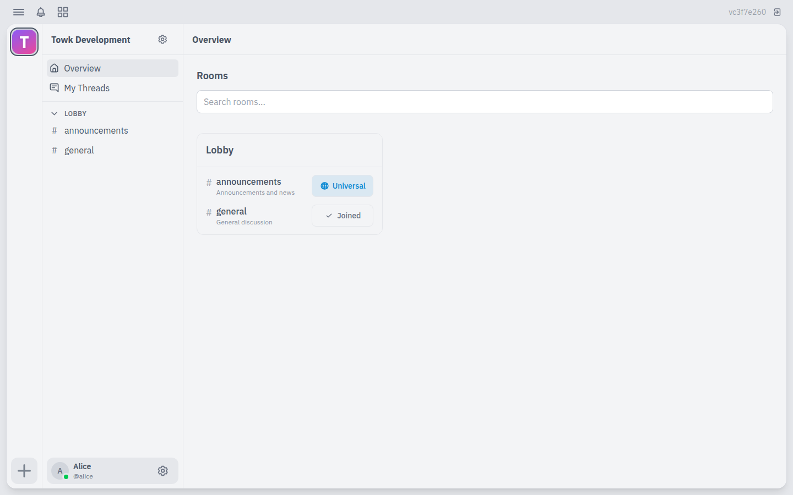
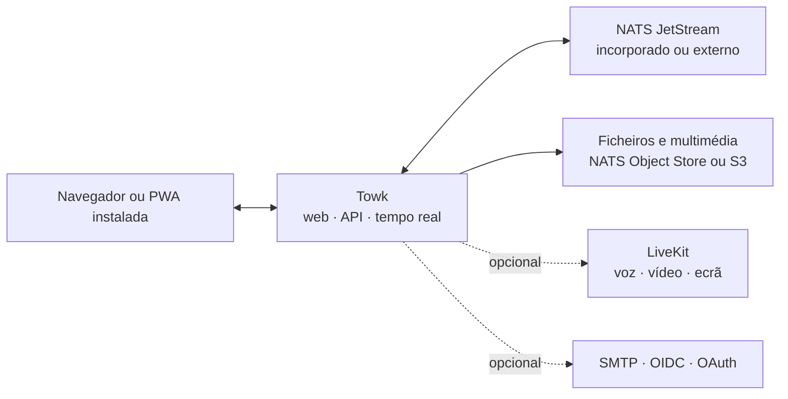

<div align="center">
  <picture>
    <source media="(prefers-color-scheme: dark)" srcset="branding/towk-horizontal-on-dark.webp" />
    <source media="(prefers-color-scheme: light)" srcset="branding/towk-horizontal-on-light.webp" />
    
  </picture>

  <p><strong>As tuas conversas. A tua infraestrutura.</strong></p>

  <p>
    Um espaço de comunicação autoalojado e focado no essencial para equipas e comunidades.<br />
    Salas, mensagens diretas, ficheiros, notificações, voz e vídeo — sem depender de um serviço alojado obrigatório.
  </p>

  <p>
    <a href="README.md">English</a> ·
    <a href="README.fr.md">Français</a> ·
    <a href="README.de.md">Deutsch</a> ·
    <a href="README.es.md">Español</a> ·
    <strong>Português</strong>
  </p>

  <p>
    <a href="https://github.com/Yo-DDV/Towk/actions/workflows/ci.yml"></a>
    <a href="ROADMAP.md"></a>
    <a href="LICENSING.md"></a>
    <a href="SECURITY.md"></a>
  </p>

  <p>
    <a href="#why-towk">Porquê Towk</a> ·
    <a href="#capabilities">Funcionalidades</a> ·
    <a href="#data-control">Controlo dos dados</a> ·
    <a href="#architecture">Arquitetura</a> ·
    <a href="#run-towk">Executar Towk</a> ·
    <a href="#project">Projeto</a>
  </p>
</div>

> [!IMPORTANT]
> O Towk está em desenvolvimento ativo e ainda não chegou à versão 1.0. Em
> instalações importantes, fixa uma versão imutável ou um digest de imagem,
> mantém cópias de segurança cuja reposição tenha sido testada e consulta as
> notas da versão antes de atualizar.

<picture>
  <source media="(prefers-color-scheme: dark)" srcset="apps/docs-website/src/assets/towk_dark.png" />
  <source media="(prefers-color-scheme: light)" srcset="apps/docs-website/src/assets/towk_light.png" />
  
</picture>

<a id="why-towk"></a>
## Porquê Towk

<table>
  <tr>
    <td width="33%" valign="top">
      <h3>Independente por conceção</h3>
      <p>Cada instalação constitui a sua própria fronteira operacional e de proteção de dados. Não existe uma conta Towk central nem uma cloud Towk obrigatória.</p>
    </td>
    <td width="33%" valign="top">
      <h3>Focado no essencial</h3>
      <p>O Towk concentra-se nas interações do dia a dia: conversas, ficheiros, notificações e chamadas — em vez de tentar tornar-se uma plataforma para tudo.</p>
    </td>
    <td width="33%" valign="top">
      <h3>Compacto primeiro, escalável depois</h3>
      <p>Começa com um único binário e NATS incorporado. Passa para NATS externo, armazenamento compatível com S3, várias réplicas e LiveKit quando a operação o exigir.</p>
    </td>
  </tr>
</table>

> **O autoalojamento não é uma caixa para assinalar.** Significa escolher onde o
> serviço é executado, como é salvaguardado, em que fornecedores de identidade
> confia e qual a revisão exata do código-fonte que produziu o artefacto
> instalado.

O Towk não pretende ser **nem** um protocolo federado **nem** um SaaS alojado.
Cada servidor pertence a uma organização ou comunidade, enquanto o cliente web
instalável pode ligar-se aos servidores Towk que o utilizador decidir adicionar.

<a id="capabilities"></a>
## O que está disponível hoje

| Área | Funcionalidades |
|---|---|
| **Conversas** | Salas, mensagens diretas, respostas, tópicos, edição e eliminação, reações, menções, indicadores de escrita e presença |
| **Ficheiros e conteúdos multimédia** | Anexos, tratamento de imagens, mensagens de voz, pré-visualizações de ligações, navegação nos ficheiros da sala e processamento de vídeo opcional |
| **Chamadas** | Salas opcionais de voz e vídeo com LiveKit, partilha de ecrã, controlos de dispositivos e encriptação ponto a ponto dos conteúdos multimédia de cada chamada |
| **Notificações** | Entrega em tempo real, Web Push, indicadores da aplicação, menções e níveis de notificação configuráveis por servidor ou sala |
| **Administração** | Funções integradas e personalizadas, permissões granulares, grupos de salas, identidade visual do servidor, administração de utilizadores e diagnóstico |
| **Identidade** | Fluxos por palavra-passe e email, além de fornecedores configuráveis OIDC, GitHub, GitLab, Google e Discord |
| **PWA instalada** | Interface responsiva para computador e dispositivos móveis, interface offline, rascunhos, caixa de saída e históricos recentes encriptados, partilha pelo sistema operativo e tratamento de ficheiros |
| **Idiomas** | Interface disponível em inglês, alemão, francês, espanhol e português |
| **Integração** | API ConnectRPC baseada em Protobuf, protocolo WebSocket em tempo real, CLI/API de operador e suporte de vários servidores no cliente |

Os contratos funcionais são documentados publicamente nos
[Feature Decision Records](docs/fdr/INDEX.md), incluindo o comportamento, os
compromissos de conceção e as limitações atuais. A documentação técnica
associada é atualmente mantida em inglês.

<a id="data-control"></a>
## Soberania, de forma concreta

| Controlo | O que o Towk disponibiliza |
|---|---|
| **Fronteira de instalação** | Um servidor operado de forma independente por organização ou comunidade, sem identidade Towk central nem plano de controlo alojado obrigatório |
| **Localização dos dados** | Persistência NATS incorporada ou externa, ficheiros em NATS Object Store ou armazenamento compatível com S3, e processos documentados de cópia e reposição |
| **Política de identidade** | Contas locais com palavra-passe/email ou fornecedores de identidade externos selecionados, incluindo um fornecedor OIDC autoalojado |
| **Ciclo de vida das chaves** | Encriptação por utilizador do texto das mensagens e de determinados campos de identidade persistentes, com eliminação criptográfica ao apagar a conta |
| **Rastreabilidade dos artefactos** | Código-fonte público, coordenadas de versão imutáveis, metadados OCI associados ao commit exato, SBOM, análises de vulnerabilidades e atestados de proveniência |
| **Visibilidade operacional** | Endpoints de estado e prontidão, métricas compatíveis com Prometheus, diagnóstico, registo administrativo de eventos e protocolo de desempenho reproduzível |

> [!NOTE]
> O autoalojamento, por si só, não torna uma instalação segura nem conforme. O
> Towk encripta **em repouso** o texto das mensagens e determinados dados
> persistentes do utilizador; atualmente não disponibiliza encriptação ponto a
> ponto para conversas de texto. Um operador que controle o servidor, o
> armazenamento e as chaves continua dentro da fronteira de confiança. Os anexos
> e muitos metadados ficam fora desta camada. Os conteúdos multimédia das
> chamadas LiveKit suportam encriptação ponto a ponto quando as chamadas estão
> ativas.

As cópias de segurança separam, por predefinição, os dados normais da aplicação
do armazenamento integrado das chaves de encriptação, exceto quando o operador
inclui ou exporta explicitamente essas chaves. Consulta o
[guia de segurança e privacidade](apps/docs-website/src/content/docs/guides/operations/security.mdx)
e o
[guia de encriptação e eliminação](apps/docs-website/src/content/docs/guides/operations/privacy-erasure.mdx)
antes de definir processos de retenção, cópia ou eliminação.

<a id="architecture"></a>
## Arquitetura num relance



O cliente responsivo SvelteKit é compilado no servidor Go. As API públicas de
pedido/resposta utilizam ConnectRPC e Protocol Buffers; as atualizações em
direto utilizam um WebSocket Protobuf. O estado de domínio duradouro é registado
como eventos em NATS JetStream e disponibilizado através de projeções.

Para consultar o inventário detalhado, vê a
[arquitetura do Towk](docs/ARCHITECTURE.md), os
[Architecture Decision Records](docs/adr/INDEX.md) e a
[referência da API pública](apps/docs-website/src/content/docs/reference/connectrpc-api/index.mdx).

<a id="run-towk"></a>
## Executar o Towk

### Ambiente de desenvolvimento

O Towk utiliza o [mise](https://mise.jdx.dev/) para disponibilizar as versões
fixadas das ferramentas do projeto:

```sh
git clone https://github.com/Yo-DDV/Towk.git
cd Towk
mise trust
mise run setup
mise dev
```

A aplicação de desenvolvimento fica disponível, por predefinição, em
<http://localhost:4000>. As contas iniciais estão documentadas em
[CONTRIBUTING.md](CONTRIBUTING.md) e nunca devem ser reutilizadas numa instalação
pública.

### Escolher uma via de instalação

| Via | Adequada para | Guia |
|---|---|---|
| **Docker Compose** | O exemplo mais completo de autoalojamento num único servidor, com NATS externo, Caddy e LiveKit opcional | [Instalar com Docker Compose](apps/docs-website/src/content/docs/guides/deployment/docker-compose.mdx) |
| **Binário autónomo** | Avaliação, máquinas virtuais compactas e operadores que escolhem deliberadamente NATS incorporado | [Executar o binário autónomo](apps/docs-website/src/content/docs/guides/deployment/binary.mdx) |
| **Kubernetes** | Operadores que fornecem o seu próprio NATS partilhado, ingress, segredos e ferramentas de ciclo de vida | [Consultar a orientação para Kubernetes](apps/docs-website/src/content/docs/guides/deployment/kubernetes.mdx) |

Começa por [Ler antes de instalar](apps/docs-website/src/content/docs/guides/deployment/read-this-first.mdx).
Para instalações duradouras, utiliza uma etiqueta de imagem e um digest
imutáveis, em vez de uma etiqueta flutuante.

### Conhecer a fronteira atual

| O Towk pode ser adequado quando… | Avalia cuidadosamente quando precisares de… |
|---|---|
| queres operar diretamente a fronteira de comunicação, a política de identidade e a localização dos dados | um SaaS gerido, suporte contratual ou um SLA de tempo de resposta |
| preferes um único cliente web responsivo e instalável no computador e em dispositivos móveis | aplicações nativas oficiais distribuídas através das lojas móveis ou de computador |
| valorizas um espaço focado em salas, ficheiros, notificações e chamadas | federação entre comunidades administradas de forma independente |
| consegues testar atualizações, cópias e reposições enquanto o projeto é anterior à versão 1.0 | APIs 1.0 estáveis ou conversas de texto com encriptação ponto a ponto já hoje |

<a id="project"></a>
## Um projeto aberto com regras explícitas

O Towk é desenvolvido publicamente, mas não aceita pull requests externos não
solicitados. A participação pública começa com uma Issue focada, para que as
restrições de produto, segurança, compatibilidade e manutenção sejam avaliadas
antes da implementação.

- [Comunicar um erro reproduzível](https://github.com/Yo-DDV/Towk/issues/new?template=bug_report.yml)
- [Propor uma funcionalidade delimitada](https://github.com/Yo-DDV/Towk/issues/new?template=feature_request.yml)
- [Colocar uma questão sobre utilização ou autoalojamento](https://github.com/Yo-DDV/Towk/issues/new?template=question.yml)

Não divulgues vulnerabilidades publicamente. Segue [SECURITY.md](SECURITY.md) e
utiliza o envio privado de vulnerabilidades do GitHub.

<table>
  <tr>
    <td width="25%" valign="top"><strong><a href="ROADMAP.md">Roteiro</a></strong><br />Direção sem promessas de entrega inventadas.</td>
    <td width="25%" valign="top"><strong><a href="GOVERNANCE.md">Governação</a></strong><br />Regras de responsabilidade, revisão e publicação.</td>
    <td width="25%" valign="top"><strong><a href="docs/PERFORMANCE.md">Desempenho</a></strong><br />Provas reproduzíveis e limiares de rejeição.</td>
    <td width="25%" valign="top"><strong><a href="PROVENANCE.md">Proveniência</a></strong><br />Origem, atribuição e revisão seletiva do projeto a montante.</td>
  </tr>
</table>

## Licença e origem

O Towk utiliza metadados SPDX e REUSE por ficheiro. O servidor, a CLI e os
artefactos de servidor incluídos usam AGPL-3.0-or-later por predefinição; as
áreas explicitamente listadas do frontend, da API pública, da documentação e
dos exemplos usam Apache-2.0. Consulta [LICENSING.md](LICENSING.md) e
[REUSE.toml](REUSE.toml) para conhecer a fronteira exata.

O Towk é um projeto independente baseado no
[Chatto](https://github.com/chattocorp/chatto). Chatto e os respetivos logótipos
são nomes e marcas da ChattoCorp GmbH. O Towk não é aprovado, patrocinado,
operado nem suportado pela ChattoCorp GmbH.
