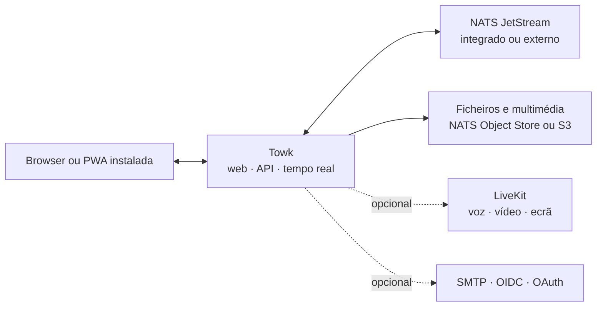

<div align="center">
  <picture>
    <source media="(prefers-color-scheme: dark)" srcset="branding/towk-horizontal-on-dark.webp" />
    <source media="(prefers-color-scheme: light)" srcset="branding/towk-horizontal-on-light.webp" />
    
  </picture>

  <p><strong>As tuas conversas. A tua infraestrutura.</strong></p>

  <p>
    Um espaço de comunicação autoalojado e focado no essencial para equipas e comunidades.<br />
    Conversas, ficheiros, notificações e chamadas do dia a dia — sem um serviço alojado obrigatório.
  </p>

  <p>
    <a href="README.md">English</a> ·
    <a href="README.fr.md">Français</a> ·
    <a href="README.de.md">Deutsch</a> ·
    <a href="README.es.md">Español</a> ·
    <strong>Português</strong>
  </p>

  <p>
    <a href="ROADMAP.md"></a>
    
    
    <a href=".github/workflows/refresh-readme-metrics.yml"></a>
    <a href="LICENSING.md"></a>
  </p>

  <p>
    <a href="#why-towk">Porquê Towk</a> ·
    <a href="#development-pulse">Ritmo</a> ·
    <a href="#capabilities">Funcionalidades</a> ·
    <a href="#architecture">Arquitetura</a> ·
    <a href="#run-towk">Executar Towk</a> ·
    <a href="#project">Projeto</a>
  </p>
</div>

<picture>
  <source media="(max-width: 600px)" srcset="https://raw.githubusercontent.com/Yo-DDV/Towk/readme-metrics/pt/hero-mobile.svg" />
  
</picture>

<p align="center">
  <a href="apps/docs-website/src/content/docs/getting-started/quick-start.mdx"><strong>🚀 Executar o Towk</strong></a>
  &nbsp;·&nbsp;
  <a href="apps/docs-website/src/content/docs/guides/deployment/docker-compose.mdx"><strong>📦 Implementar</strong></a>
  &nbsp;·&nbsp;
  <a href="apps/docs-website/src/content/docs/guides/operations/security.mdx"><strong>🛡️ Modelo de segurança</strong></a>
  &nbsp;·&nbsp;
  <a href="ROADMAP.md"><strong>🗺️ Roteiro</strong></a>
</p>

> [!IMPORTANT]
> O Towk está em desenvolvimento ativo e ainda não chegou à versão 1.0. Para
> instalações importantes, fixa o digest exato da imagem ou o commit de origem,
> mantém cópias de segurança com restauros testados e consulta as notas de versão
> e as alterações de configuração antes de atualizar.

<picture>
  <source media="(prefers-color-scheme: dark)" srcset="apps/docs-website/src/assets/towk_dark.png" />
  <source media="(prefers-color-scheme: light)" srcset="apps/docs-website/src/assets/towk_light.png" />
  
</picture>

<a id="why-towk"></a>
## Porquê Towk

<table>
  <tr>
    <td width="33%" valign="top">
      <h3>🛡️ Independente por conceção</h3>
      <p><strong>A tua instalação define o perímetro.</strong> Não existe uma conta Towk central, uma nuvem Towk obrigatória nem um plano de controlo partilhado entre organizações.</p>
    </td>
    <td width="33%" valign="top">
      <h3>🎯 Focado na comunicação diária</h3>
      <p><strong>As funções essenciais merecem atenção especial.</strong> O Towk dá prioridade a conversas, ficheiros, notificações e chamadas em vez de se tornar uma plataforma para tudo.</p>
    </td>
    <td width="33%" valign="top">
      <h3>⚙️ Primeiro compacto, depois escalável</h3>
      <p><strong>Começa com um único processo.</strong> Passa para NATS externo, armazenamento compatível com S3, várias réplicas e LiveKit apenas quando a operação o exigir.</p>
    </td>
  </tr>
</table>

> **O autoalojamento é mais do que uma opção numa lista de funcionalidades.** Significa escolher onde o
> serviço é executado, como é salvaguardado, em que fornecedores de identidade
> confia, onde ficam os ficheiros e que revisão exata do código-fonte produziu o
> artefacto implantado.

O Towk não pretende ser **nem** um protocolo federado **nem** um SaaS alojado. É
uma alternativa de código aberto e focada para equipas e comunidades que querem
operar o seu próprio espaço de comunicação — sem alegar que substitui todas as
funcionalidades de todas as plataformas colaborativas.

<a id="development-pulse"></a>
## Ritmo de desenvolvimento

<picture>
  <source media="(max-width: 600px)" srcset="https://raw.githubusercontent.com/Yo-DDV/Towk/readme-metrics/pt/activity-mobile.svg" />
  
</picture>

<picture>
  <source media="(max-width: 600px)" srcset="https://raw.githubusercontent.com/Yo-DDV/Towk/readme-metrics/pt/contributors-mobile.svg" />
  
</picture>

<details>
  <summary><strong>Como estas métricas são produzidas</strong></summary>

  O próprio repositório gera estes SVG a partir da API do GitHub com o seu
  `GITHUB_TOKEN` limitado ao repositório; não usa um token pessoal nem um serviço
  externo de estatísticas. O workflow é executado depois de cada push para `main`
  e está agendado aproximadamente para as **06:17 e 21:17 no fuso horário
  Europe/Paris**, todos os dias.

  Os contadores principais e as classificações começam depois do commit público
  que criou o repositório independente `205e91fe1ae5e5c23420974f7e04cf82456eeab3`, integrado em 12 de julho
  de 2026. Assim, o histórico herdado do Chatto não é apresentado como progresso
  atual do Towk. Os gráficos mantêm janelas móveis de 30 dias, 12 semanas e 12
  meses; os períodos anteriores a essa criação aparecem com atividade zero. Os
  commits são selecionados topologicamente a partir de `main` depois do commit de
  criação e agrupados pelo respetivo carimbo temporal de commit em UTC. As pull
  requests são contadas por `merged_at` depois do instante de criação. As
  classificações usam o nome de utilizador do GitHub quando está disponível e, caso
  contrário, o nome público do autor do commit. Os bots detetados são excluídos das
  classificações humanas e apresentados separadamente. Estes números descrevem a
  atividade do repositório e a atribuição Git, não o esforço individual. As
  mensagens de commit e os endereços de correio eletrónico não são escritos no ramo
  gerado.

  Os SVG e o instantâneo legível por máquina são publicados no ramo
  [`readme-metrics`](https://github.com/Yo-DDV/Towk/tree/readme-metrics).
</details>

<a id="capabilities"></a>
## O que está disponível hoje

<table>
  <tr>
    <td width="33%" valign="top">
      <h3>💬 Conversas</h3>
      <p>Salas, mensagens diretas, respostas, tópicos, edição e eliminação, reações, menções, indicadores de escrita e presença.</p>
    </td>
    <td width="33%" valign="top">
      <h3>📎 Ficheiros e multimédia</h3>
      <p>Anexos, tratamento de imagens, mensagens de voz, pré-visualizações de ligações, consulta de ficheiros por sala e processamento de vídeo opcional.</p>
    </td>
    <td width="33%" valign="top">
      <h3>📞 Chamadas e aplicação instalada</h3>
      <p>Chamadas de voz e vídeo opcionais com LiveKit, partilha de ecrã, cifragem ponta a ponta dos fluxos multimédia das chamadas e uma PWA responsiva e instalável.</p>
    </td>
  </tr>
  <tr>
    <td width="33%" valign="top">
      <h3>🔐 Identidade e continuidade local</h3>
      <p>Fluxos por palavra-passe/correio, OIDC e fornecedores OAuth selecionados, além de rascunhos, caixa de saída e históricos recentes de salas cifrados em navegadores compatíveis.</p>
    </td>
    <td width="33%" valign="top">
      <h3>🧭 Administração</h3>
      <p>Funções integradas e personalizadas, permissões granulares, grupos de salas, identidade visual, administração de utilizadores, diagnósticos e registo de eventos.</p>
    </td>
    <td width="33%" valign="top">
      <h3>🔌 API e operação</h3>
      <p>API ConnectRPC baseadas em Protobuf, tramas WebSocket em tempo real, CLI/API de operador, endpoints de saúde, métricas e cliente multisservidor.</p>
    </td>
  </tr>
</table>

A interface está disponível em **inglês, alemão, francês, espanhol e português**.
O comportamento detalhado, os compromissos e as limitações atuais estão registados
nos [Feature Decision Records](docs/fdr/INDEX.md). A documentação técnica associada
é atualmente mantida em inglês.

## Soberania, de forma concreta

<table>
  <tr>
    <td width="33%" valign="top"><h3>🏠 Implantação</h3><p>Cada instalação serve uma organização ou comunidade, desde um binário compacto até uma topologia com réplicas.</p></td>
    <td width="33%" valign="top"><h3>🗄️ Localização dos dados</h3><p>Escolhe persistência NATS integrada ou externa e NATS Object Store ou armazenamento compatível com S3 para os ficheiros.</p></td>
    <td width="33%" valign="top"><h3>🪪 Política de identidade</h3><p>Usa contas locais com palavra-passe/correio ou fornecedores externos escolhidos explicitamente, incluindo um fornecedor OIDC autoalojado.</p></td>
  </tr>
  <tr>
    <td width="33%" valign="top"><h3>🔑 Ciclo de vida das chaves</h3><p>O texto das mensagens e certos campos de identidade duradouros usam cifragem por utilizador, com eliminação criptográfica ao apagar a conta.</p></td>
    <td width="33%" valign="top"><h3>📦 Rastreabilidade das compilações</h3><p>Código público, metadados OCI do commit exato, digests de imagem, SBOM, análises de vulnerabilidades e atestados de proveniência.</p></td>
    <td width="33%" valign="top"><h3>📈 Visibilidade operacional</h3><p>Endpoints de saúde e prontidão, métricas compatíveis com Prometheus, diagnósticos, registo administrativo e um protocolo reproduzível de qualificação do desempenho multimédia.</p></td>
  </tr>
</table>

> [!NOTE]
> O autoalojamento não torna uma instalação automaticamente segura ou conforme.
> O Towk cifra **em repouso** o texto das mensagens e certos dados duradouros do
> utilizador; atualmente não oferece cifragem ponta a ponta para conversas de
> texto. Um operador que controla o servidor, o armazenamento e as chaves continua
> dentro do perímetro de confiança. Os anexos e grande parte dos metadados ficam
> fora dessa envolvente. Os fluxos multimédia das chamadas LiveKit usam cifragem
> ponta a ponta quando as chamadas estão ativadas, mas o Towk fornece a chave
> partilhada da chamada; um operador do Towk com acesso a essas chaves continua
> dentro do perímetro de confiança da chamada.

As cópias de segurança separam deliberadamente os dados normais da aplicação do
armazenamento integrado de chaves de cifragem, salvo se o operador incluir ou
exportar essas chaves explicitamente. Consulta o
[guia de segurança e privacidade](apps/docs-website/src/content/docs/guides/operations/security.mdx)
e o [guia de cifragem e eliminação](apps/docs-website/src/content/docs/guides/operations/privacy-erasure.mdx)
antes de definires políticas de retenção, cópia de segurança ou eliminação.

<a id="architecture"></a>
## Arquitetura em resumo



O cliente SvelteKit responsivo é compilado no servidor Go. As API públicas de
pedido/resposta usam ConnectRPC e Protocol Buffers; as atualizações em tempo real
usam um WebSocket Protobuf. O estado duradouro do domínio é guardado como eventos
no NATS JetStream e disponibilizado através de projeções.

Consulta o [inventário da arquitetura](docs/ARCHITECTURE.md), os
[Architecture Decision Records](docs/adr/INDEX.md) e a
[referência da API pública](apps/docs-website/src/content/docs/reference/connectrpc-api/index.mdx).

<a id="run-towk"></a>
## Executar o Towk

### Ambiente de desenvolvimento

O Towk usa [mise](https://mise.jdx.dev/) para instalar a cadeia de ferramentas fixada:

```sh
git clone https://github.com/Yo-DDV/Towk.git
cd Towk
mise trust
mise run setup
mise dev
```

A interface de desenvolvimento está disponível por predefinição em
<http://localhost:4000>. As contas de arranque estão documentadas em
[CONTRIBUTING.md](CONTRIBUTING.md) e nunca devem ser reutilizadas numa instalação
pública.

### Escolher uma forma de implantação

<table>
  <tr>
    <td width="33%" valign="top"><h3>📦 Docker Compose</h3><p>O exemplo mais completo para um único servidor, com NATS externo, Caddy e LiveKit opcional.</p><p><a href="apps/docs-website/src/content/docs/guides/deployment/docker-compose.mdx"><strong>Abrir o guia →</strong></a></p></td>
    <td width="33%" valign="top"><h3>⚡ Binário autónomo</h3><p>Para avaliação, máquinas virtuais compactas e operadores que escolhem conscientemente NATS integrado.</p><p><a href="apps/docs-website/src/content/docs/guides/deployment/binary.mdx"><strong>Abrir o guia →</strong></a></p></td>
    <td width="33%" valign="top"><h3>☸️ Kubernetes</h3><p>Para operadores que fornecem o seu próprio NATS partilhado, ingress, segredos e ferramentas de ciclo de vida.</p><p><a href="apps/docs-website/src/content/docs/guides/deployment/kubernetes.mdx"><strong>Abrir o guia →</strong></a></p></td>
  </tr>
</table>

Começa por [Read This First](apps/docs-website/src/content/docs/guides/deployment/read-this-first.mdx).
Para instalações duradouras, fixa um digest de imagem exato em vez de confiares
numa etiqueta flutuante.

### Conhecer o limite atual

| O Towk pode ser adequado se… | Avalia com especial cuidado se precisas de… |
|---|---|
| queres gerir o perímetro de comunicação, a política de identidade e a localização dos dados | um SaaS gerido, suporte contratual ou um SLA de tempo de resposta |
| preferes um único cliente web responsivo e instalável para computador e dispositivos móveis | aplicações nativas oficiais distribuídas em lojas móveis ou de computador |
| valorizas um espaço focado com salas, ficheiros, notificações e chamadas | federação entre comunidades administradas de forma independente |
| consegues testar atualizações, cópias de segurança e restauros enquanto o projeto está em fase pré-1.0 | API 1.0 estáveis ou conversas de texto cifradas ponta a ponta já hoje |

<a id="project"></a>
## Projeto aberto, regras explícitas

O Towk é desenvolvido publicamente, mas não aceita pull requests externas não
solicitadas. A participação pública começa com uma Issue GitHub bem delimitada,
para avaliar os limites de produto, segurança, compatibilidade e manutenção antes
da implementação.

<p align="center">
  <a href="https://github.com/Yo-DDV/Towk/issues/new?template=bug_report.yml"><strong>🐛 Comunicar um erro</strong></a>
  &nbsp;·&nbsp;
  <a href="https://github.com/Yo-DDV/Towk/issues/new?template=feature_request.yml"><strong>✨ Propor uma funcionalidade</strong></a>
  &nbsp;·&nbsp;
  <a href="https://github.com/Yo-DDV/Towk/issues/new?template=question.yml"><strong>💬 Fazer uma pergunta</strong></a>
</p>

Não publiques vulnerabilidades. Segue [SECURITY.md](SECURITY.md) e usa o sistema
privado de comunicação de vulnerabilidades do GitHub.

<table>
  <tr>
    <td width="25%" valign="top"><strong><a href="ROADMAP.md">🗺️ Roteiro</a></strong><br />Direção sem promessas de entrega inventadas.</td>
    <td width="25%" valign="top"><strong><a href="GOVERNANCE.md">⚖️ Governação</a></strong><br />Regras de responsabilidade, revisão e publicação.</td>
    <td width="25%" valign="top"><strong><a href="docs/PERFORMANCE.md">📊 Desempenho</a></strong><br />Evidência reproduzível e limites de rejeição.</td>
    <td width="25%" valign="top"><strong><a href="PROVENANCE.md">🔎 Proveniência</a></strong><br />Origem, atribuição e revisão seletiva do upstream.</td>
  </tr>
</table>

## Licença e origem

O Towk usa metadados SPDX e REUSE por ficheiro. O servidor, a CLI e os artefactos
de servidor incluídos usam AGPL-3.0-or-later por predefinição; as superfícies do
frontend, da API pública, da documentação e dos exemplos explicitamente listadas
usam Apache-2.0. Consulta [LICENSING.md](LICENSING.md) e [REUSE.toml](REUSE.toml)
para veres a fronteira exata.

O Towk é um projeto independente baseado no
[Chatto](https://github.com/chattocorp/chatto). Chatto e os seus logótipos são
nomes e marcas da ChattoCorp GmbH. O Towk não é recomendado, patrocinado, operado
nem suportado pela ChattoCorp GmbH.
