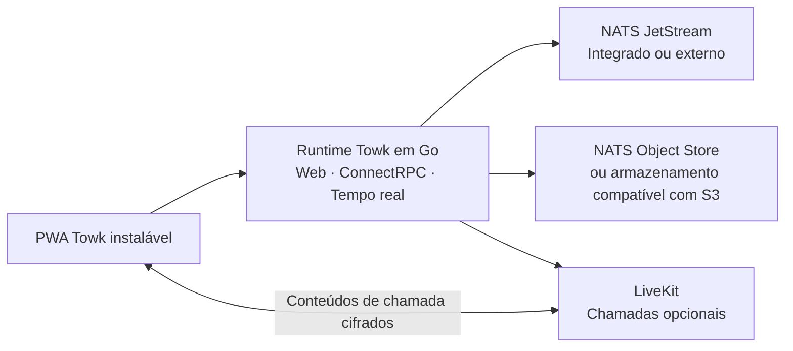

<div align="center">
  <picture>
    <source media="(prefers-color-scheme: dark)" srcset="branding/towk-horizontal-on-dark.webp" />
    <source media="(prefers-color-scheme: light)" srcset="branding/towk-horizontal-on-light.webp" />
    
  </picture>

  <h3>Comunicação que continua a ser tua.</h3>

  <p>
    Um espaço de comunicação autoalojado para equipas e comunidades.<br />
    Mensagens, ficheiros, notificações, voz e vídeo — na infraestrutura que escolheres.
  </p>

  <p>
    <a href="README.md">English</a> ·
    <a href="README.de.md">Deutsch</a> ·
    <a href="README.fr.md">Français</a> ·
    <a href="README.es.md">Español</a> ·
    <a href="README.pt.md"><strong>Português</strong></a>
  </p>

  <p>
    <a href="https://github.com/Yo-DDV/Towk/releases"></a>
    
    
    
    <a href="SECURITY.md"></a>
    <a href="LICENSING.md"></a>
  </p>

  <p>
    <a href="#why-towk">Porquê o Towk</a> ·
    <a href="#what-you-get-today">Funcionalidades</a> ·
    <a href="#security-and-privacy">Segurança e privacidade</a> ·
    <a href="#deploy-your-way">Implementação</a> ·
    <a href="#try-towk-locally">Início rápido</a> ·
    <a href="#project-status">Estado do projeto</a>
  </p>
</div>

> [!IMPORTANT]
> **O Towk é software pré-1.0 em desenvolvimento ativo.** Fixa as implementações
> importantes a uma versão imutável, a um digest de imagem ou a um commit de
> código-fonte; mantém cópias de segurança cuja reposição tenha sido testada;
> valida as atualizações em pré-produção; e consulta as notas de versão antes de
> mudar de versão.

<picture>
  <source media="(prefers-color-scheme: dark)" srcset="apps/docs-website/src/assets/towk_dark.png" />
  <source media="(prefers-color-scheme: light)" srcset="apps/docs-website/src/assets/towk_light.png" />
  
</picture>

## Comunica sem entregar o controlo

O Towk leva a comunicação diária de uma equipa para uma infraestrutura que **tu**
escolhes. Não existe uma conta Towk central, um serviço alojado pelo Towk
obrigatório, nem análise de produto ou rastreio de terceiros integrados na
aplicação. Cada implementação serve uma organização ou comunidade e mantém a sua
própria fronteira administrativa e de proteção de dados.

Essa independência é intencional. O Towk não é uma rede federada e não copia
dados da comunidade entre servidores. O cliente Web instalável liga-se
diretamente aos servidores adicionados pelo utilizador, enquanto cada operador
mantém o controlo das contas, dos fornecedores de identidade, do armazenamento,
das cópias de segurança, da retenção e da exposição pública.

<a id="why-towk"></a>
## Porquê o Towk

<table>
<tr>
<td width="50%" valign="top">

### Controla a tua fronteira

Escolhe o anfitrião, a região, o domínio, os fornecedores de identidade, o
armazenamento e a política de cópias de segurança. O Towk não exige um tenant
partilhado com um fornecedor nem uma conta cloud operada pelo projeto.

</td>
<td width="50%" valign="top">

### Mantém o essencial no mesmo lugar

Salas, mensagens diretas, tópicos, ficheiros, notificações e chamadas vivem num
espaço adaptável em vez de estarem dispersos por ferramentas sem relação entre
si.

</td>
</tr>
<tr>
<td width="50%" valign="top">

### Começa de forma compacta e cresce com intenção

Executa a aplicação Web, a API, o serviço em tempo real e um armazenamento NATS
integrado a partir de um único binário; adota NATS externo, armazenamento
compatível com S3 e LiveKit quando existir uma necessidade operacional real.

</td>
<td width="50%" valign="top">

### Opera um sistema inspecionável

O Towk utiliza APIs baseadas em Protobuf, ADRs e FDRs documentados, ferramentas
reprodutíveis e artefactos de versão ligados a commits de código-fonte exatos,
com metadados SBOM e de proveniência.

</td>
</tr>
</table>

### Intencionalmente focado

O Towk não tenta reproduzir todas as camadas de uma grande suite colaborativa
alojada. A sua direção é tornar os fundamentos usados todos os dias — conversas,
navegação, notificações, ficheiros e chamadas — coerentes, rápidos e agradáveis
antes de aumentar a superfície do produto. A nova complexidade deve resolver um
problema claro para utilizadores ou operadores.

<a id="what-you-get-today"></a>
## O que está disponível hoje

| Área | Capacidades atuais |
| --- | --- |
| **Conversas** | Salas, mensagens diretas, respostas, tópicos, reações, menções, presença, pesquisa de membros e pesquisa de mensagens |
| **Conteúdo** | Ficheiros anexos, imagens, pré-visualizações de ligações, mensagens de voz e processamento de vídeo opcional |
| **Chamadas** | Voz e vídeo por sala através do LiveKit, partilha de ecrã, janela ou separador, controlos de dispositivos e E2EE dos conteúdos multimédia |
| **Notificações** | Atualizações em tempo real, níveis de notificação configuráveis, emblemas, Web Push e encaminhamento de notificações nativas |
| **PWA instalável** | Cliente adaptável para computador e telemóvel, shell offline, rascunhos locais cifrados, mensagens pendentes e cronologias recentes limitadas, partilha do sistema e integrações de chamadas conforme as capacidades disponíveis |
| **Identidade e administração** | Fluxos de e-mail/palavra-passe, OAuth/OIDC, contas independentes por servidor, funções integradas e personalizadas, permissões granulares, exceções por sala e ferramentas administrativas |
| **Operação e integração** | NATS integrado ou externo, armazenamento de objetos compatível com S3 opcional, métricas compatíveis com Prometheus, APIs Protobuf/ConnectRPC, WebSocket em tempo real e API/CLI Operator local |
| **Idiomas** | Catálogos de interface em inglês, alemão, francês, espanhol e português |

<a id="security-and-privacy"></a>
## Segurança e privacidade, sem promessas vagas

O Towk considera que fronteiras precisas fazem parte do produto. O projeto não
afirma que todos os bytes armazenados estão cifrados, que todos os caminhos de
comunicação têm cifragem ponto a ponto ou que qualquer implementação autoalojada
é automaticamente segura.

| Fronteira | O que o Towk faz hoje |
| --- | --- |
| **Telemetria** | Não integra análise de produto nem rastreio de terceiros. Um servidor autoalojado não envia conversas nem dados de contas ao proprietário do projeto Towk. Os operadores podem expor métricas locais para a sua própria monitorização. |
| **Autenticação** | Credenciais opacas mantidas no servidor, cookies de navegador assinados, cifragem opcional de cookies, comportamento contra enumeração em fluxos de e-mail sensíveis e limites de autenticação partilhados entre réplicas. |
| **Autorização** | Controlo de acesso na fronteira da API com funções integradas e personalizadas, concessões e recusas explícitas, exceções específicas por sala e verificações de permissões antes das alterações de domínio. |
| **Cifragem ao nível da aplicação** | O texto das mensagens e determinados campos persistentes de dados pessoais são cifrados antes do armazenamento com chaves por utilizador. Anexos, avatares e uma parte importante dos metadados de eventos ficam fora desse invólucro e precisam de proteção da infraestrutura. |
| **Chamadas** | Quando as chamadas LiveKit estão ativas, o Towk fornece material de chave por chamada e ativa E2EE para os conteúdos multimédia. Isto não implica cifragem ponto a ponto da sinalização, pertença ou metadados operacionais. |
| **Recuperação** | As cópias de segurança podem ser cifradas com age. Dados, exportações de chaves, armazenamento NATS e objetos alojados em S3 devem ser protegidos e conservados de acordo com a política de recuperação e eliminação do operador. |

Consulta o modelo atual exato antes de implementar:
[Segurança e privacidade](apps/docs-website/src/content/docs/guides/operations/security.mdx) ·
[Cifragem e eliminação de dados](apps/docs-website/src/content/docs/guides/operations/privacy-erasure.mdx) ·
[Cópia de segurança e reposição](apps/docs-website/src/content/docs/guides/operations/backup-restore.mdx) ·
[Política de segurança](SECURITY.md)

## Um único cliente, onde o navegador chegar

O cliente principal do Towk é uma Aplicação Web Progressiva instalável para
navegadores atuais de computador e telemóvel. O mesmo cliente adapta-se desde um
separador normal até uma aplicação instalada e só usa capacidades da plataforma
quando estão realmente disponíveis.

- O service worker guarda em cache o shell executável, não as respostas privadas
  da API nem os conteúdos de conversa protegidos.
- Os rascunhos associados a uma conta, mensagens de texto pendentes, anexos
  preparados e cronologias recentes limitadas são cifrados com chaves do
  navegador locais ao dispositivo.
- O estado offline é apresentado como conteúdo em cache ou desligado — nunca
  como uma resposta atual e autoritativa do servidor.
- Destinos de partilha, manipuladores de ficheiros, Web Push, emblemas, Wake Lock,
  Media Session e Picture-in-Picture são melhorias progressivas, não dependências
  obrigatórias.

Atualmente não são publicados pacotes próprios nas lojas de aplicações. A PWA
continua a ser a única superfície do produto para evitar a fragmentação da
interação, das atualizações de segurança e do comportamento funcional por vários
clientes separados.

<a id="deploy-your-way"></a>
## Implementa à tua maneira

| Opção | Mais adequada para | Estrutura |
| --- | --- | --- |
| **Binário único** | Avaliação local, máquinas virtuais simples e pequenos servidores independentes | O Towk serve a PWA, as APIs e o tráfego em tempo real, e pode executar um armazenamento NATS/JetStream integrado. |
| **Docker Compose** | A maioria das implementações autoalojadas num único anfitrião | Ligação explícita entre Towk, NATS, Caddy e LiveKit com volumes persistentes e configuração controlada pelo operador. |
| **Serviços externos** | Operadores que precisam de separação ou crescimento | Liga o Towk a NATS externo, armazenamento de objetos compatível com S3, SMTP, LiveKit e sistemas de monitorização. |
| **Kubernetes** | Equipas que já operam Kubernetes | Um caminho gerido pelo operador. O exemplo não é uma garantia geral de alta disponibilidade; NATS, armazenamento, ingress e domínios de falha continuam a ser responsabilidades do operador. |

Começa pelo guia de decisão de implementação:
[Lê primeiro](apps/docs-website/src/content/docs/guides/deployment/read-this-first.mdx) ·
[Binário autónomo](apps/docs-website/src/content/docs/guides/deployment/binary.mdx) ·
[Docker Compose](examples/dockercompose/README.md) ·
[Kubernetes](examples/k8s/README.md)

<details>
<summary><strong>Arquitetura num relance</strong></summary>



O cliente é construído com SvelteKit e integrado na distribuição Go. O estado de
domínio é escrito como eventos Protobuf persistentes no NATS JetStream e servido
através de projeções. As APIs públicas de pedido/resposta usam ConnectRPC,
enquanto as atualizações em direto usam um protocolo WebSocket Protobuf.

Consulta [Towk Architecture](docs/ARCHITECTURE.md), os
[Architecture Decision Records](docs/adr/INDEX.md) e os
[Feature Decision Records](docs/fdr/INDEX.md).

</details>

<a id="try-towk-locally"></a>
## Experimenta o Towk localmente

O Towk utiliza [mise](https://mise.jdx.dev/) para instalar a cadeia de ferramentas
de desenvolvimento fixada pelo projeto.

```sh
git clone https://github.com/Yo-DDV/Towk.git
cd Towk
mise trust
mise run setup
mise dev
```

Abre <http://localhost:4000>. Este é um espaço de desenvolvimento, não uma
configuração de produção. As contas e fixtures de desenvolvimento documentadas
em [CONTRIBUTING.md](CONTRIBUTING.md) nunca devem ser reutilizadas num servidor
público.

Para uma instalação duradoura, continua com o
[início rápido](apps/docs-website/src/content/docs/getting-started/quick-start.mdx)
e os [guias de implementação](apps/docs-website/src/content/docs/guides/deployment/read-this-first.mdx).

<a id="project-status"></a>
## Estado do projeto

O Towk é mantido de forma independente, desenvolvido publicamente e continua na
série `0.x`. O repositório atual é útil para avaliação e para operadores
dispostos a validar a sua própria implementação, mas antes da versão 1.0 as
interfaces, a configuração e as orientações operacionais ainda podem evoluir.

Antes de confiares comunicações importantes ao Towk:

1. fixa a versão exata, o digest de imagem ou o commit de código-fonte que
   implementares;
2. testa a cópia de segurança **e a reposição**, incluindo a cobertura de chaves
   e armazenamento de objetos;
3. valida navegadores, notificações e chamadas nos dispositivos e redes de que os
   teus utilizadores dependem;
4. testa as atualizações em pré-produção e lê as notas de versão;
5. monitoriza o serviço e mantém o anfitrião, NATS, armazenamento de objetos,
   segredos e cópias de segurança dentro da tua fronteira de segurança.

Segue o [roteiro](ROADMAP.md), as
[versões](https://github.com/Yo-DDV/Towk/releases) e o
[trabalho conhecido](https://github.com/Yo-DDV/Towk/issues) para conhecer o estado atual.

## Código aberto independente

O Towk é um projeto independente baseado no
[Chatto](https://github.com/chattocorp/chatto). Preserva a proveniência factual,
a autoria do projeto de origem e os avisos de licença, enquanto toma as suas
próprias decisões de produto, publicação, suporte e compatibilidade. O Towk não é
aprovado, patrocinado, operado nem suportado pela ChattoCorp GmbH.

O repositório utiliza um modelo de licenciamento por ficheiro:

- o servidor, a CLI e os artefactos de servidor incluídos estão geralmente sob
  **AGPL-3.0-or-later**;
- as áreas de frontend, API pública, documentação, integração e exemplos
  explicitamente identificadas estão sob **Apache-2.0**;
- os avisos de terceiros permanecem em [NOTICE](NOTICE) e a fronteira exata
  legível por máquina é definida em [REUSE.toml](REUSE.toml).

Lê [LICENSING.md](LICENSING.md), [PROVENANCE.md](PROVENANCE.md),
[UPSTREAM.md](UPSTREAM.md) e [SOURCE.md](SOURCE.md) antes de redistribuir ou
operar um serviço de rede modificado.

## Participa com segurança

A participação pública começa pelas issues:

- [Comunicar um erro reproduzível](https://github.com/Yo-DDV/Towk/issues/new?template=bug_report.yml)
- [Propor uma funcionalidade focada](https://github.com/Yo-DDV/Towk/issues/new?template=feature_request.yml)
- [Colocar uma questão de utilização ou autoalojamento](https://github.com/Yo-DDV/Towk/issues/new?template=question.yml)

O Towk não aceita pull requests externas não solicitadas. Lê
[CONTRIBUTING.md](CONTRIBUTING.md), [GOVERNANCE.md](GOVERNANCE.md) e
[SUPPORT.md](SUPPORT.md) antes de participar.

> [!CAUTION]
> Nunca comuniques uma suspeita de vulnerabilidade numa issue pública. Segue
> [SECURITY.md](SECURITY.md) e utiliza a comunicação privada de vulnerabilidades.
> Remove segredos, dados pessoais, mensagens privadas, registos brutos de
> produção e capturas de ecrã não ocultadas de qualquer relatório público.

<div align="center">
  <p><strong>As tuas conversas. A tua infraestrutura. A tua decisão.</strong></p>
  <p>
    <a href="apps/docs-website/src/content/docs/getting-started/introduction.mdx">Descobrir o Towk</a> ·
    <a href="apps/docs-website/src/content/docs/getting-started/quick-start.mdx">Executar localmente</a> ·
    <a href="ROADMAP.md">Ver a direção</a>
  </p>
</div>
